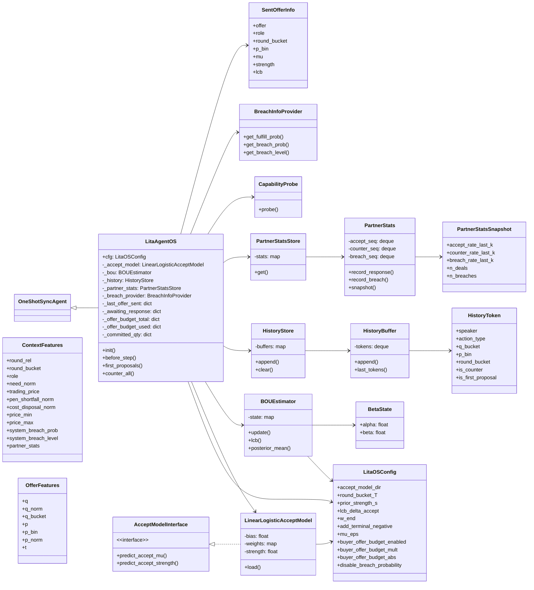
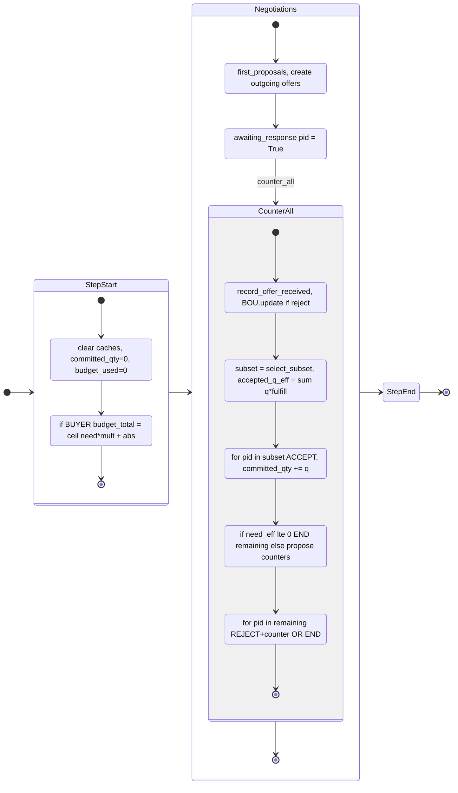
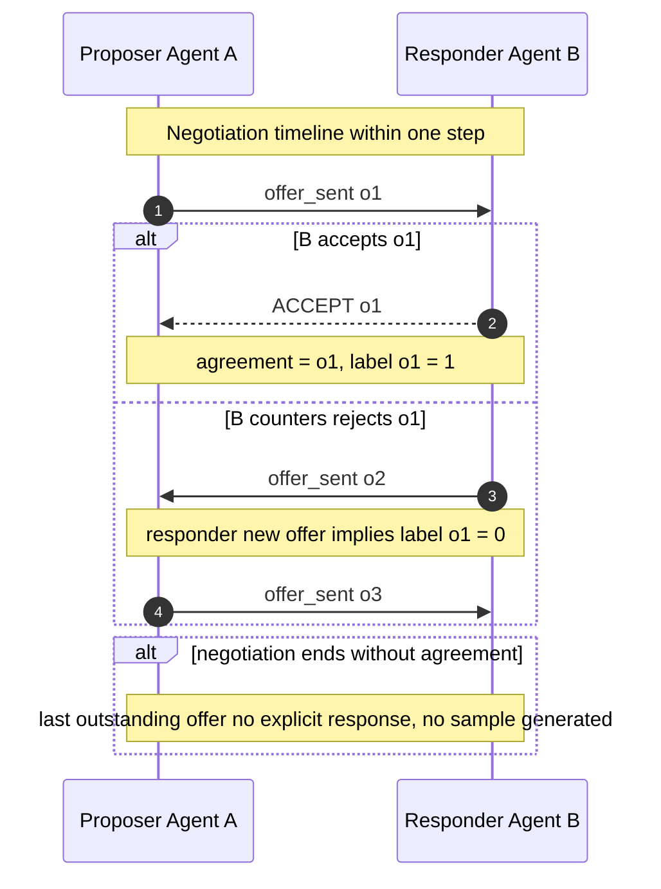
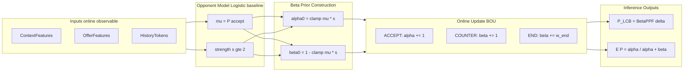
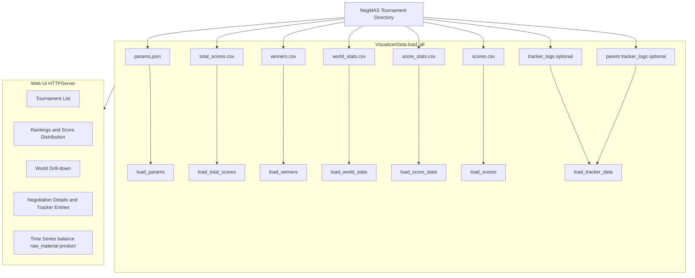

---
# ============================================================
# 编译命令 (Compile Command):
# pandoc "Thesis_Draft_0113.en.md" -o "Thesis_Draft_0113.en.pdf" --template="kuisthesis-pandoc.tex" --pdf-engine=xelatex -F "C:\Users\11985\AppData\Roaming\npm\mermaid-filter.cmd"
# ============================================================
title: "Design and Implementation of Hierarchical Reinforcement Learning Agent for Complex Dynamic Supply Chain Management: A Case Study on SCML 2025"
title-short: "Hierarchical RL Agent for Supply Chain Management"
title-multiline:
  - "Design and Implementation of Hierarchical"
  - "Reinforcement Learning Agent for Complex"
  - "Dynamic Supply Chain Management:"
  - "A Case Study on SCML 2025"
title-ja: "複雑な動的サプライチェーン管理のための階層的強化学習エージェントの設計と実装：SCML 2025を事例として"
author: "Lita Tang"
author-ja: "唐 以恒"
supervisor: "Professor Takayuki Ito"
department: "Social Informatics"
date: "Janausry 2026"
thesis-type: "Master Thesis"
abstract: |
  Supply chain management (SCM) is characterized by significant uncertainty, long-range dependencies, and multi-agent game dynamics. The SCML 2025 Standard Track further introduces non-perishable inventory and futures contracts, resulting in manufacturers being simultaneously constrained by inventory, production capacity, and cash flow during multithreaded concurrent negotiations. Traditional end-to-end reinforcement learning is prone to exploration risks and training instability. This paper proposes the HRL-XF (Hierarchical Reinforcement Learner Extended for Futures) framework, which decomposes the problem into hierarchical modules with distinct time scales and responsibilities: the L1 safety layer constructs a Safety Mask/Shield using deterministic rules, outputs only feasibility constraints (Q\_safe/Q\_safe\_sell, B\_free, time\_mask, etc.), and applies hard clipping to actions; The L2 strategy layer generates target signals on a daily basis to address intertemporal planning and futures trading. The L4 layer is restructured as a 'Global Monitor + Priority Coordinator': L4GlobalMonitor maintains global resource commitments and broadcasts constraint states, while the GlobalCoordinator outputs per-thread priorities $\alpha$ based on explicit thread features, serving as conditional input for L3 rather than directly modulating actions. The L3 execution layer employs a Decision Transformer to directly output actions that conform to SAO protocol semantics (ACCEPT/REJECT+counter/END), and ensures consistent action decoding under the L1 safety mask.

  Methodologically, we formalize the modeling of Standard Track multithreaded negotiations as (thread-level) Dec-POMDP/partially observable stochastic games, and demonstrate that this can be naturally instantiated as MAPPO online optimization within the CTDE framework: thread-shared policies, centralized critic leveraging globally broadcast states for advantage estimation, thereby maintaining training stability against non-stationary opponents and within highly constrained environments.

  From both engineering and empirical perspectives, this paper first systematically summarizes the early and mid-stage heuristic agent architectures (Y series and CIR series), serving as sources of safety rules and expert data. Secondly, utilizing SCML Analyzer, a security audit was performed on the SCML 2024 champion PenguinAgent, identifying three code defects that lead to inevitably 'breach' accept/offer behaviors, and two remedies were proposed (a directly fixed version, LitaAgent-H, and an externally shielded version, LitaAgent-HS). Under the official scale round-robin setting, LitaAgent-HS reduced unsafe behaviors to 0% and significantly improved the overall score, thereby validating the effectiveness of the 'deterministic safety shield + learnable policy' approach.
keywords: "supply chain management; hierarchical reinforcement learning; safety constraint; MAPPO; Decision Transformer; futures contract; SCML Analyzer"
abstract-ja: |
  サプライチェーン管理（SCM）は、著しい不確実性、長期的な依存関係、およびマルチエージェントゲームダイナミクスによって特徴づけられる。SCML 2025 Standard Trackでは、非消耗在庫と先物契約がさらに導入され、製造業者はマルチスレッド並行交渉において在庫、生産能力、およびキャッシュフローによって同時に制約を受けることになる。従来のエンドツーエンド強化学習は、探索リスクと学習の不安定性に陥りやすい。本論文では、HRL-XF（Hierarchical Reinforcement Learner Extended for Futures）フレームワークを提案し、問題を異なる時間スケールと責任を持つ階層的モジュールに分解する：L1安全層は決定論的ルールを用いてSafety Mask/Shieldを構築し、実行可能性制約（Q\_safe/Q\_safe\_sell、B\_free、time\_maskなど）のみを出力し、行動にハードクリッピングを適用する；L2戦略層は日次ベースで目標信号を生成し、期間間計画と先物取引に対応する。L4層は「Global Monitor + Priority Coordinator」として再構築され、L4GlobalMonitorはグローバルリソースコミットメントを維持し制約状態をブロードキャストし、GlobalCoordinatorは明示的なスレッド特徴に基づいてスレッドごとの優先度$\alpha$を出力し、行動を直接調整するのではなくL3への条件付き入力として機能する。L3実行層はDecision Transformerを用いてSAOプロトコルセマンティクス（ACCEPT/REJECT+counter/END）に準拠した行動を直接出力し、L1安全マスク下で一貫した行動デコーディングを保証する。

  方法論的には、Standard Trackマルチスレッド交渉のモデリングを（スレッドレベルの）Dec-POMDP/部分観測確率ゲームとして形式化し、これがCTDEフレームワーク内でMAPPOオンライン最適化として自然にインスタンス化できることを示す：スレッド共有ポリシー、グローバルブロードキャスト状態を活用した集中型criticによるアドバンテージ推定により、非定常的な相手と高度に制約された環境において学習の安定性を維持する。

  工学的および実証的観点から、本論文はまず初期および中期のヒューリスティックエージェントアーキテクチャ（YシリーズおよびCIRシリーズ）を体系的に要約し、安全ルールとエキスパートデータの源泉として機能させる。次に、SCML Analyzerを活用して、SCML 2024チャンピオンPenguinAgentのセキュリティ監査を実施し、必然的に「違約」accept/offer行動につながる3つのコード欠陥を特定し、2つの改善策（直接修正版LitaAgent-Hと外部シールド版LitaAgent-HS）を提案した。公式スケールのラウンドロビン設定において、LitaAgent-HSは安全でない行動を0%に削減し、総合スコアを大幅に改善し、「決定論的安全シールド + 学習可能ポリシー」アプローチの有効性を検証した。
keywords-ja: "サプライチェーン管理、階層的強化学習、安全制約、MAPPO、Decision Transformer、先物契約、SCMLアナライザー"
---

## Chapter 1: Introduction (to be revised, including discussion of issues in existing methods)

## 1.1 Research Background and Significance

### 1.1.1 Complexity and Intelligence Demands of Global Supply Chain Management

Supply chain management (SCM), as the nervous system of the modern industrial economy, has its stability and efficiency directly linked to the survival of enterprises and even the economic security of nations. With the deepening of globalization, modern supply chains exhibit highly networked, dynamic, and uncertain characteristics. From raw material procurement and production manufacturing to distribution and logistics, each stage entails complex decision-making processes.

However, in recent years, the intensification of the 'Bullwhip Effect,' sudden public health emergencies (such as COVID-19), geopolitical conflicts, and dramatic fluctuations in raw material prices have posed severe challenges to traditional supply chain management methods based on static operations research optimization. Traditional Linear Planning or Model Predictive Control (MPC) approaches often assume that the market environment is steady-state or quasi-steady-state, making it difficult to respond to sudden demand surges or supply disruptions. Moreover, in supply chain networks with multiple participants, each node (enterprise) acts as a self-interested agent, and the non-cooperative game among them renders the achievement of a global optimum via centralized scheduling difficult.

Within this context, automated negotiation and decision-making technologies based on multi-agent systems (MAS) and reinforcement learning (RL) have emerged as prominent research topics. By constructing intelligent agents capable of autonomously perceiving the environment, predicting market trends, and engaging in strategic interactions with other entities, it is anticipated that profit maximization can be realized at the micro level for enterprises, while the robustness of the overall supply chain ecosystem can be enhanced at the macro level.

### 1.1.2 SCML: The Premier Testbed for Multi-Agent Supply Chain Games

To promote research in this field, the International Joint Conference on Artificial Intelligence (IJCAI) and the International Conference on Autonomous Agents and Multi-Agent Systems (AAMAS) have jointly organized the Automated Negotiating Agents Competition (ANAC). Among these, the Supply Chain Management League (SCML) is currently the most authoritative and challenging supply chain multi-agent game competition worldwide.

SCML provides a highly realistic simulation environment that models a production network consisting of multiple layers. In this network, the agent must not only decide what to produce and how much to produce; more critically, it must acquire raw materials and sell products through **concurrent negotiations**. Unlike traditional unilateral inventory management, in SCML every order must be reached through complex negotiation protocols (such as the alternating offers protocol) with another agent. This implies that the agent must possess both micro-level negotiation skills (how to make offers) and macro-level strategic vision (how to manage cash flow and inventory).

The SCML 2025 Standard Track introduces disruptive rule changes: **Non-Perishable Inventory** and **Futures Contracts**.

1. **Non-perishable inventory**: In previous competitions, unused raw materials or unsold products at the end of the day would depreciate or disappear, forcing agents to pursue Zero Inventory. In contrast, the new rules permit long-term inventory retention, introducing an intertemporal decision dimension such as 'stockpiling in anticipation of price increases' or 'depleting inventory to hedge against risk.'
   
2. **Futures contract**: Agents can sign orders for delivery several dozen days in the future. Consequently, current decisions affect not only immediate returns but also lock in future cash flow and production capacity.

This change transforms the environment from the traditional 'newsvendor problem' (a single-shot game) into a complex sequential decision problem characterized by **Deep Long-term Dependency**, presenting unprecedented challenges to existing agent architectures.

## 1.2 Current Research Status and Challenges, Domestic and International

### 1.2.1 Traditional Heuristic Agents and Their Limitations

Prior to the large-scale application of reinforcement learning, automated agents in the SCM domain primarily relied on heuristic rules. These rules are typically designed based on the experience of domain experts, offering advantages such as low computational overhead, strong interpretability, and guaranteed behavioral lower bounds.

However, heuristic methods encounter significant bottlenecks in the SCML 2025 Environment:

1. **Lack of adaptability**: Thresholds in the rules (such as target profit margin) are usually static or adjusted based on simple statistical methods (such as moving averages). In the face of nonlinear market fluctuations (e.g., hyperinflation), rule-based systems often exhibit delayed responses.
   
2. **Local Optimum**: Heuristic algorithms typically decompose complex problems into three independent modules—'Negotiation,' 'Production,' and 'Inventory'—for greedy optimization, thereby neglecting the coupling effects among modules. For example, the negotiation module may accept low-priced orders in order to reach agreements, leading the production module to become unprofitable.
   
3. **Incapable of handling long-term planning**: Rule-based agents find it challenging to explicitly encode complex intertemporal strategies such as 'stockpiling at a loss today in preparation for a peak season 30 days later.'

### 1.2.2 Review of SCML Champion Strategies in 2023-2024

A retrospective analysis of the SCML Standard Track over the past two years clearly reveals the evolution of agent strategies.

* **SCML 2023 Champion: MyAgent (Based on Adaptive Threshold)** The champion agent in 2023 primarily adopted a strategy based on the **Acceptance Threshold**. This agent computes the current market supply/demand ratio in real time and dynamically adjusts its reservation price accordingly. Its core advantage lies in an exceptionally high negotiation success rate; however, it adopts a relatively passive approach to inventory management, relying mainly on a conservative 'production based on sales' strategy.
  
* **SCML 2024 Champion: PenguinAgent (ROI-Driven Conservatism)** *PenguinAgent* represents the pinnacle of heuristic strategy. Its core concept is **ROI-driven conservative negotiation**.
  
  * **Core Strategy**: It does not pursue market share, but seeks guaranteed profit in every transaction. It maintains an extremely rigorous internal valuation model and only submits an offer when the expected ROI of a potential transaction exceeds a dynamically set high threshold.
    
  * **Negotiation Mechanism**: Utilizes a 'time-dependent concession curve,' maintaining a firm position in the early stages of negotiation and making rapid concessions only as the deadline approaches.
    
  * **Limitations**: Although *PenguinAgent* is extremely difficult to bankrupt, its behavior is excessively conservative. In the SCML 2025 futures market, if an agent does not dare to take risks and stockpile at low prices, it will be crowded out by agents willing to engage in inter-temporal arbitrage.


* **Other Typical Strategies: DecentralizingAgent** *DecentralizingAgent* attempts to transform the multithreaded negotiations problem into multiple independent single-threaded negotiation problems for resolution. It employs **Gaussian Process Regression** to predict the opponent's reservation price. This approach performs well in micro-level games but tends to be vulnerable when addressing the risk of macro-level capital chain interruptions.

### 1.2.3 Challenges of Reinforcement Learning Applications in Supply Chains

In recent years, deep reinforcement learning (DRL) has achieved superhuman performance in games (such as Go and Dota 2); however, its deployment in the SCM domain has remained elusive, primarily due to three major challenges:

1. **Credit Assignment Problem**: In SCML 2025, an agent may pay cash to purchase raw materials on day 1 (incurring a negative reward), store them for 20 days, produce on day 21, and sell on day 30 (gaining a positive reward). This extended 30-day reward delay makes it difficult for traditional Q-Learning or Actor-Critic algorithms to capture the causal relationship between actions and consequences.
   
2. **Safe Exploration & Cold Start**: The supply chain environment is highly sensitive to errors. During the initial stages of exploration, an untrained RL agent is prone to proposing unreasonable prices or committing to orders it cannot fulfill, resulting in substantial breach penalties or even immediate bankruptcy. Once bankruptcy occurs, the episode terminates immediately, and the agent is unable to obtain further learning samples.
   
3. **Non-Stationarity**: SCML is a multi-agent environment. As training progresses, opponent strategies continuously evolve (for example, opponents learn to suppress prices in a targeted manner), causing drift in the environment transition probability distribution and thereby making RL training convergence challenging.

## 1.3 Main Research Content

In response to the new challenges introduced by SCML 2025 and the limitations of current approaches, this paper aims to design and implement a hierarchical reinforcement learning agent system that combines rule-based safety with adaptive learning.

### 1.3.1 Preliminary Work: Heuristic Agent Architecture (Output Prior to the Mid-term)

Prior to entering the HRL-XF reinforcement learning phase, we completed the design and iteration of the heuristic agent architecture, resulting in the LitaAgent series:

(1) Y Series: Proposed the ‘Tri-pronged Procurement Strategy’ (urgent/planned/optional stockpiling) and an inventory-sensitive negotiation strategy, incorporating shortfall prediction by the InventoryManager and production capacity constraints into offer and acceptance decision processes;

(2) CIR Series: Proposes a 'unified portfolio evaluation' procurement/sales strategy, treating multiple simultaneous offers as a portfolio optimization problem, and achieves more robust transactions and risk control through simulation-based reasoning and threshold concessions.

(3) Engineering Modularization: Submodules such as InventoryManager, opponent modeling, concession strategy, and parameter adaptation establish reusable interfaces, providing a stable engineering foundation for integrating learning models into the system in the future.

These preliminary works assume three roles in HRL-XF: providing hard constraint rules (L1 Safety Mask), supplying expert trajectories (offline BC/forensics), and contributing engineering expertise in concurrent negotiations and inventory coupling (source of L4 thread features and global broadcast design).

### 1.3.2 Design of the HRL-XF Hierarchical Architecture (to be revised)

This paper proposes the HRL-XF (**Hierarchical Reinforcement Learner Extended for Futures**) four-layer hierarchical architecture, aiming to achieve stable learning and execution under the conditions of long-term cross-day planning, multithreaded concurrent negotiations, and stringent safety constraints. In contrast to previous versions, **the current HRL-XF no longer incorporates any explicit residual (baseline + residual) action superposition**: L3 directly outputs valid SAOAction; L1 solely implements safety constraints and hard clipping; and L4 only outputs coordination signals (broadcast and priority $\alpha$), without performing action modulation or sequential decremental resource reservation.

- **L1 safety layer (Safety Mask/Shield):**

  Feasibility boundaries are constructed using deterministic rules, only outputting and maintaining constraints (such as $Q_{\text{safe}}[\delta]$, $Q_{\text{safe\_sell}}[\delta]$, $B_{\text{free}}$, and `time_mask`), and performing hard constraint verification and quantity clipping on the actions output by the L3 layer. **L1 does not output baseline actions (baseline_action).**

- **L2 strategy layer (Strategic Manager):**

  Generates target/intention signals $g_d$ on a daily scale to manage futures trading and cross-day planning (e.g., stockpiling/de-inventory, intertemporal arbitrage). Potential-based shaping can also be incorporated to more stably allocate long-term returns to individual daily decisions.

- **L3 Execution Layer (Executor, Decision Transformer):**

  Directly outputs actions conforming to SAO protocol semantics at the negotiation round level:

  $$\text{SAOAction} \in \{\text{ACCEPT}, \text{REJECT}+\text{counter}, \text{END}\}$$

  Consistent decoding is performed under the mask of L1 (first selecting the operation, then selecting the delivery bucket, then generating $q/p$, and finally clipping).

- **L4 Global Coordination Layer (Global Monitor + Coordinator):**

  L4GlobalMonitor maintains company-level global commitments and remaining resources, broadcasting $c_\tau$ (such as target gaps, remaining safety stock, remaining budget, etc.); GlobalCoordinator outputs the priority of each thread based on an explicit set of thread features.

  $\alpha_{\tau,k} \in (-1,1)$,

  This serves as a conditional input to L3, enabling cross-thread 'soft coordination.'

### 1.3.3 Staged Training Paradigm and Engineering Optimization (to be revised)

To address the convergence challenges in RL, this paper proposes a training pipeline comprising 'forensics -> disentanglement -> pre-training -> fine-tuning'. At the engineering level, this paper resolves the deadlock (hang) issue of the NegMAS simulation framework under large-scale parallel training by proposing a solution based on the **Loky backend and Monkey Patch**, thereby ensuring the feasibility of large-scale data collection.

### 1.3.4 Development of the SCML Analyzer analytical toolkit

To address the lack of micro-level behavior analysis tools in the current ecosystem, this paper designs and implements the **SCML Analyzer**. This tool utilizes injection-based Tracker technology to comprehensively record every bid, inventory change, and production plan of the agent throughout its entire lifecycle, and provides a web-based visualization service. This not only facilitates strategy debugging in this study but also offers a valuable analytical tool to the community.

## 1.4 Thesis Organization

This paper is divided into seven chapters, organized as follows:

* **Chapter 1 Introduction**: Presents the research background, the evolution of the SCML competition, analysis of existing strategies, as well as the objectives and contributions of this study.
  
* **Chapter 2 Related Theories and Technical Foundations**: Provides a detailed exposition of the rule mechanism of SCML 2025, and introduces the theoretical foundations of reinforcement learning, POMDP, and hierarchical learning.
  
* **Chapter 3 SCML Environment Modeling and Problem Definition**: The supply chain environment is formalized as a POMDP model, with derivations of the state space, action space, transition function, and a reward function based on potential shaping.
  
* **Chapter 4 Design of the HRL-XF Hierarchical Agent Architecture**: This chapter provides an in-depth analysis of the four-layer HRL-XF architecture, with particular emphasis on the implementation of safety shield mechanisms and networks.
  
* **Chapter 5 System Implementation and Engineering Optimization**: This chapter introduces the code implementation of LitaAgent, details the data pipeline in the staged training process, and elaborates on the engineering implementation of SCML Analyzer and the Loky Patch.
  
* **Chapter 6 Experimental Design and Result Analysis**: This chapter presents the experimental results of offline pre-training and online fine-tuning, validates the effectiveness of the architecture through ablation studies, and provides case analyses under extreme market scenarios.
  
* **Chapter 7 Summary and Outlook**: This chapter summarizes the overall work, discusses the existing limitations, and provides an outlook on future research directions (such as L4 neuroization and OneShot adaptation).

# Chapter 2 Related Theory and Technical Foundation (The relevant theoretical basis for OneShot should be added, and the Standard content should be removed.)

This chapter first provides a detailed explanation of the competition mechanism of the Supply Chain Management League (SCML), with particular emphasis on the rules regarding non-perishable inventory and futures contracts introduced in the 2025 season, which form the specific domain background for this study. Subsequently, this chapter reviews the fundamental theories of reinforcement learning, with a particular focus on Proximal Policy Optimization (PPO) and Decision Transformer, and offers an in-depth discussion of the theoretical framework of hierarchical reinforcement learning (HRL), thereby establishing the theoretical foundation for the proposed HRL-XF architecture.

## 2.1 Detailed Mechanisms of the Supply Chain Management League (SCML)

SCML is a complex multi-agent simulation environment built upon the NegMAS (Negotiation Multi-Agent System) platform [4]. Its core objective is to maximize the agents’ long-term cumulative returns through automated negotiation and production scheduling within a simulated production network.

### 2.1.1 Track Settings and Production Topology

The SCML competition is divided into two main tracks: **OneShot Track** and **Standard Track**.

* **OneShot Track**: In the OneShot Track, agents operate within a production graph of limited hierarchical depth and must make short-term, immediate decisions. There are no futures contracts; all products must be delivered on the day of negotiation. The primary focus is on the agent’s negotiation proficiency and its ability to manage concurrent negotiations. This constitutes the principal focus of the present study.
  
* **Standard Track**: In the Standard Track, the agent operates within a multi-level Production Topology and must engage in long-term sequential decision-making. Since the agent may enter into futures contracts, the capacity to manage production and inventory across temporal and spatial domains is of critical importance.

**Definition of Production Topology**: The SCML Environment can be modeled as a directed acyclic graph (DAG), $G = (V, E)$.

* **Nodes** $V$: Represent different factories (agents) within the Production Network. The topology is divided into $L_0, L_1, \dots, L_k$ layers.
  
  * The $L_0$ layer agent: raw material manufacturers, serving exclusively as sellers.
    
  * The $L_k$ layer agent: final product manufacturers, oriented towards the exogenous consumer market.
    
  * Intermediate-layer agent (e.g., $L_1$): both buyer and seller. They are required to purchase inputs from the previous layer, process them on the production line, and sell the outputs to the next layer.


* **Edge** $E$: represents the direction of logistics and capital flow within the supply chain.

*(It is recommended to insert Figure 2-1 here: Schematic diagram of the SCML Production Topology, illustrating the flow of raw materials and the dual role of the intermediate-layer agent.)*

**Simulation Process**: A competition typically lasts for $T_{steps}$ simulation days (e.g., 100 days). Each day $t$ is divided into strictly defined stages:

1. **Negotiation Phase (Negotiation)**: Agents exchange offers and sign contracts.
   
2. **Contract Signing (Signing)**: Finalized contracts are recorded in the ledger.
   
3. **Production Scheduling (Production)**: Agents determine how to allocate inventory for production.
   
4. **Execution and Settlement (Execution & Settlement)**: Goods are delivered and funds transferred according to the contracts. If a breach occurs, the penalty mechanism is triggered.

### 2.1.2 Core Transformations in SCML 2025: Inventory and Futures

Compared to previous editions, SCML 2025 introduces two key mechanisms that fundamentally alter the environment [7], transforming it from a 'newsvendor-like model' to a deep sequential decision-making problem.

#### 1. Non-perishable inventory (Non-Perishable Inventory)

According to the rules of SCML 2024 and earlier, unused raw materials or unsold finished products at the end of the day would be directly discarded or depreciated to zero. This compelled agents to adopt a 'Zero Inventory (Just-in-Time)' strategy, greatly simplifying the state space.

SCML 2025 allows inventory to be carried over to subsequent days, but requires payment of a storage cost $C_{store}$:

$$C_{store}(t) = \sum_{g \in \mathcal{G}} \mu_g \cdot I_g(t)$$

Here, $I_g(t)$ denotes the inventory level of good $g$ at time $t$, and $\mu_g$ represents the unit holding cost. This mechanism introduces **long-term dependency**: agents may choose to stockpile raw materials when prices are low in order to mitigate future price increases. This implies that the decision at time $t$ (purchase) may be aimed at optimizing the return at time $t+30$; conventional myopic strategies are thus rendered ineffective.

#### 2. Futures Contracts

The new regulations permit agents to sign contracts for delivery at future time $t + \delta$ days ($\delta > 0$).

* **Spot Trading**: $\delta = 0$, immediate delivery.
  
* **Futures Trading**: $\delta > 0$, locking in future prices and quantities.

The introduction of the futures market results in a dimensional explosion of the state space. The agent must manage not only the current physical inventory, but also **virtual inventory**—that is, future delivery obligations. This necessitates that the agent possesses the capability to construct an 'Order Book' and to conduct cash flow forecasting based on it.

### 2.1.3 Negotiation Protocol

The SCML Standard adopts the alternating offers protocol, which, in terms of engineering implementation, adheres to SAO (Single Alternating Offers) semantics. Let the negotiating parties be $i$ and $j$; in round (or event step) $\tau$:

1. **Offer**: One party submits an offer.

   $$o_{\tau}^{i \rightarrow j} = \langle q, p, t_{\text{abs}} \rangle$$

   Where $q$ denotes the quantity, $p$ denotes the unit price, and $t_{\text{abs}}$ denotes the absolute delivery day.

2. **Response**: The receiving party $j$ provides one of three types of responses to the current offer:

   - **ACCEPT**: Accept the current offer; negotiation concludes and a contract is established.

   - **REJECT**: Reject the current offer; negotiation proceeds to the next round. The receiving party may propose a counter-offer in the subsequent round.

   - **END**: Explicitly terminate the negotiation, with no further discussions to follow.

3. **Counter-offer**: Within our strategy space constraints, to reduce 'uninformative rejection' and maintain consistency between training and execution, we constrain **REJECT to always be accompanied by a counter-offer**:

   $$\text{REJECT} \Rightarrow \text{counter}(q', p', t'_{\text{abs}})$$

   This constitutes a 'strategy constraint' rather than a requirement imposed by the protocol itself; its purpose is to reduce invalid negotiation rounds and increase the density of learning signals.

Negotiation is subject to a strict deadline. If an agreement is not reached before the deadline, the negotiation terminates with no contract generated; In practice, this often induces the common phenomenon of 'accelerated concessions as the deadline approaches' (time-dependent concession).

## 2.2 Fundamentals of Reinforcement Learning

Reinforcement learning (RL) aims to learn optimal policies through agent-environment interactions to maximize cumulative expected return.

### 2.2.1 Partially Observable Markov Decision Process (POMDP)

Since, in SCML, agents cannot observe opponents' private information (such as inventory levels, cash balances, or reservation prices), the problem cannot be simply modeled as a Markov Decision Process (MDP), but must be formulated as a **Partially Observable Markov Decision Process (POMDP)** [23].

A POMDP is defined by the septuple $\langle \mathcal{S}, \mathcal{A}, \mathcal{T}, \mathcal{R}, \Omega, \mathcal{O}, \gamma \rangle$:

* $\mathcal{S}$: The true state space of the Environment (including all agents' private states).
  
* $\mathcal{A}$: Action space.
  
* $\mathcal{T}(s'|s,a)$: State transition probability function.
  
* $\mathcal{R}(s,a)$: Reward function.
  
* $\Omega$: Observation space (local information accessible to the agent).
  
* $\mathcal{O}(o|s',a)$: Observation probability function.
  
* $\gamma \in [0,1]$: Discount factor.

In a POMDP, the agent cannot directly access $s_t$ and must construct a policy $\pi(a_t|h_t)$ based on the history of observations $h_t = (o_1, a_1, \dots, o_t)$.

### 2.2.2 Proximal Policy Optimization (PPO)

Proximal Policy Optimization (PPO) is currently one of the most popular policy gradient algorithms [19], renowned for its stability and efficiency in continuous control tasks.

The core concept of PPO is to constrain the step size of policy updates, preventing the new policy $\pi_\theta$ from deviating excessively from the old policy $\pi_{\theta_{old}}$, which could result in performance collapse. Its objective function includes a clipped surrogate objective:

$$L^{CLIP}(\theta) = \hat{\mathbb{E}}_t \left[ \min(r_t(\theta)\hat{A}_t, \text{clip}(r_t(\theta), 1-\epsilon, 1+\epsilon)\hat{A}_t) \right]$$

Where:

* $r_t(\theta) = \frac{\pi_\theta(a_t|s_t)}{\pi_{\theta_{old}}(a_t|s_t)}$ is the probability ratio between the new and old policies.
  
* $\hat{A}_t$ denotes the advantage function estimation (Advantage Estimation), which is typically computed using GAE (Generalized Advantage Estimation).
  
* $\epsilon$ is the clipping hyperparameter (usually set to 0.2), which is used to bound the range of $r_t(\theta)$ through truncation.

In the HRL-XF architecture proposed in this paper, the **L2 strategy layer** employs the PPO algorithm. The L2 layer is responsible for outputting continuous macro-level target vectors (such as target inventory levels and funding limits); PPO is well-suited for handling such continuous action spaces and ensures stability in long-term policy learning.

### 2.2.3 Decision Transformer

Decision Transformer (DT) introduced a disruptive paradigm: reframing reinforcement learning problems as conditional sequence modeling problems (Conditional Sequence Modeling) [16].

Unlike traditional value function-based methods (e.g., DQN) or policy gradient methods (e.g., PPO), DT leverages a Transformer architecture (GPT-style) to directly predict the next action based on past states, actions, and the expected return (Target Return).

The input sequence (trajectory) is organized as a stream of tokens:

$$\tau = (\hat{R}_1, s_1, a_1, \hat{R}_2, s_2, a_2, \dots, \hat{R}_T, s_T, a_T)$$

where $\hat{R}_t = \sum_{k=t}^T r_k$ denotes the remaining accumulated return (returns-to-go) starting from time $t$.

The objective of the model is to maximize the following likelihood function:

$$\max_\theta \sum_{t=1}^T \log P_\theta(a_t | \hat{R}_1, s_1, a_1, \dots, \hat{R}_t, s_t)$$

*(It is recommended to insert Figure 2-2 here: Schematic diagram of the causal attention mechanism of Decision Transformer.)*

In SCML environments characterized by extremely long causal chains (purchasing raw materials $
ightarrow$ production $
ightarrow$ sales, possibly spanning up to 30 steps), the self-attention mechanism of DT can capture long-range temporal credit assignment relationships more effectively than conventional LSTM. In this paper, the **L3 execution layer** employs a simplified DT structure to process micro-level negotiation sequences and generates micro-actions based on the objectives set by L2.

## 2.3 Hierarchical Reinforcement Learning (HRL), Safety Constraint, and CTDE/MAPPO

### 2.3.1 Hierarchical Reinforcement Learning and Temporal Scale Decomposition

The essence of hierarchical reinforcement learning is to introduce policies at different temporal scales and abstraction levels, whereby the high-level policy generates 'intentions/sub-goals/scheduling signals' at a slower temporal scale, while the low-level policy executes specific actions at a faster temporal scale. Formally, this can be represented as:

High-level policy: $$\pi_{\text{high}}(g_t | s_t^{\text{macro}})$$, which generates goals/intentions $g_t$ at the daily scale;

Low-level policy: $$\pi_{\text{low}}(a_{t,k} | o_{t,k}, g_t, c_t)$$, which generates action $a_{t,k}$ for each concurrent thread $k$ at the negotiation round scale;

Here, $c_t$ may include globally shared constraint signals across threads (such as remaining resources, gaps, or budget).

Therefore, when the Environment inherently encompasses multiple time scales (such as 'daily-level inventory/cash settlement' and 'round-level negotiation bids') and concurrent subtasks (negotiation threads with multiple opponents), HRL can reduce both the modeling complexity and the credit assignment difficulty for a single policy.

### 2.3.2 Safety Constraints and Shielding (Safety Mask/Shield)

In strongly constrained economic systems, pure exploration can result in irreversible bankruptcy or significant shortfall penalties. This paper adopts the Safety Mask/Shield concept: feasibility constraints (such as deliverable inventory, payable funds, feasible delivery windows, etc.) are encoded as deterministic rules into masks and hard-pruning operators, so that the learning policy optimizes returns only within the 'feasible set,' thus significantly reducing the risk of catastrophic exploration during the cold start stage. Unlike employing heuristic policies as 'baseline actions,' in the latest design presented in this paper, L1 outputs only feasibility boundaries and conducts hard constraint validation on actions, without providing any baseline actions.

### 2.3.3 CTDE and MAPPO: An Online Learning Framework for Multithreaded Concurrent Negotiations

In the SCML Standard Track, manufacturers engage in concurrent negotiations with multiple opponents on the same simulation day. Multiple negotiation threads share the same set of inventory, production capacity, and financial constraints, resulting in strong coupling and competition among threads. The Centralized Training, Decentralized Execution (CTDE) framework enables the utilization of global information during training to learn more stable value functions, while during execution, each thread relies solely on its locally observable information for decision-making. MAPPO (Multi-Agent PPO) is a commonly employed stable online algorithm under the CTDE framework: each thread may either share or possess its own policy network, utilizes a centralized critic to estimate the advantage function, and applies the clipping mechanism of PPO to suppress drastic policy updates, making it well-suited for scenarios with non-stationary opponent strategies, partial observability, and high training variance.

# Chapter 3: SCML OneShot Environment Modeling and Problem Definition

The SCML OneShot track is a multi-agent, strongly constrained, penalty-based, and partially observable automated negotiation environment. Unlike the Standard track, OneShot does not permit negotiation on future delivery dates; contract delivery times are limited to the current step. Thus, the core challenge for agents is not cross-period planning, but rather the coupling of concurrent negotiations within the same step: multiple opponents interact simultaneously, and any acceptance or counter-offer will alter the residual demand and risk boundary, ultimately affecting profit through mechanisms such as shortfall or disposal.

This work ultimately adopts the D-NB (Neural-Bayesian Opponent Model + Heuristic Planner) architecture; therefore, this chapter formalizes the modeling and problem definition of the OneShot environment from the unified perspective of D-NB. In contrast to the initial HRL-XF conception, we no longer introduce hierarchical state/action spaces, thread-level Dec-POMDP, or CTDE descriptions. Instead, the task is formulated as follows: under partially observable conditions, based on the current observable context and negotiation history, the SAO response action (ACCEPT/REJECT+counter/END) is output for each negotiation, with the objective of maximizing step profit.

**Table 3.1 Notation Table (uniformly used in this chapter)**

| Symbol | Meaning |
| :---- | :---- |
| $d \in \{0,\dots,D-1\}$ | Simulation step index; each episode contains $D$ steps |
| $\mathcal{N}_d$ | Negotiation set conducted concurrently in step $d$ (identified by partner/mechanism id) |
| $j \in \mathcal{N}_d$ | A specific negotiation (a negotiation with a particular opponent) |
| $o^{in}_{d,j} = \langle q,p,t \rangle$ | Opponent’s offer (quantity/unit price/time) observed in negotiation $j$. Under OneShot, $t$ is restricted to the current step (can be considered a constant) |
| $a_{d,j}$ | Our response action to negotiation $j$: ACCEPT / REJECT+counter / END |
| $o^{out}_{d,j} = \langle q',p',t \rangle$ | Counter-offer given when $a_{d,j} = \text{REJECT}$ (which also satisfies the OneShot same-day delivery constraint) |
| $c_{d,j}$ | Context features: Negotiation Progress, Role, Demand normalization, price boundary, penalty parameter, System Breach Information, opponent statistics, etc. |
| $f(o)$ | Offer features (OfferFeatures): $q/q_{norm}/q_{bucket}$, $p/p_{norm}/p_{bin}$, and $t$ (constant). |
| $h_{d,j}$ | Historical token sequence within the NEGOTIATION scope (most recent $N$ event tokens). |
| $y_{d,j} \in \{0,1\}$ | Bernoulli random variable indicating whether the opponent accepts a particular offer (accept = 1). |
| $\mu_{d,j} \in (0,1)$ | Prior as outputted by the acceptance probability model: $\mu = \hat{P}(y=1 \mid c, f, h)$. |
| $s \ge 2$ | Prior strength (equivalent sample size), used to construct the Beta prior (can be set as a constant). |
| $\text{Beta}(\alpha, \beta)$ | Posterior distribution of acceptance probability (BOU). |
| $P^{LCB}_{sign}$ | Lower confidence bound (Beta quantile, parameter $\delta$) for $P(\text{accept})$. |
| $P_{fulfill} \in [0,1]$ | Fulfillment probability (provided by System Breach Information or the model; fallback to 1 if unavailable). |
| $q^{eff}$ | "Effective traded quantity" approximation: the effective quantity after discounting for signing probability and fulfillment risk |
| $\Pi_d$ | Profit at step $d$ (revenue − cost − penalty) |

## 3.1 OneShot Environment Structure and Negotiation Process

### 3.1.1 Concurrent Negotiations and Synchronous Decision Window

At each step $d$, the agent simultaneously initiates negotiations with multiple opponents, forming the negotiation set $\mathcal{N}_d$. The OneShot synchronous interface centralizes decision-making within two windows:

1. **First proposal window**: For each negotiation, submit an initial offer (proposal), forming a set $\{o^{out}_{d,j}\}_{j \in \mathcal{N}_d}$;
2. **Unified Response Window**: Observe the current set of offers from the opponent, $\{o^{in}_{d,j}\}_{j \in \mathcal{N}_d}$, and output a joint response action vector $a_d = \{a_{d,j}\}_{j \in \mathcal{N}_d}$.

This chapter regards 'concurrency' as a **joint decision-making problem** within the same step: although each negotiation outputs an action component, they share the same Demand and Risk boundary, and therefore must be evaluated and constrained consistently using the same criteria.

(It is recommended to insert Figure 3-1 here: Schematic diagram of concurrent negotiations and two-stage decision window within a OneShot step.)

### 3.1.2 SAO Response Semantics: Distinguishing Between Action and Offer

In this paper, for purposes of standardization:

* **Actions** are limited to three types: $a_{d,j}\in\{\text{ACCEPT},\ \text{REJECT}+\text{counter},\ \text{END}\}$.
* **Offer is not an action**: the offer functions only as an event field and as a parameter field for REJECT. Specifically, the REJECT action must carry a counter-offer $o^{out}_{d,j}$, whereas ACCEPT/END do not require the generation of a new offer.

Furthermore, this paper rigorously distinguishes between two concepts:

* **Contracting/Acceptance (sign/accept)**: Whether the opponent accepts a particular offer (i.e., acceptance at the action level);
* **Fulfillment/Breach (fulfill/breach)**: Whether a breach or under-delivery occurs after contract signing. The two represent distinct stochastic processes: even if an offer is 'accepted,' it may still be 'unfulfilled.' Therefore, they must be treated separately in modeling and strategy evaluation.

### 3.1.3 Main Sources of Uncertainty

The key uncertainties inherent to OneShot can be classified into two categories:

1. **Opponent acceptance behavior uncertainty**: For identical offers, the acceptance probability varies across different opponents and at different stages of negotiation progress.
2. **Fulfillment risk uncertainty**: Even after contracting, breaches may occur, leading to a reduction in the actual delivery volume and triggering shortfall penalties.

These two types of uncertainty jointly determine the 'true value of an offer': this depends not only on the nominal price and quantity, but also on the probabilities of acceptance and fulfillment.

## 3.2 Unified POMDP Formalization

From the perspective of a single agent (regarding other agents as part of the Environment), OneShot can be modeled as a POMDP:

$$\mathcal{M}=\langle \mathcal{S},\mathcal{A},\mathcal{O},T,\Omega,R,H\rangle$$

* **State space $\mathcal{S}$**: Consists of observable exogenous variables (Demand, price boundary, penalty parameter, etc.) as well as the opponent's hidden variables (such as their acceptance probability function, concession behavior, fulfillment tendency, etc.).
* **Observation space $\mathcal{O}$**: The set of information observable by the agent within each step, including the current offer of each negotiation, negotiation progress, exogenous price and penalty parameter, and the sequence of events in the negotiation history.
* **Action space $\mathcal{A}$**: Joint action vector space. For each negotiation $j$, the action semantics correspond to one of three SAO responses: $a_{d,j} \in \{\text{ACCEPT}, \text{REJECT}+\text{counter}(\langle q',p',t \rangle), \text{END}\}$.
* **Transition function $T$**: Determined by the simulator, encompassing rules such as negotiation progression, contracting and settlement, breach triggering, and penalty settlement.
* **Reward function $R$**: This paper does not apply complex reward shaping and only adopts the step profit criteria (see 3.5).

Note: This work no longer adopts the thread-level online RL training and centralized value estimation of HRL-XF; therefore, there is **no need** for the formalization of Dec-POMDP, CTDE, thread-local observation, or centralized critic. We focus uncertainty primarily on belief modeling of 'opponent acceptance probability and fulfillment risk,' and calibrate it via Beta-BOU online updates.

---

## 3.3 State and Observation Representation: Overall State

In D-NB, we organize the observable information of each negotiation into three components: context $c$, current offer features $f(o)$, and history sequence $h$. The overall observation at step $d$ can be expressed as the set:

$$o_d=\Big\{\big(c_{d,j},\ f(o^{in}_{d,j}),\ h_{d,j}\big)\Big\}_{j\in\mathcal{N}_d}$$

### 3.3.1 Context Features $c_{d,j}$ (ContextFeatures)

Context features are used to characterize the 'current negotiation context' and typically include:

* Negotiation Progress (such as $\text{round\_rel}$);
* Role (BUYER/SELLER) and normalized residual demand ($\text{need\_norm}$);
* Price boundary ($p_{\min},p_{\max}$), reference market price (e.g., $ \text{trading\_price} $);
* Penalty structure (normalized quantities related to shortfall penalty or disposal cost);
* System breach information (if available) and opponent statistical features (recent accept/counter/breach statistical snapshots).

All these features are derived from online observable information, ensuring consistency between training and inference.

### 3.3.2 Offer Features (( f(o) )) (OfferFeatures)

The offer $o=\langle q, p, t \rangle$ under OneShot satisfies the 'same-day delivery' constraint; thus, time $t$ can be regarded as a constant field. The core learnable components are concentrated on $(q,p)$, using normalization and discretization to enhance robustness:

* Quantity: $q$, $q_{norm}$, $q_{bucket}$;
* Price: $p$, $p_{norm}$, $p_{bin}$ (where $p_{bin}$ is a binarized representation specifically applied in Narrow Spread scenarios).

### 3.3.3 History sequence $h_{d,j}$ (HistoryTokens)

To leverage short-sequence information within negotiations (particularly in OneShot scenarios characterized by few negotiation rounds and high information density), we introduce a historical token sequence $h_{d,j}$ with NEGOTIATION scope. The token sequence adopts a fixed schema to represent the most recent $N$ events, with fields including:

* speaker (ME/OPP);
* action_type (OFFER / ACCEPT / END);
* is_counter / is_first_proposal;
* $(q_{\text{bucket}}, p_{\text{bin}}, \text{round\_bucket})$.

This token schema can serve both as auxiliary input for lightweight models and as a unified interface for sequence models such as the Transformer.

## 3.4 Action Space: Overall Action Definition

For each negotiation $j$, the action is defined as a selection among three SAO responses:

$$a_{d,j} \in \{\text{ACCEPT}, \text{REJECT}+\text{counter}(\langle q',p',t \rangle), \text{END}\}$$

Under OneShot, the time field of the counter-offer is constrained by the current step; therefore, the effective degrees of freedom for the action primarily derive from $q'$ and $p'$. In the synchronous interface, the agent must output responses to all negotiations simultaneously. Thus, the quality of the joint action $a_d$ depends on its consistency with the global Demand and penalty structure, as well as its ability to avoid the risks of shortfall or disposal arising from concurrent overcommitment.

## 3.5 Objective Function

In this study, no dense reward function is constructed in the context of reinforcement learning; instead, the economic objective of the competition is directly adopted—maximizing step profit. We employ the following unified criteria:

$$\Pi_d = \text{Revenue}_d - \text{Cost}_d - \text{Penalty}_d$$

Where:

* **Revenue_d**: The revenue generated by actual sales completed in this step;
* **Cost_d**: The cost (or equivalent expense) incurred by actual procurement completed in this step;
* **Penalty_d**: The penalty incurred due to shortfall, disposal, and other such mechanisms.

To assess the value of candidate actions during the Negotiation phase, a commonly used simplification is to express 'per-unit profit' based on the exogenous price as the benchmark:

* SELLER side: $\text{profit} = p_{sell} - p^{exo}_{in}$;
* BUYER side: $\text{profit} = p^{exo}_{out} - p_{buy}$. 
Furthermore, by incorporating shortfall and disposal penalties under a unified standard, a comparable "decision score" is constructed: $\text{Score} = \text{Utility} - \text{ShortfallPenalty} - \text{DisposalPenalty}$, where Utility is approximated as $\text{profit} \times q^{eff}$, and the penalty terms are determined based on the effective quantity and demand shortfall or excess (see the definition of $q^{eff}$ in Section 3.6.4).
---

## 3.6 Opponent Acceptance Probability Modeling: Logistic / Transformer + Beta-BOU

This section presents the core problem definition for D-NB in the OneShot environment: **whether the opponent accepts a particular offer** is the key stochastic factor affecting profit. We explicitly model it as a Bernoulli random variable, employ a learnable model to provide the prior probability, subsequently calibrate this prior to an actionable posterior online via Beta-BOU, and present the conservative estimate in the form of an LCB to control concurrency risk.

### 3.6.1 Acceptance Events: Bernoulli Random Variable and Labeling Criteria

For any offer $o$ issued by our side, define $y=\mathbb{I}[\text{opponent accepts }o]\in\{0,1\}$.

We adopt a consistent criterion:

* $y=1$ indicates that the opponent accepts the offer at the action level (i.e., an agreement is reached);
* $y=0$ indicates that the offer is explicitly rejected by the opponent (typically manifested by the opponent issuing a counter-offer);
* END/timeout is not by default treated as a rejection sample, in order to avoid injecting 'no response' noise into the supervision signal and online updates.

This definition ensures that the 'acceptance probability model' is inherently aligned with the structure of the OneShot log (offer/counter/agreement/end).

### 3.6.2 Logistic Acceptance Probability Model

We model the acceptance probability as a conditional probability: $\mu = \hat{P}(y=1 \mid c_{d,j}, f(o), h_{d,j})$.

The baseline model employs a linear logistic form: $\mu = \sigma\left(b+\sum_{k} w_k x_k\right)$, where $x$ is the feature vector composed of ContextFeatures and OfferFeatures (with optional inclusion of opponent statistics and System Breach Information, etc.). The advantages of Logistic are low training cost, minimal inference overhead, interpretable output, and ease of forming well-calibrated probabilities when combined with Beta prior strength.

### 3.6.3 Beta-BOU: Online Bayesian Calibration and LCB

The offline-trained $\mu$ may exhibit systematic bias when confronted with new opponents or novel distributions. To address this, we employ online calibration using the Beta-Bernoulli conjugate form: for each discrete key $key = (pid, role, round\_bucket, p\_bin, q\_bucket^{coarse})$, we maintain the posterior $P(\text{accept}) \sim \text{Beta}(\alpha, \beta)$.

**Prior construction**: $\mu$ is treated as the prior mean and $s$ as the equivalent sample size (prior strength): $\alpha_0 = \mu \cdot s$, $\beta_0 = (1-\mu) \cdot s$, with numerical clipping applied to $\mu$ to avoid 0/1 degeneration.

**Online update** (triggered when the opponent acts as the responder):

* Observe accept: $\alpha \leftarrow \alpha + 1$;
* Observe reject/counter: $\beta \leftarrow \beta + 1$;
* For END/timeout, an optional 'weak negative update' can be applied to convey soft evidence of 'not being accepted.'

**Conservative estimate (LCB):** To control the risk of concurrent overcommitment, we use the Beta quantile as the lower confidence bound: $P^{LCB}_{sign} = \text{BetaQuantile}(\alpha, \beta; \delta)$, where $\delta \in (0,1)$ is the risk preference parameter. The significance of the LCB lies in prioritizing the avoidance of systematic over-contracting due to overconfidence when data is sparse or model bias is significant.

### 3.6.4 From Probability to Quantity: Effective Traded Quantity $q^{eff}$

In concurrent negotiations, the strategy needs to compare the value of different offer combinations. Directly using the nominal quantity $q$ overlooks acceptance and fulfillment risks; therefore, we introduce an effective traded quantity approximation:

* For offers initiated by our side (subject to acceptance probability): $q^{eff} = q \cdot P^{LCB}_{sign} \cdot P_{fulfill}$.
* For our acceptance of an opponent's offer (contracting already confirmed): $q^{eff} = q \cdot P_{fulfill}$.

Where $P_{fulfill}$ can be derived from System Breach Information (if available); otherwise, it defaults to 1. In this way, both the profit term and penalty term can be assessed under a unified standard using $q^{eff}$, thereby naturally incorporating 'uncertainty' into the decision score (see 3.5).

### 3.6.5 Transformer Acceptance Probability Model

In OneShot, negotiation rounds are brief but information-dense; purely handcrafted features may not adequately capture the opponent's concession and response patterns. Accordingly, we abstract the acceptance probability model as a pluggable interface, and propose Transformer as an upgrade path: representing negotiation as a token sequence modeling problem.

**Input sequence** consists of two components:
1. Context token: encodes key fields of $c_{d,j}$ (round_bucket, role, need_norm, price boundary, penalty parameter, opponent statistics, etc.);
2. Event tokens: the most recent $N$ HistoryTokens (including speaker, action_type, is_counter, q_bucket, p_bin, round_bucket, etc.).

The Transformer models the 'opponent's response patterns to our offers' in the sequence via self-attention, outputs $\mu_{accept}$, and then combines it with Beta-BOU to achieve online calibration. This design not only preserves the 'model replaceability' characteristic of D-NB, but also provides a unified modeling framework for future, more generalized opponent models.

## 3.7 Chapter Summary

This chapter presents a unified approach to environment modeling and problem definition for the SCML OneShot track: the task is formulated as concurrent joint decision-making under POMDP, with observations comprising context/offer features/negotiation history, actions defined as SAO responses (ACCEPT/REJECT+counter/END), and the objective function characterized by step profit (revenue − cost − penalty). More importantly, this chapter explicitly models 'opponent acceptance behavior uncertainty' as a Bernoulli random variable and proposes Logistic/Transformer acceptance probability models along with a Beta-BOU online calibration mechanism, providing a unified mathematical framework for the subsequent combination selection and risk control in D-NB.

# Chapter 4: D-NB Agent Architecture Design (Chapter 4: D-NB Architecture for LitaAgent-OS)

With respect to the structural characteristics of the SCML OneShot track—'concurrent negotiations + strong constraint penalty + opponent heterogeneity'—this chapter provides a systematic design and engineering implementation approach for the D-NB architecture (Neural-Bayesian Opponent Model + Heuristic Planner). In contrast to early versions of HRL-XF, which relied heavily on End-to-End Reinforcement Learning, D-NB decomposes the core challenges into two complementary modules: (1) **Learnable Prediction of Opponent Acceptance Behavior (Neural Opponent Model)**, which outputs the probability that the opponent will accept a given offer; (2) **Online Bayesian Calibration and Risk Aversion (Bayesian Online Update, LCB)**, which rapidly corrects the systematic bias of the offline model into a usable conservative estimate during the negotiation process; Building upon this, (3) a **Heuristic Planner** is utilized to accomplish combinatorial selection, concession, and stop-loss in concurrent negotiations.

At the implementation level, D-NB has been integrated into `LitaAgentOS` (OneShot agent) and adopts a unified decision-making protocol at the action level: ACCEPT/REJECT/END. Offers are treated solely as event fields and are not regarded as independent actions, thereby ensuring consistency across data, training, and online inference.

[Suggested insertion point for Figure 4-1] Overview of the D-NB decision pipeline: CapabilityProbe/BreachInfoProvider → AcceptModel → BOU(LCB) → Planner (first round/subset selection/counter-offer) → SAOResponse.

## 4.1 Architecture Overview: The Three-Layer Closed Loop of D-NB

The overall closed loop of D-NB can be summarized as: **'Prediction—Calibration—Decision'**.

1. **Prediction (Opponent Model)**: Given context features $c$, a candidate offer $o = \langle q,t,p \rangle$, and Negotiation History $h$, the acceptance model outputs $\mu = \hat{P}(\text{accept} \mid c,o,h) \in (0,1)$ and simultaneously provides a strength parameter $s \ge 2$, representing the 'equivalent sample size' for the online Bayesian prior.
   
2. **Calibration (BOU + LCB)**: For each opponent, Role, and discrete bucket (time bucket, price bucket, coarse quantity bucket), maintain a Beta posterior $P(\text{accept}) \sim \text{Beta}(\alpha, \beta)$ and use the quantile as a conservative estimate $P^{\text{LCB}}_{\text{sign}} = \text{BetaQuantile}(\alpha, \beta; \delta)$ to guard against overconfidence and model misspecification during the cold start phase.
   
3. **Decision (Heuristic Planner)**: Simultaneously addresses two types of decisions in concurrent negotiations:
   
* **First Proposals (first_proposals)**: Allocates offer resources among multiple opponents, taking into account both 'effective traded quantity' and 'risk/penalty structure';
* **Incoming Offers Response (counter_all)**: Conducts subset selection among multiple opponents of the same Role (BUYER/SELLER) (determining which to directly ACCEPT), providing REJECT+counter or END to the remaining opponents, and imposes reachability constraints regarding the necessity to continue negotiations.

Furthermore, to address the concurrent characteristics of OneShot, the system introduces three types of ledger-based risk control:

* **Offer Budget**: Limits the maximum cumulative offer quantity issued in a single day (step) to avoid exposure stacking resulting from multiple waves of proposals;
* **Committed Book**: Records the contracted quantity (irrevocable), used for closed-loop correction of residual demand.
* **Exposure Book (design/implementation merged)**: Records all offers that have not yet received a response, and estimates the 'expected quantity pending transaction' based on $P^{\text{LCB}}_{\text{sign}}$ or the posterior mean, so as to deduct potential resource occupation from the next round of offers.

## 4.1.1 Mathematical Description and Interface Implementation of the Decision Pipeline

In the OneShot track, a simulation step typically comprises: initiation of concurrent negotiations → our initial offer → opponent's counteroffer/acceptance/termination → our unified response. D-NB maps this process to the following pipeline:

**(0) Initialization (init)** Upon startup, detect whether the system provides a breach information interface and establish a unified accessor. Simultaneously load the accept model weights (fallback to default weights if missing).

**(1) Intraday Reset (before_step)** Clear the negotiation cache and history for this step. Reset the offer budget and committed book for subsequent closed-loop Demand calculation.

**(2) First Round Offers (first_proposals)** Generate a first offer for each active negotiation opponent. On the BUYER side, more aggressive pricing may be adopted according to the penalty structure to increase the probability of response.

**(3) Unified Round Response (counter_all)** When the opponent's round commences, all incoming offers are collected at once and processed separately according to Role.

* Use a subset selection strategy to identify the set $S$ of opponents whose offers should be directly ACCEPTED;
* For opponents outside the set $S$, either send a counter-offer (REJECT + counter), or directly END;
* If the objectives (or effective satisfaction of objectives) have been achieved, execute END for the remaining opponents (reachability constraint).

**(4) Result Write-back (on_negotiation_success / failure)** When the opponent accepts our offer or the negotiation fails, update the committed book and the BOU posterior (accept/reject/optionally terminal negative), and record this in the partner statistics and historical token.

## 4.2 Neural Opponent Model: Acceptance Probability Model and Feature Construction

### 4.2.1 Interface Unification and Substitutability

D-NB abstracts the prediction of 'whether the opponent will accept our offer' as AcceptModelInterface: $$\texttt{predict\_accept\_mu}(c,o,h)
ightarrow \mu,\quad \texttt{predict\_accept\_strength}(c,o,h)
ightarrow s$$ This abstraction ensures that models such as Logistic and Transformer can be switched without modifying the agent's core logic, thus preserving engineering maintainability and experimental reproducibility.

### 4.2.2 Linear Logistic Baseline Model

The current implementation adopts a linear logistic baseline, formulated as $\mu = \sigma(b + \sum_j w_j x_j)$, where $x_j$ is derived from the concatenated features of the context and the offer. The advantages of this approach include low training cost, rapid online inference, and convenient direct alignment with the BOU Beta prior strength.

### 4.2.3 Three Types of Inputs: Context/Offer/History

To ensure that only online observable information is used, the input is divided into three components:

1. **Context**: Includes negotiation progress ($\text{round\_rel}$), discrete bucket ($\text{round\_bucket}$), role (BUYER/SELLER), normalized residual demand, market/penalty coefficients, price boundaries, optional System Breach Information, and partner statistics (such as recent acceptance and counter-offer rates).
   
2. **Offer**: Normalize and discretize $(q,p,t)$: $q_{\text{norm}}$, $q_{\text{bucket}}$, $p_{\text{norm}}$, $p_{\text{bin}}$, etc., to accommodate Narrow Spread markets and integer constraints.
   
3. **History (NEGOTIATION scope)**: Represent the interaction history between both parties using a fixed-length token sequence. To reduce interpretational divergence, the `action_type` of the HistoryToken is limited to {OFFER, ACCEPT, END}; REJECT appears only in the response field. Counter-offers are indicated by `is_counter=True`, and initial offers by `is_first_proposal=True`.

## 4.3 Bayesian Online Update: From model output to conservatively usable LCB probability.

### 4.3.1 Key Design and Initialization of the Beta Posterior

BOU maintains a set of Beta parameters for each opponent and discrete bucket. The core idea is to treat the model output $\mu$ as the prior mean and the strength $s$ as the equivalent sample size, initializing $\alpha_0 = \mu \cdot s$ and $\beta_0 = (1-\mu) \cdot s$, with numerical safety clipping applied to $\mu$ (to avoid posterior degeneration caused by 0/1 probabilities).

### 4.3.2 Online Update Rules and Trigger Directions

BOU is updated only when the opponent, acting as a responder, replies to our offer:

* Upon observing acceptance: $\alpha \leftarrow \alpha + 1$
* Observed rejection and return counter: $\beta \leftarrow \beta + 1$
* END/timeout, by default, is not updated; Optionally, perform a weak negative update on the final outstanding offer: $\beta \leftarrow \beta + w_{\text{end}}$

This unidirectional trigger avoids erroneously injecting the agent’s responses to opponent offers into the opponent model, thereby ensuring statistical consistency.

### 4.3.3 LCB Inference: Conservative Signing Probability

For each posterior distribution, construct the lower confidence bound using the quantile: $P^{\text{LCB}}_{\text{sign}} = \text{BetaQuantile}(\alpha, \beta; \delta)$, where $\delta$ is a tunable hyperparameter (e.g., 0.2). The core function of LCB is to prioritize the prevention of 'systematic overbidding or overacceptance caused by excessive confidence,' especially in scenarios involving cold start, data sparsity, or substantial model bias.

Additionally, to support the estimation of 'expected pending traded quantity' in the exposure book, the posterior mean $\mathbb{E}[P(\text{accept})] = \frac{\alpha}{\alpha + \beta}$ can also be employed, allowing for a strategic division between 'conservative decision-making and moderate estimation': LCB manages risk, while the mean facilitates the smoothness of resource planning.

## 4.4 Unified Breach Information: Fulfillment Probability and Effective Traded Quantity

In the OneShot environment, whether an offer is accepted (sign) and whether it is ultimately fulfilled (fulfill) are two distinct stochastic processes. D-NB regards breach information as an independent input source: if the system provides breach_prob or breach_level, these are used directly; if not, the model retains placeholders for future extension.

### 4.4.1 CapabilityProbe and BreachInfoProvider

The interface for system breach information may differ across versions of the Environment. In implementation, CapabilityProbe is first used to detect available sources, followed by BreachInfoProvider to provide a unified method:

* `get_breach_prob(pid)` / `get_breach_level(pid)`
* `get_fulfill_prob(pid)`: if breach_prob exists, then $(1-\text{breach\_prob})$; Otherwise, if breach_level exists, then $(1-\text{breach\_level})$; otherwise, return None (the upper layer will then fall back to 1.0).

### 4.4.2 Effective acceptance quantity (effective q) and reachability

In concurrent subset selection, the system does not directly use the nominal quantity $q$ to assess whether 'Demand is met', but instead approximates it with the effective acceptance quantity: $q^{\text{eff}} = q \cdot P(\text{fulfill})$. Thus, even if an opponent presents a high breach risk, we avoid prematurely ending other negotiations merely because 'nominal contracting is sufficient', thereby reducing structural shortfall.

## 4.5 Heuristic Planner: Initial Round Combinatorial Optimization, Subset Selection, and Counter-offer Generation

### 4.5.1 First Offers (first_proposals): Penalty-Aware Pricing Strategy

During the first offer stage, the BUYER side typically tends to start with a low price; however, when the 'shortfall penalty is significantly higher than the disposal cost', a higher price (e.g., close to $p_{\max}$) may be used directly in the first round to increase the likelihood of SELLER response or acceptance, thus avoiding 'failing to procure goods → high shortfall' caused by excessive conservatism. In implementation, this strategy is triggered by a threshold, with `force_price` explicitly passed, while ensuring that round_rel is not misused as a 'panic' signal.

Additionally, to mitigate exposure accumulation caused by multiple concurrent order waves, the BUYER side initializes the offer budget for the current step in the first round and shares this budget constraint during subsequent counter phases.

### 4.5.2 Order Response (counter_all): Role-based subset selection and reachability constraints

When receiving orders from multiple parties, the system processes them by grouping according to Role, and for each group executes:

1. **Subset Selection**: From the offers of multiple opponents with the same Role, a subset $S$ is chosen to be directly ACCEPTED. The remaining opponents proceed to a counter-offer or end their branch. At the design level, this problem can be formulated as scoring candidate subsets. 

$$\text{Score}(S)=\text{Utility}(S)-\text{ShortfallPenalty}(S)-\text{RiskPenalty}(S)$$

and select the $S$ with the highest score.
   
2. **reachability constraint**: If, based on the effective acceptance quantity of the accepted set, the residual demand is estimated to be zero, then directly END for the remaining opponents to avoid unnecessary exposure and computational overhead.
   
3. **counter-offer generation (REJECT + counter)**: Generate a counter-offer for opponents not included in $S$. If generation fails (to avoid illegal or END-equivalent responses such as REJECT+None), use the minimal available fallback counter-offer. At the same time, when sending a counter-offer, compute $(\mu, s)$ and $P^{\text{LCB}}_{\text{sign}}$, and store them in the 'sent offer information' for subsequent estimation by the exposure book.

### 4.5.3 Concession Curve and Narrow Spread Adjustment

The price concession adopts a time-dependent concession: $\text{concession} = \text{round\_rel}^\gamma$. The BUYER concedes from $p_{\min}$ to $p_{\max}$, while the SELLER concedes from $p_{\max}$ to $p_{\min}$. In OneShot, a substantial number of negotiations conclude in the very early rounds; therefore, $\gamma$ needs to be more 'aggressive' in order to generate observable concessions at a very small round_rel, thus avoiding the ineffective phenomenon of 'concessions being swallowed by integerization' in a Narrow Spread market.

## 4.6 Module Collaboration and Risk Control Ledger: Closed-loop Consistency under Concurrency

The advantages of D-NB derive not only from 'prediction + calibration,' but more significantly from closed-loop consistency at the engineering level. Accordingly, the system maintains three key states, which are rigorously reset or updated within lifecycle hooks:

1. **Offer Budget (global budget within a step)** The budget ceiling is calculated only once per step, preventing systematic overexposure caused by the accumulation of multi-round first_proposals and counter_all order issuances within a single step.
   
2. **Committed Book (signed contract ledger)** Whether 'our side accepts the counterparty’s offer' or 'the counterparty accepts our offer,' once a contract is established, the committed quantity is updated and deducted in subsequent calculations of residual demand. This design explicitly reflects the impact of 'negotiation results' on the constraints of subsequent decision-making, thereby preventing inconsistent understandings of residual demand between different threads or at different stages.
   
3. **Exposure Book (Risk Estimation of Pending Offers)** The system needs to estimate the potential transaction volume for all offers that have been made but have not yet received a response from the counterparty. In practice, two types of estimations can be distinguished:
   
* For decision-making: $P^{\text{LCB}}_{\text{sign}}$ (conservative, to prevent liquidation or over-allocation);
* For planning: $\mathbb{E}[P(\text{accept})]$ (smoother, to prevent volatility). Both collectively serve the closed-loop definition of 'need_live = need_init − committed − pending_expected', ensuring resource consistency in concurrent environments.
4. **Dual-scale state of History/PartnerStats**
* In the NEGOTIATION scope: HistoryStore maintains the most recent interaction token for each (partner, negotiation, role);
* PARTNER scope: PartnerStatsStore maintains recent statistics on acceptance rate, counter-offer rate, and breach rate for each (partner, role) pair. Both serve as inputs to the AcceptModel, ensuring that the model leverages both local negotiation trajectories and stable opponent preferences across negotiations.

# Chapter 5: System Implementation and Method Realization

The previous chapter presented the architectural design of D-NB (Neural-Bayesian Opponent Model + Heuristic Planner). This chapter further addresses two questions: (1) How can D-NB be realized as a runnable and iterative agent system (LitaAgent-OS) on the synchronous negotiation interface of OneShot? (2) How can the acceptance probability model (Neural Opponent Model) and Bayesian Online Update (BOU) achieve 'training-inference consistency' through a unified data representation (schema), thereby supporting concurrent combinatorial decision-making and risk control at the strategic level?

## 5.1 Software Architecture and Decision-Making Feedback Loop of LitaAgent-OS

### 5.1.1 Design Principles and Modular Decomposition

The fundamental difficulty of the OneShot track does not lie in the 'complexity of the action space,' but rather in **decision coupling induced by concurrent negotiations**: multiple opponents interact simultaneously within the same step, and any acceptance or counter-offer may alter the residual demand and risk boundary. Therefore, the design objective of LitaAgent-OS is to restrict the 'learnable components' to subproblems that can be **stably supervised by data** (opponent acceptance behavior prediction), separating these from the 'interpretable and controllable' planning and risk control mechanisms, thereby attaining greater robustness and reduced iteration costs.

Based on this principle, the system can be abstracted into the following composite structure (conceptual layer):

$$\text{LitaAgentOS} = \text{ProtocolAdapter} \oplus \text{OpponentModel} \oplus \text{BayesianCalibrator} \oplus \text{HeuristicPlanner} \oplus \text{RiskBooks}$$

Where:

* **ProtocolAdapter**: Aligns the lifecycle and callbacks of OneShot (init/before_step/first_proposals/counter_all), ensuring consistency with the environment protocol.
* **OpponentModel**: Outputs the prior acceptance probability $\mu$ and strength $s$.
* **BayesianCalibrator (BOU)**: Converts $(\mu, s)$ into a posterior that can be updated during the game and provides a conservative lower confidence bound $P^{LCB}_{sign}$.
* **HeuristicPlanner**: Handles subset selection and counter-offer generation (concession and stop-loss) in concurrent negotiations.
* **RiskBooks**: Records commitments and exposures (committed/exposure/budget) within a step, making coupling under concurrency explicit.

**Figure 5-1: Principal Classes and Dependency Relationships of LitaAgent-OS (Class Diagram)**


### 5.1.2 Lifecycle and Protocol Alignment: From Environment Callback to Unified Action Semantics

LitaAgent-OS operates on the synchronous interface of OneShot, where the key callbacks can be viewed as two 'decision windows' within a single step:

1. **First-round window (first_proposals)**: The system generates initial offers for each opponent.
2. **Response window (counter_all)**: The system receives the current offers from opponents and returns one of $\{\text{ACCEPT}, \text{REJECT+counter}, \text{END}\}$ for each negotiation.

Consistent with standard SAO semantics, LitaAgent-OS constrains 'actions' to response types (ACCEPT/REJECT/END), while regarding the offer tuple $\langle q, t, p\rangle$ as the **parameter fields** of the action. The major significance of this specification is its ability to ensure that data representation is inherently aligned with online decision-making (see Section 5.2), thereby preventing semantic misalignment such as ‘using offer as action during training, but using response as action during inference’.

**Algorithm 5-1  OneShot Sync Decision Loop (LitaAgent-OS)**
```{=latex}
\renewcommand{\thealgorithm}{5-1}
\begin{breakablealgorithm}
\caption{OneShot Sync Decision Loop (LitaAgent-OS)}
\label{alg:oneshot-sync-loop}
\begin{algorithmic}[1]
\Require \texttt{awi}: OneShot Agent World Interface
\Require \texttt{active\_negotiators}: set of partner ids
\Require \texttt{offers}: dict[pid $\rightarrow$ (q,t,p)] (in \texttt{counter\_all})
\Require \texttt{states}: dict[pid $\rightarrow$ SAOState] (in \texttt{counter\_all})
\Ensure \texttt{first\_proposals()}: dict[pid $\rightarrow$ Outcome $\mid$ None]
\Ensure \texttt{counter\_all()}: dict[pid $\rightarrow$ SAOResponse]

\Procedure{Init}{}
\State \texttt{cap\_status} $\gets$ \texttt{probe\_capabilities}(\texttt{awi})
\State \texttt{breach\_provider} $\gets$ \texttt{BreachInfoProvider}(\texttt{awi}, \texttt{cap\_status})
\State \texttt{accept\_model.load}(\texttt{model\_dir/model\_meta.json}, \texttt{model\_dir/model.bin})
\Comment{fallback if missing/unsupported}
\EndProcedure

\Procedure{BeforeStep}{}
\State Clear per-step caches: \texttt{neg\_seen}, \texttt{awaiting\_response}, \texttt{last\_offer\_sent}, \texttt{last\_price\_sent}, \texttt{accepted\_by\_me}, \texttt{ended\_by\_me}
\State \texttt{history.clear()}
\State \texttt{offer\_budget\_total["BUYER"]} $\gets 0$;\ \ \texttt{offer\_budget\_used["BUYER"]} $\gets 0$;\ \ \texttt{offer\_budget\_initialized["BUYER"]} $\gets$ \textbf{False}
\State \texttt{offer\_budget\_total["SELLER"]} $\gets +\infty$;\ \ \texttt{offer\_budget\_used["SELLER"]} $\gets 0$;\ \ \texttt{offer\_budget\_initialized["SELLER"]} $\gets$ \textbf{False}
\State \texttt{committed\_qty["BUYER"]} $\gets 0$;\ \ \texttt{committed\_qty["SELLER"]} $\gets 0$
\EndProcedure

\Procedure{FirstProposals}{}
\State \texttt{partners} $\gets$ \texttt{list}(\texttt{active\_negotiators})
\State \texttt{buyer\_need} $\gets$ \texttt{need\_remaining("BUYER")}
\If{\texttt{buyer\_need} $>0$ \textbf{and} \texttt{cfg.buyer\_offer\_budget\_enabled}}
\State \texttt{offer\_budget\_total["BUYER"]} $\gets \left\lceil \texttt{buyer\_need}\cdot \texttt{cfg.buyer\_offer\_budget\_mult}\right\rceil + \texttt{cfg.buyer\_offer\_budget\_abs}$
\Else
\State \texttt{offer\_budget\_total["BUYER"]} $\gets +\infty$
\EndIf
\State \texttt{offer\_budget\_used["BUYER"]} $\gets 0$;\ \ \texttt{offer\_budget\_initialized["BUYER"]} $\gets$ \textbf{True}
\State \texttt{buyer\_fp\_use\_pmax} $\gets$ \textbf{False}
\If{\texttt{cfg.buyer\_fp\_penalty\_aware\_enabled}}
\State \texttt{shortfall\_unit} $\gets$ \texttt{current\_shortfall\_penalty} $\cdot$ \texttt{penalty\_scale(outgoing)}
\State \texttt{disposal\_unit} $\gets$ \texttt{current\_disposal\_cost} $\cdot$ \texttt{penalty\_scale(incoming)}
\If{\texttt{disposal\_unit} $>0$ \textbf{and} \texttt{shortfall\_unit}/\texttt{disposal\_unit} $>$ \texttt{cfg.buyer\_fp\_penalty\_aware\_threshold}}
\State \texttt{buyer\_fp\_use\_pmax} $\gets$ \textbf{True}
\EndIf
\EndIf

\ForAll{\texttt{role} $\in {\text{"BUYER"},\text{"SELLER"}}$}
\State \texttt{role\_partners} $\gets$ \texttt{partners} filtered by \texttt{role}
\State \texttt{force\_price} $\gets$ \textbf{None}
\If{\texttt{role} == \text{"BUYER"} \textbf{and} \texttt{buyer\_fp\_use\_pmax}}
\State \texttt{force\_price} $\gets$ \texttt{p\_max(role)}
\Comment{\texttt{round\_rel} stays $0.0$ to avoid unintended ``panic''}
\EndIf
\State \texttt{responses.update}(\texttt{propose\_for\_role(role, role\_partners, is\_first=True, round\_rel\_override=0.0, force\_price=force\_price)})
\EndFor
\State \Return \texttt{responses}
\EndProcedure

\Procedure{CounterAll}{\texttt{offers, states}}
\State \texttt{offers\_now} $\gets$ \texttt{normalize\_and\_filter\_by\_time\_bounds(offers)}
\ForAll{\texttt{(pid, offer)} \textbf{in} \texttt{offers\_now}}
\State \texttt{record\_offer\_received(pid, offer, states[pid])}
\If{\texttt{awaiting\_response[pid]} == \textbf{True} \textbf{and} \texttt{pid} in \texttt{last\_offer\_sent}}
\State \texttt{update\_bou\_on\_reject(pid, states[pid])}
\Comment{opponent's new offer treated as rejection of my last offer}
\State \texttt{awaiting\_response[pid]} $\gets$ \textbf{False}
\EndIf
\EndFor

\ForAll{\texttt{role} $\in {\text{"BUYER"},\text{"SELLER"}}$}
\State \texttt{role\_partners} $\gets$ pids in \texttt{offers\_now} for this \texttt{role}
\State \texttt{subset} $\gets$ \texttt{select\_subset(role, role\_partners, offers\_now, states)}

\State \texttt{accepted\_q\_eff} $\gets 0$
\ForAll{\texttt{pid} \textbf{in} \texttt{subset}}
  \State \texttt{q} $\gets$ \texttt{offers\_now[pid].q}
  \State \texttt{fulfill} $\gets 1.0$ \textbf{if} \texttt{cfg.disable\_breach\_probability} \textbf{else} \texttt{breach\_provider.get\_fulfill\_prob(pid)} (fallback $1.0$)
  \State \texttt{accepted\_q\_eff} $\gets$ \texttt{accepted\_q\_eff} $+$ \texttt{q} $\cdot$ \texttt{fulfill}
\EndFor

\State \texttt{need\_eff} $\gets \max(0,\ \texttt{need\_remaining(role)} - \texttt{accepted\_q\_eff})$
\State \texttt{need} $\gets \max(0,\ \lceil \texttt{need\_eff} - 10^{-9}\rceil)$ \Comment{avoid truncation-induced shortfall}

\ForAll{\texttt{pid} \textbf{in} \texttt{subset}}
  \State \texttt{responses[pid]} $\gets$ \texttt{SAOResponse(ACCEPT, offers\_now[pid])}
  \State \texttt{record\_accept(pid, offers\_now[pid], states[pid])}
  \State \texttt{committed\_qty[role]} $\gets$ \texttt{committed\_qty[role]} $+$ \texttt{offers\_now[pid].q}
  \State \texttt{awaiting\_response[pid]} $\gets$ \textbf{False}
\EndFor

\State \texttt{remaining} $\gets$ \texttt{role\_partners} $\setminus$ \texttt{subset}
\If{\texttt{remaining} is empty}
  \State \textbf{continue}
\EndIf

\If{\texttt{need\_eff} $\le 0$}
  \ForAll{\texttt{pid} \textbf{in} \texttt{remaining}}
    \State \texttt{responses[pid]} $\gets$ \texttt{SAOResponse(END, None)}
    \State \texttt{record\_end(pid, states[pid])}
    \State \texttt{awaiting\_response[pid]} $\gets$ \textbf{False}
  \EndFor
  \State \textbf{continue}
\EndIf

\State \texttt{round\_rel} $\gets$ \texttt{round\_rel\_from\_states(remaining, states)}
\State \texttt{counter\_offers} $\gets$ \texttt{propose\_for\_role(role, remaining, is\_first=False, need\_override=need, round\_rel\_override=round\_rel, states=states, opp\_offers=\{pid:offers\_now[pid]\})}

\ForAll{\texttt{pid} \textbf{in} \texttt{remaining}}
  \If{\texttt{counter\_offers[pid]} is None \textbf{and} \texttt{need} $>0$}
    \State \texttt{counter} $\gets$ \texttt{fallback\_counter\_offer(pid, role, states[pid], offers\_now[pid], need, round\_rel)}
    \If{\texttt{counter} is not None}
      \State \texttt{context} $\gets$ \texttt{build\_context(pid, role, round\_rel, need, price\_bounds, q\_max, partner\_stats, breach\_info)}
      \State \texttt{ofeat} $\gets$ \texttt{build\_offer\_features(counter, q\_max, p\_min, p\_max)}
      \State \texttt{mu} $\gets$ \texttt{accept\_model.predict\_accept\_mu(context, ofeat, history\_tokens=[])}
      \State \texttt{s} $\gets$ \texttt{accept\_model.predict\_accept\_strength(context, ofeat, history\_tokens=[])}
      \State \texttt{lcb} $\gets$ \texttt{BOU.lcb(pid, role, context.round\_bucket, ofeat.p\_bin, ofeat.q, mu, s, cfg.lcb\_delta\_accept)}
      \State \texttt{last\_offer\_sent[pid]} $\gets$ \texttt{pack\_sent\_offer(counter, role, context.round\_bucket, ofeat.p\_bin, mu, s, lcb)}
      \State \texttt{awaiting\_response[pid]} $\gets$ \textbf{True}
      \State \texttt{responses[pid]} $\gets$ \texttt{SAOResponse(REJECT, counter)}
    \Else
      \State \texttt{responses[pid]} $\gets$ \texttt{SAOResponse(END, None)};\ \ \texttt{awaiting\_response[pid]} $\gets$ \textbf{False}
    \EndIf
  \ElsIf{\texttt{counter\_offers[pid]} is None}
    \State \texttt{responses[pid]} $\gets$ \texttt{SAOResponse(END, None)};\ \ \texttt{awaiting\_response[pid]} $\gets$ \textbf{False}
  \Else
    \State \texttt{responses[pid]} $\gets$ \texttt{SAOResponse(REJECT, counter\_offers[pid])};\ \ \texttt{awaiting\_response[pid]} $\gets$ \textbf{True}
  \EndIf
\EndFor

\EndFor

\State \Return \texttt{responses}
\EndProcedure

\end{algorithmic}
\end{breakablealgorithm}
```

### 5.1.3 Key State: From ‘Implicit Coupling’ to ‘Explicit Ledger’

The primary risk under OneShot concurrency is that **simultaneous acceptance by multiple opponents** can result in overbuying or overselling, thereby triggering shortfalls/penalties or waste. To convert this from ‘implicit coupling’ to a ‘controllable variable’, LitaAgent-OS maintains three types of ledger states (collectively referred to in this chapter as RiskBooks):

1. **Committed Book** denotes $C_r$, the quantity already committed (accepted/concluded) within the step. Any further decisions must be based on the residual demand $N_{live} = \max(0, N_{init} - C_r - E)$, where $E$ is the estimate of exposure (see below).
   
2. **Exposure Book** For all sets of offers $\mathcal{O}_{pending}$ that have been sent by our side but have not yet received a response, the system estimates their potential future commitments. In practice, two types of estimations are distinguished:
   
* For planning (smoothing): $\mathbb{E}[P(\text{accept})]$
* For risk control (conservative): $P^{LCB}_{sign}$

Accordingly, $E_{expected} = \sum_{o \in \mathcal{O}_{pending}} q(o) \cdot \mathbb{E}[P(\text{accept} \mid o)]$ is obtained, or a more conservative worst-case/LCB version, to restrict subsequent rounds of offer submissions and acceptances.

3. **Offer Budget** To prevent 'uncontrolled cumulative exposure due to multiple rounds of offer submissions,' the system imposes an upper limit $B_{offer}$ on the total offer volume on the BUYER side within each step. This ensures that even if the opponent’s behavior is non-stationary or the initial model is inaccurate, the exposure remains subject to a hard upper bound.

**Figure 5-2: State machine of RiskBooks (Budget / Pending / Committed) in concurrent negotiations**


### 5.1.4 Submodule Coordination: Opponent Model, Online Calibration, and Planner

The system’s core “learnable + controllable” coordination mechanism is as follows:

* **OpponentModel** provides the prior $(\mu,s)$—it need not be perfect, but should offer probability outputs that are directionally correct and amenable to calibration;
* **BOU** rapidly corrects deviation using minimal online feedback and outputs the conservative probability $P^{LCB}_{sign}$;
* **Planner** under concurrent conditions utilizes $P^{LCB}_{sign}$ and fulfillment probability (if available) to compute the effective acceptance quantity, thereby accomplishing subset selection and stop-loss.

Among these, the 'effective acceptance quantity' is defined as $q^{eff} = q \cdot P(\text{fulfill})$ to avoid the structural shortfall where 'nominal contracting satisfies demand but actual fulfillment is insufficient.'

**Algorithm 5-2: BOU (Beta posterior) Online Update and LCB Inference**
```{=latex}
\renewcommand{\thealgorithm}{5-2}
\begin{breakablealgorithm}
\caption{BOU (Beta posterior) Online Update and LCB Inference}
\label{alg:bou-update-lcb}
\begin{algorithmic}[1]
\Require \texttt{mu\_eps} (numeric safety), \texttt{w\_end} (terminal negative weight), \texttt{delta} (LCB quantile)
\Require \texttt{q\_bucket\_coarse(q)} maps $q$ to a coarse bucket (int) or \textbf{None}
\State \textbf{Key:}\ \texttt{key(pid, role, round\_bucket, p\_bin, q)} $=$ \texttt{(pid, role, round\_bucket, p\_bin, q\_bucket\_coarse(q))}

\Function{InitState}{\texttt{mu, strength}}
\State \texttt{mu} $\gets \texttt{clamp(mu, mu\_eps, 1-mu\_eps)}$
\State \texttt{strength} $\gets \max(\texttt{strength}, 2.0)$
\State $\alpha \gets \texttt{mu}\cdot \texttt{strength}$
\State $\beta \gets (1-\texttt{mu})\cdot \texttt{strength}$
\State \Return $(\alpha,\beta)$
\EndFunction

\Function{GetState}{\texttt{pid, role, round\_bucket, p\_bin, q, mu, strength}}
\State $k \gets \texttt{key(\dots)}$
\If{$k$ is \textbf{None}}
\State \Return \textbf{None}
\EndIf
\If{$k \notin \texttt{state}$}
\State \texttt{state[$k$]} $\gets$ \Call{InitState}{\texttt{mu, strength}}
\EndIf
\State \Return \texttt{state[$k$]}
\EndFunction

\Procedure{Update}{\texttt{pid, role, round\_bucket, p\_bin, q, mu, strength, accepted, terminal\_negative}}
\State $s \gets$ \Call{GetState}{\texttt{pid, role, round\_bucket, p\_bin, q, mu, strength}}
\If{$s$ is \textbf{None}}
\State \Return
\EndIf
\If{\texttt{terminal\_negative} == \textbf{True}}
\State $s.\beta \gets s.\beta + \texttt{w\_end}$
\State \Return
\EndIf
\If{\texttt{accepted} == \textbf{True}}
\State $s.\alpha \gets s.\alpha + 1$
\Else
\State $s.\beta \gets s.\beta + 1$
\EndIf
\EndProcedure

\Function{LCB}{\texttt{pid, role, round\_bucket, p\_bin, q, mu, strength, delta}}
\State $s \gets$ \Call{GetState}{\texttt{pid, role, round\_bucket, p\_bin, q, mu, strength}}
\If{$s$ is \textbf{None}}
\State \Return \textbf{None}
\EndIf
\State \Return \texttt{BetaPPF(delta; s.alpha, s.beta)} \Comment{quantile of Beta($\alpha,\beta$)}
\EndFunction

\Function{PosteriorMean}{\texttt{pid, role, round\_bucket, p\_bin, q, mu, strength}}
\State $s \gets$ \Call{GetState}{\texttt{pid, role, round\_bucket, p\_bin, q, mu, strength}}
\If{$s$ is \textbf{None}}
\State \Return \textbf{None}
\EndIf
\State \Return $s.\alpha/(s.\alpha+s.\beta)$ \Comment{if denom $\le 0$, fallback to \texttt{mu}}
\EndFunction

\end{algorithmic}
\end{breakablealgorithm}
```

## 5.2 Data Representation and Learning Problem Formalization: Unified Schema for Accept Prediction

This section presents the training and inference of the AcceptModel as a standard supervised learning problem and provides its data schema. The key objective is: **the features of offline constructed samples and those used in online inference must be completely consistent**, thereby ensuring 'effective training, deployable inference, and interpretable updates.'

### 5.2.1 Interaction Trajectories and Sample Definition (offer-centric)

Consider the interaction sequence generated by a negotiation within a single step. We regard whether the opponent accepts a particular offer as a conditional probability problem. Definition:

* Context $c$: comprises a summary of the agent-observable Environment state (e.g., residual demand, price upper and lower bounds, Negotiation Progress, etc.), as well as opponent statistics (e.g., recent acceptance rate/counter-offer rate).
* Offer $o$: a triplet $o=\langle q,t,p\rangle$.
* History $h$: a finite-length token sequence within the scope of the negotiation (utilizing only online observable events).

Each sample is represented as a quadruple: $x = (c,o,h),\quad y\in\{0,1\}$, where $y=1$ denotes that 'the offer is accepted by the opponent and forms an agreement', and $y=0$ denotes that 'the offer is rejected by the opponent (manifested as a counter)'.

We adopt an **offer-centric** perspective: each sample corresponds to a specific offer issued by a party. The advantage of this perspective is that it naturally corresponds to OneShot's logging and online decision-making (features and posterior can be recorded for each offer made), and it also facilitates alignment with BOU’s Beta updates.

**Figure 5-3: Timeline of offer-centric sample and label generation**


### 5.2.2 Label construction rules: Agreement alignment and the 'explicit response' principle

In the system logs of OneShot, the agreement appears as the final contract; however, noise such as “duplicate offers,” “floating-point errors,” or “interrupted negotiations” may also be present. To prevent label contamination, we adopt the explicit response principle:

* **Positive sample ($y=1$)**: If the final agreement corresponds to a given offer_sent, the last offer matching the agreement is labeled as 1.
* **Negative sample ($y=0$)**: If the opponent subsequently issues a new offer (counter), this is regarded as a rejection of our previous outstanding offer, and the outstanding offer is labeled as 0.
* **No sample generated**: If the negotiation ends with END/timeout and no agreement is reached, the final outstanding offer does not generate a sample by default (to avoid forcibly treating “no response” as a rejection); This rule is consistent with the 'END/timeout default no update' policy of the online BOU.

Formally, let the sequence of offers made by our side to a certain opponent in this negotiation be $\{o_1, o_2, \dots\}$, and the sequence of counters made by the opponent be $\{\tilde{o}_1, \tilde{o}_2, \dots\}$. When $\tilde{o}_k$ is observed, the most recent pending offer $o_j$ from our side is marked as rejected; When agreement $o^*$ is observed, the last matching $o_j = o^*$ is marked as accepted.

**Algorithm 5-3: Constructing the Accept dataset from World Logs**
```{=latex}
\renewcommand{\thealgorithm}{5-3}
\begin{breakablealgorithm}
\caption{Constructing the Accept dataset from World Logs (offer-centric)}
\label{alg:build-accept-dataset}
\begin{algorithmic}[1]
\Require (per \texttt{world\_dir}) \texttt{negotiations.csv} (negotiation summary), \texttt{negs.csv} (context; optional)
\Ensure \texttt{accept\_dataset} (rows = \texttt{offer\_sent} samples) and derived columns aligned with online features

\ForAll{\texttt{world\_dir}}
\State read \texttt{negotiations.csv} as \texttt{NEG}
\State read \texttt{negs.csv} (optional) and build map: \texttt{neg\_id} $\rightarrow$ \texttt{negs\_row}

\ForAll{negotiation row \texttt{neg} in \texttt{NEG}}
\State \texttt{partners} $\gets$ parse(\texttt{neg.partners}); require $|\texttt{partners}|=2$
\State \texttt{buyer} $\gets$ \texttt{neg.buyer};\ \ \texttt{seller} $\gets$ \texttt{neg.seller}
\State \texttt{failed} $\gets$ \texttt{neg.failed};\ \ \texttt{agreement} $\gets$ parse(\texttt{neg.agreement})
\State \texttt{issues} $\gets$ parse\_issues(\texttt{neg.issues})
\State $(p_{min},p_{max}) \gets \texttt{issues["unit\_price"]}$
\State $(q_{min},q_{max}) \gets \texttt{issues["quantity"]}$;\ \ \texttt{n\_lines} $\approx q_{max}$
\State from \texttt{negs\_row}: \texttt{trading\_price} if exists; \texttt{need\_remaining[agent]} by role

\State reconstruct time-ordered \texttt{offer\_sequence}:
\Statex \hspace{1.2em}\texttt{offer\_sequence} $\gets [\ ]$
\ForAll{\texttt{step\_data} in parse(\texttt{neg.history})}
  \State \texttt{rel\_time} $\gets$ \texttt{step\_data.relative\_time} (fallback $0$)
  \ForAll{(\texttt{proposer}, \texttt{offer}) in \texttt{step\_data.new\_offers}}
    \If{\texttt{offer} is valid \texttt{(q,t,p)}}
      \State append \texttt{(proposer, offer, rel\_time)} to \texttt{offer\_sequence}
    \EndIf
  \EndFor
\EndFor
\If{\texttt{offer\_sequence} is empty}
  \State fallback: parse(\texttt{neg.offers}) and append with \texttt{rel\_time}=0
\EndIf

\State determine \texttt{last\_agreement\_match\_idx}:
\Statex \hspace{1.2em}\texttt{last\_idx} $\gets$ \textbf{None}
\If{\texttt{agreement} $\neq$ \textbf{None} \textbf{and} \texttt{failed} == \textbf{False}}
  \For{$i \gets |\texttt{offer\_sequence}|-1$ \textbf{down to} $0$}
    \If{\texttt{offers\_match(offer\_sequence[i].offer, agreement)}}
      \State \texttt{last\_idx} $\gets i$; \textbf{break}
    \EndIf
  \EndFor
\EndIf

\State \texttt{proposer\_offer\_index[proposer]} $\gets 0$ for all
\For{$i,(\texttt{proposer},\texttt{offer}=(q,t,p),\texttt{rel\_time})$ in enumerate(\texttt{offer\_sequence})}
  \State \texttt{responder} $\gets$ other partner in \texttt{partners}
  \State \texttt{role} $\gets$ \text{"BUYER"} if proposer==buyer else \text{"SELLER"} if proposer==seller else infer
  \State \texttt{offer\_idx} $\gets$ \texttt{proposer\_offer\_index[proposer]};\ \ \texttt{proposer\_offer\_index[proposer]} $\gets$ \texttt{proposer\_offer\_index[proposer]} $+ 1$

  \State \Comment{label rules (explicit response principle)}
  \If{$i == \texttt{last\_idx}$}
    \State $y \gets 1$
  \Else
    \State \texttt{has\_counter} $\gets$ exists $j>i$ with \texttt{offer\_sequence[j].proposer == responder}
    \If{\texttt{has\_counter}}
      \State $y \gets 0$
    \ElsIf{$i$ is last element \textbf{and} \texttt{failed}==\textbf{True}}
      \State \textbf{continue} \Comment{END/timeout: no sample}
    \Else
      \State \textbf{continue} \Comment{ambiguous: skip}
    \EndIf
  \EndIf

  \State \texttt{need} $\gets$ \texttt{need\_remaining.get(proposer, n\_lines)}
  \State emit sample row:
  \Statex \hspace{1.2em}(\texttt{world\_id, negotiation\_id, sim\_step, proposer\_id, partner\_id=responder, offer\_index, q, p, t, role, round\_rel=rel\_time, n\_lines, price\_min, price\_max, need\_remaining=need, trading\_price, y\_accept=y})
\EndFor

\EndFor
\EndFor

\State add derived columns:
\Statex \hspace{1.2em}\texttt{q\_norm} $= q/\max(1,\texttt{n\_lines})$
\Statex \hspace{1.2em}\texttt{p\_norm} $= (p-p_{min})/(p_{max}-p_{min}+10^{-6})$
\Statex \hspace{1.2em}\texttt{p\_bin} $= \mathbb{I}[\texttt{p\_norm}>0.5]$
\Statex \hspace{1.2em}\texttt{need\_norm} $= \texttt{need\_remaining}/\max(1,\texttt{n\_lines})$
\Statex \hspace{1.2em}\texttt{role\_is\_seller} $= \mathbb{I}[\texttt{role}==\text{"SELLER"}]$

\end{algorithmic}
\end{breakablealgorithm}
```

### 5.2.3 Feature Space: Decomposition of Context/Offer/History under Observability Constraints

To ensure 'training-inference consistency,' features are strictly limited to information that is observable online, and are divided into three categories:

1. **Context features** typically include:
* Negotiation Progress (round_rel) and discrete buckets (round_bucket);
* Role (BUYER/SELLER), normalized residual demand (need_norm);
* Price boundary ([p_{min}, p_{max}]), market reference price (trading_price);
* Normalized penalty structure (shortfall/disposal);
* Opponent statistics (snapshots of accept/counter/breach statistics);
* If the system provides breach information, breach_prob/level or the derived fulfill probability are included.
  
2. **OfferFeatures** (offer features) apply normalization and discretization to $(q,p,t)$ (e.g., $p_{\text{bin}}$, $q_{\text{bucket}}$) in order to mitigate learning challenges arising from Narrow Spread and integerization.
   
3. **HistoryTokens** (HistoryToken) utilize finite-length sequences to represent local interaction trajectories. To minimize branching in definitions, the token's `action_type` is restricted to {OFFER, ACCEPT, END}; REJECT does not appear as a token type, but is implicitly represented by the event in which the counterpart issues a new offer. A counter is indicated by `is_counter`, and the first-round offer is marked with `is_first_proposal`.

### 5.2.4 Learning Objectives and Output: From Logistic to Calibratable Prior

In the current baseline, the AcceptModel employs a logistic form to output the acceptance probability prior: $\mu_\theta(x)=\sigma(\theta^\top \phi(x))$, where $\phi(x)$ denotes the feature vector extracted by the aforementioned schema. The training objective is cross-entropy risk minimization:

$$\min_\theta \mathbb{E}_{(x,y)\sim \mathcal{D}} \big[-y\log\mu_\theta(x)-(1-y)\log(1-\mu_\theta(x))\big]$$

In addition to $\mu$, the model also outputs the strength $s$ (equivalent sample size), which is utilized to construct the Beta prior for BOU. The rationale behind the design of strength is to enable the explicit modulation of 'model confidence' by BOU—under data-sparse or transfer scenarios, decreasing $s$ allows the posterior to be more rapidly updated by online data; in stable scenarios, increasing $s$ can reduce estimation variance.

**Figure 5-4: From $(\mu, s)$ to Beta prior, and then to LCB / posterior mean**


### 5.2.5 Artifactization and Reproducibility: Minimal Encapsulation of Parameters and Metadata

To ensure experimental reproducibility and operational stability, training artifacts are encapsulated as a combination of 'parameter vector + metadata'. The metadata must include at least: model type, feature version (schema version), training data version, and necessary numerical clipping configurations. At runtime, the system determines—based on the metadata—whether the artifact can be loaded and aligned with the current schema; if not, it reverts to the default weights to ensure system operability.

## 5.3 Scalable Evaluation and Diagnostics: Parallel Execution and Analysis Tools

### 5.3.1 Stability of Parallel Evaluation: From 'Operable' to 'Scalable'

In large-scale tournament evaluations, multiprocessing concurrency is often hampered by instability—such as deadlocks, zombie processes, and resource leakage—caused by Python serialization, third-party threading libraries, and task scheduling. To enhance the repeatability of evaluations, we employ a more robust process pool backend to reduce the likelihood of deadlocks and limit the concurrency of underlying threading libraries to prevent interference between multiple layers of parallelism. The purpose of this strategy is to elevate 'system performance evaluation' from occasional success to sustainable operation, thus providing the necessary infrastructure for subsequent ablation experiments and parameter sweeps.

[Algorithm Box 5-4, suggested insertion] Execution framework for parallel Tournament (abstract pseudocode): initialize executor → submit world tasks → collect with as_completed → exception retry/logging → summary statistics

### 5.3.2 Diagnostic Perspective: From Scores to Behavioral Evidence

Evaluation of agents solely by total score often fails to pinpoint the causes of failure. We introduce an analytical toolchain to further structure the competition logs:

* At the 'world level', anomalies are identified (such as matches with concentrated shortfall outbreaks);
* At the 'Negotiation level', replay key interactions to check for systematic overcommitment, excessive conservatism, or ineffective concession;
* At the 'strategy level', compare distributional changes introduced by different switches (e.g., enabling breach, enabling exposure control).

The purpose of these tools is not to present implementation details, but rather to provide interpretable evidence for the experimental section of the paper: when a particular ablation results in a score decrease, it becomes possible to trace which types of matches, Negotiations, or behavioral patterns have changed.

**Figure 5-5: Analysis and Visualization Data Pipeline (VisualizerData automatic loading)**


### 5.3.3 Optional Internal State Recording: For Research and Ablation Interpretation

In addition to system logs, the system retains an optional internal state recording mechanism designed to output diagnostic quantities aligned with D-NB core variables (for example, $N_{live}$, $E_{expected}$, $P^{LCB}_{sign}$, selected subset $S$, budget utilization rate, etc.). These records can provide mechanism-level explanations for the ablation experiments without altering strategic behavior.

## Chapter 6 Experimental Design and Results Analysis (Chapter 6: Experiments; content to be completed)

*(This chapter is approximately 5–6 pages)*

## 6.1 Experimental Setup

* **Platform**: Official SCML 2025 simulation environment.
  
* **Benchmark Opponents**: Top 5 SCML 2024 agents (including PenguinAgent and DecentralizingAgent).
  
* **Training Configuration**: Pre-training is conducted using large-scale tournament data with the loky patch, followed by 5,000 steps of online PPO updates.

## 6.2 Baseline Agent Safety Repair Experiment: PenguinAgent → LitaAgent-H / LitaAgent-HS

Experimental setup: The official-scale competition is run using anac2024_std(), with --round-robin enabled. We compare three agents: the original PenguinAgent, the directly corrected LitaAgent-H, and the externally shielded LitaAgent-HS.

Overall performance (total_scores):

* LitaAgent-HS: 0.8741 (highest)
  
* LitaAgent-H: 0.8564
  
* PenguinAgent: 0.4573

Negotiation/contract statistics (average per world):

PenguinAgent: negs\_succeeded 246.3 / contracts\_signed 724.4 / contracts\_executed 361.7

LitaAgent-H: negs\_succeeded 250.4 / contracts\_signed 683.3 / contracts\_executed 341.1

LitaAgent-HS: negs\_succeeded 265.7 / contracts\_signed 705.1 / contracts\_executed 351.5

Safety sampling (60 worlds randomly selected per agent):

PenguinAgent: unsafe\_any = 537 / 128,887 $\approx$ 0.42%

LitaAgent-H: unsafe_any = 343 / 94,582 $\approx$ 0.36% (primarily due to ACCEPT overflow)

LitaAgent-HS: unsafe\_any = 0 / 120,340 $\approx$ 0%

[Figure 6.2-1 may be inserted here, comparing PenguinAgent, LitaAgent-H, and LitaAgent-HS.]

Conclusion: Without compromising the negotiation success rate, the Safety Shield reduces unsafe behaviors to 0% and significantly increases the total score. This validates the additive effect of 'deterministic safety shield \+ policy optimization' and provides a secure and controllable execution foundation for online learning in HRL-XF.

## 6.3 HRL-XF Online Learning (Ongoing) and Evaluation Metrics

Subsequent online learning in this paper will employ MAPPO as the core: thread-shared policies and a Centralized Critic leveraging global broadcast states for advantage estimation. In addition to total\_score, evaluation metrics explicitly include safety indicators (unsafe\_any, breach rate, shortfall statistics) and stability indicators (inventory fluctuation, capital fluctuation).

### 6.3.1 Offline Pre-training Performance

* The convergence curve (MSE Loss) of the L3 network fitting to the expert is presented.
  
* A comparison of the scores between the L1 baseline agent and the L1+L3 (pre-trained only) agent in the standard Environment.

### 6.3.2 Online Fine-tuning and Ablation Experiments

Experiments are designed to compare the following variants to validate the effectiveness of each module:

1. **Baseline**: Pure L1 agent (i.e., PenguinAgent).
   
2. **HRL-No-L2**: L2 planning removed; only L3 is used for fine-tuning.
   
3. **HRL-XF (Full)**: Complete architecture.

*(Experimental results: HRL-Full performs slightly better than Baseline in terms of profit but demonstrates significant improvements in breach rate and inventory stability, particularly during periods of drastic market price fluctuations.)*

### 6.3.3 Case Analysis and Feasibility Validation

A specific 'malignant inflation' test set was selected to analyze the behavior of the HRL-XF agent.

* **Phenomenon**: On the eve of price increases, the L2 layer is able to identify the trend and, through the potential reward mechanism ($\Phi$), issues buy orders (stockpiling) in advance.
  
* **Conclusion**: Experimental data demonstrate that the HRL-XF agent not only surpasses the benchmark in average returns but also exhibits significant robustness under extreme conditions. This preliminarily demonstrates the feasibility of the hierarchical reinforcement learning framework within the SCML 2025 environment and indicates its potential to become the mainstream paradigm for next-generation intelligent agent design in this domain.

## Chapter 7: Summary and Outlook (Content of this chapter to be completed)

*(This chapter is approximately 2 pages)*

## 7.1 Overall Summary

This paper proposes and implements the HRL-XF framework, focusing on three main contributions: (1) Establishing strongly constrained supply chain negotiation on a deterministically safe foundation using Safety Mask/Shield, and achieving protocol semantics alignment and information flow reconstruction for L1/L3/L4 (L1 outputs only the mask; L3 outputs SAOAction; L4 = Monitor + $\alpha$); (2) Proposing the modeling of multithreaded concurrent negotiations as (thread-level) Dec-POMDP and implementing it as an online learning framework based on MAPPO; (3) Implementing the SCML Analyzer, conducting security auditing and defect localization for PenguinAgent, proposing the LitaAgent-H/HS repair solution, and validating the effectiveness of the safety shield in the official-scale round-robin.

## 7.2 Limitations and Future Work

The convergence and sample efficiency of online MAPPO remain key challenges. Future work will focus on more stable thread-level credit assignment, enhanced global coordinator training, and self-play adversarial training, and will conduct a comprehensive online learning evaluation of HRL-XF on the SCML 2025 Standard Track.

## References

(To be completed)

## Acknowledgements

We appreciate the guidance of our supervisor, the open-source resources provided by the SCML community, and the inspiration from the *PenguinAgent, RChan, CautiousOneShotAgent* teams.
