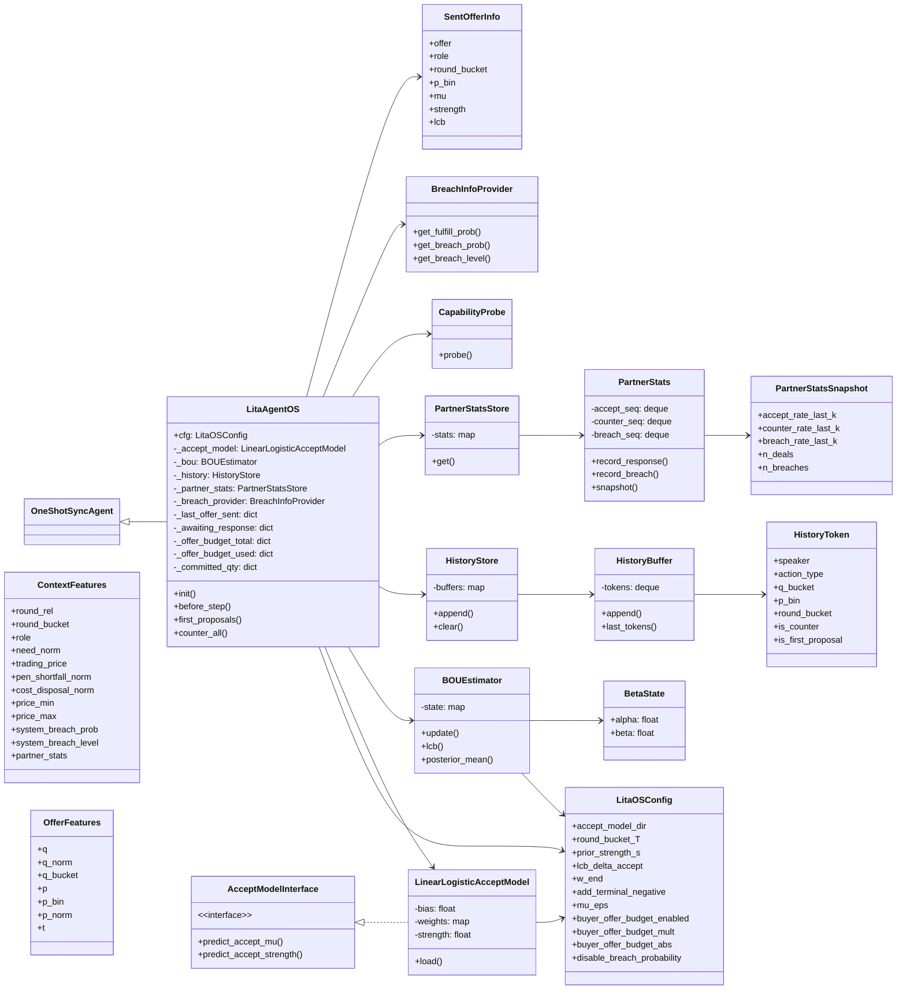
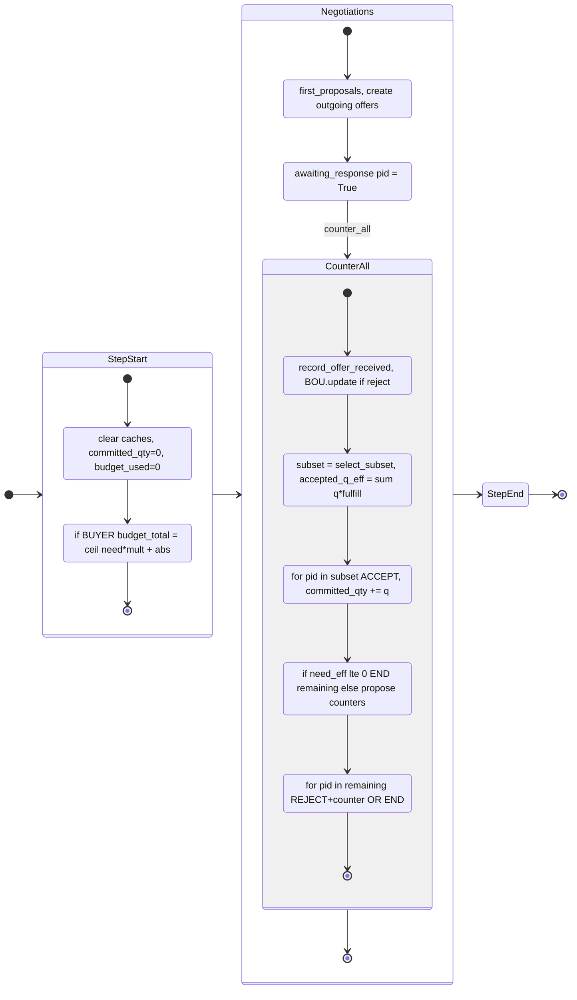
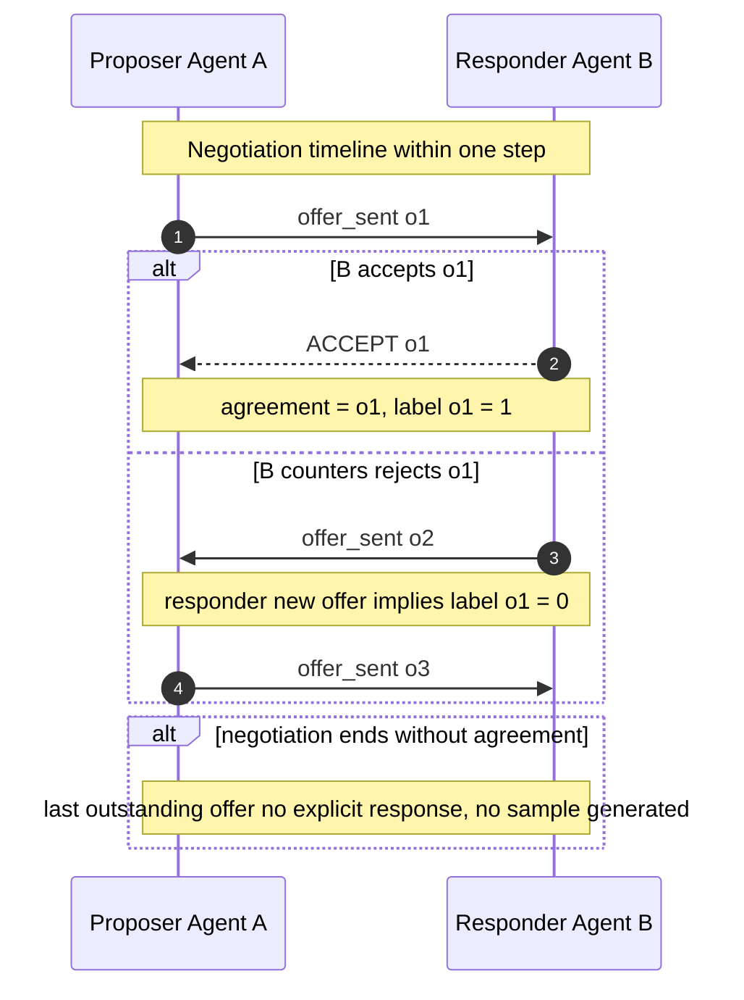
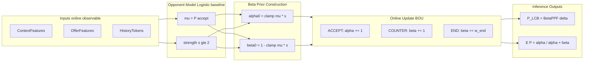
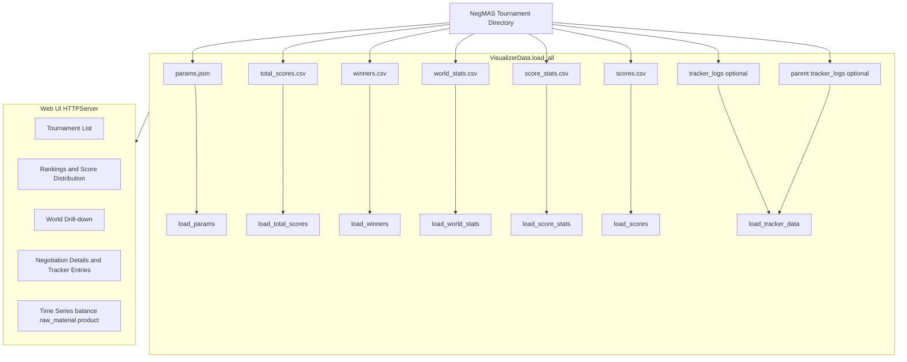

Design and Implementation of Hierarchical Reinforcement Learning Agent for Complex Dynamic Supply Chain Management: A Case Study on SCML 2025

## 摘要 (Abstract)

供应链管理（SCM）具有强不确定性、长程依赖与多方博弈特性。SCML 2025 标准赛道进一步引入非易腐库存与期货合约，使制造商在多线程并发谈判中同时受库存、产能与现金流约束，传统端到端强化学习易出现探索风险与训练不稳定。本文提出 HRL-XF（Hierarchical Reinforcement Learner Extended for Futures）框架，将问题拆解为不同时间尺度与不同职责的层级模块：L1 安全层以确定性规则构建 Safety Mask/Shield，仅输出可行性约束（Q_safe/Q_safe_sell、B_free、time_mask 等）并对动作进行硬裁剪；L2 战略层在日尺度生成目标信号以处理跨期规划与期货交易；L4 层重构为“全局监控器 + 优先级协调器”：L4GlobalMonitor 维护全局资源承诺并广播约束状态，GlobalCoordinator 基于显式线程特征输出每线程优先级 $\alpha$，作为 L3 的条件输入而非对动作进行直接调制；L3 执行层采用 Decision Transformer 直接输出符合 SAO 协议语义的动作（ACCEPT/REJECT+counter/END），并在 L1 安全掩码下进行一致性的动作解码。

在方法论方面，我们给出将标准赛道的多线程谈判建模为（线程级）Dec-POMDP/部分可观测随机博弈的形式化，并说明其可自然落地为 CTDE 框架下的 MAPPO 在线优化：线程共享策略、集中式 critic 利用全局广播状态进行优势估计，从而在非稳态对手与强约束环境中保持训练稳定。

在工程与实证方面，本文首先系统总结中期之前的启发式代理体系（Y 系列与 CIR 系列），作为安全规则来源与专家数据来源；其次基于 SCML Analyzer 对 SCML 2024 冠军 PenguinAgent 进行安全性审计，定位到三处导致“必定违约”accept/offer 的代码缺陷，并提出两种修复（直接修复版 LitaAgent-H 与外接安全护盾版 LitaAgent-HS）。在官方规模 round-robin 设置下，LitaAgent-HS 将不安全行为降至 0%，并显著提升总分，验证了“确定性安全护盾 + 可学习策略”的有效性。

关键词：供应链管理；分层强化学习；安全约束；MAPPO；Decision Transformer；期货合约；SCML Analyzer

## 第一章 绪论 (Chapter 1: Introduction)（等待重写，要加入现有方法的问题等）

## 1.1 研究背景与意义

### 1.1.1 全球供应链管理的复杂性与智能化需求

供应链管理（Supply Chain Management, SCM）作为现代工业经济的神经系统，其稳定性与效率直接关系到企业的生存乃至国家的经济安全。随着全球化进程的深入，现代供应链呈现出高度的网络化、动态化和不确定性特征。从原材料采购、生产制造到分销物流，每一个环节都涉及复杂的决策过程。

然而，近年来，“牛鞭效应”（Bullwhip Effect）的加剧、突发公共卫生事件（如 COVID-19）、地缘政治冲突以及原材料价格的剧烈波动，使得传统的基于静态运筹优化（Operations Research）的供应链管理方法面临严峻挑战。传统的线性规划（Linear Planning）或模型预测控制（MPC）往往假设市场环境是稳态或准稳态的，难以应对突发的需求激增或供应中断。此外，在多方参与的供应链网络中，每个节点（企业）都是自利的智能体，它们之间的非合作博弈导致了全局最优解难以通过中心化调度实现。

在此背景下，基于多智能体系统（Multi-Agent Systems, MAS）和强化学习（Reinforcement Learning, RL）的自动化谈判与决策技术成为了研究热点。通过构建能够自主感知环境、预测市场趋势并与其他实体进行博弈的智能代理（Agent），有望在微观层面实现企业利润最大化，在宏观层面提升整个供应链生态的鲁棒性。

### 1.1.2 SCML：供应链多智能体博弈的顶级试验场

为了推动该领域的研究，国际人工智能联合会议（IJCAI）和国际自主智能体与多智能体系统会议（AAMAS）联合举办了自动谈判代理竞赛（ANAC）。其中的供应链管理联赛（Supply Chain Management League, SCML）是目前全球范围内最权威、最具挑战性的供应链多智能体博弈赛事。

SCML 提供了一个高度逼真的仿真环境，模拟了一个包含多个层级（Layer）的生产网络。在这个网络中，代理不仅要决定“生产什么”和“生产多少”，更核心的挑战在于通过**并发谈判（Concurrent Negotiation）来获取原材料和销售产品。与传统的单边库存管理不同，SCML 中的每一个订单都需要通过复杂的谈判协议（如交替出价协议）与另一个智能体达成。这意味着代理必须同时具备微观的博弈技巧**（如何出价）和**宏观的战略视野**（如何管理现金流和库存）。

SCML 2025 标准赛道（Standard Track）引入了颠覆性的规则变更：**非易腐库存（Non-Perishable Inventory）和期货合约（Futures Contracts）**。

1. **非易腐库存**：以往赛制中，当日未使用的原料或未售出的产品会贬值或消失，迫使代理追求“零库存”。而新规则允许长期持有库存，这引入了“囤货待涨”或“去库存避险”的跨期决策维度。  
     
2. **期货合约**：代理可以签署未来几十天后交付的订单。这使得当前的决策不仅影响即时收益，更锁定了未来的现金流和产能。

这种变化将环境性质从传统的“报童问题”（单次博弈）转变为具有**深层长程依赖（Deep Long-term Dependency）**的复杂序贯决策问题，对现有的代理架构提出了前所未有的挑战。

## 1.2 国内外研究现状与挑战

### 1.2.1 传统启发式代理及其局限性

在强化学习大规模应用之前，SCM 领域的自动化代理主要依赖于启发式规则（Heuristics）。这些规则通常基于领域专家的经验设计，具有计算开销小、可解释性强、行为下限有保证等优点。

然而，启发式方法在 SCML 2025 环境下面临严重瓶颈：

1. **缺乏适应性**：规则中的阈值（如目标利润率）通常是静态或基于简单统计（如移动平均）调整的。面对市场的非线性波动（如恶性通胀），规则系统往往反应滞后。  
     
2. **局部最优**：启发式算法通常将复杂问题分解为“谈判”、“生产”、“库存”三个独立模块进行贪心优化（Greedy Optimization），忽略了模块间的耦合效应。例如，谈判模块可能为了达成交易而接受低价订单，导致生产模块无利可图。  
     
3. **无法处理长程规划**：基于规则的代理很难通过显式的逻辑编写出“为了 30 天后的旺季而在今天亏本囤货”这样的复杂跨期策略。

### 1.2.2 2023-2024 年 SCML 冠军策略回顾

回顾近两年的 SCML 标准赛道，我们可以清晰地看到代理策略的演进路径。

* **SCML 2023 冠军：MyAgent (基于自适应阈值)** 2023 年的冠军代理主要采用了一种基于**接受度阈值（Acceptance Threshold）**的策略。该代理实时计算当前市场的供需比（Supply/Demand Ratio），据此动态调整其保留价格（Reservation Price）。其核心优势在于极高的谈判成功率，但在库存管理上较为被动，主要依赖“以销定产”的保守策略。  
    
* **SCML 2024 冠军：PenguinAgent (基于 ROI 驱动的保守主义)** *PenguinAgent* 代表了启发式策略的巅峰。其核心思想是**投资回报率（ROI）驱动的保守谈判**。  
    
  * **策略核心**：它不追求市场占有率，而是追求每一笔交易的确定性利润。它维护一个极其严格的内部估值模型，只有当一笔潜在交易的预期 ROI 超过动态设定的高阈值时，才会进行报价。  
      
  * **谈判机制**：采用了“时间相关的让步曲线”（Time-dependent Concession Curve），在谈判初期保持强硬，仅在截止时间临近时快速让步。  
      
  * **局限性**：尽管 *PenguinAgent* 极难破产，但其行为过于保守。在 SCML 2025 的期货市场中，如果不敢在低价时进行风险性囤货，将被那些敢于进行跨期套利的代理挤出市场。


* **其他典型策略：DecentralizingAgent** *DecentralizingAgent* 尝试将多线程谈判问题转化为多个独立的单线程谈判问题进行求解。它利用**高斯过程回归（Gaussian Process Regression）** 来预测对手的底价。这种方法在微观博弈上表现出色，但在处理宏观资金链断裂风险时往往显得脆弱。

### 1.2.3 强化学习在供应链中的应用难点

近年来，深度强化学习（DRL）在游戏（如 Go, Dota 2）领域取得了超越人类的成就，但在 SCM 领域的落地却步履维艰，主要面临三大难题：

1. **信用分配难题（Credit Assignment Problem）**：在 SCML 2025 中，代理可能在第 1 天支付现金买入原料（负奖励），经过 20 天的仓储，第 21 天生产，第 30 天售出（正奖励）。这种长达 30 天的奖励延迟使得传统的 Q-Learning 或 Actor-Critic 算法难以捕捉动作与后果的因果联系。  
     
2. **安全探索与冷启动（Safe Exploration & Cold Start）**：供应链环境对错误极其敏感。一个未经训练的 RL 代理在探索初期极易报出离谱的价格或承诺无法交付的订单，导致巨额违约金甚至直接破产。一旦破产，Episode 立即结束，代理无法获得后续的学习样本。  
     
3. **非稳态环境（Non-Stationarity）**：SCML 是多代理环境，随着训练的进行，对手策略也在不断变化（例如对手学会了针对性的压价），导致环境状态转移概率分布发生漂移，使得 RL 训练难以收敛。

## 1.3 本文主要研究内容

针对 SCML 2025 带来的新挑战以及现有方法的不足，本文旨在设计并实现一个兼具**规则安全性**与**学习适应性**的分层强化学习代理系统。

### 1.3.1 前期工作：启发式代理体系（中期前产出）

在进入 HRL-XF 强化学习阶段之前，我们完成了启发式代理体系的设计与迭代，形成 LitaAgent 系列：

(1) Y 系列：提出“采购三分法”（紧急/计划/可选囤货）与库存敏感的谈判策略，将 InventoryManager 的短缺预测与产能约束引入报价与接受决策；

(2) CIR 系列：提出“统一组合评估”的采购/销售策略，将同一时刻的多份报价视为组合优化问题，通过仿真推演与阈值退让实现更稳健的成交与风险控制；

(3) 工程模块化：InventoryManager、对手建模、让步策略、参数自适应等子模块形成可复用接口，为后续将学习模型替换进入系统提供了稳定工程底座。

这些前期工作在 HRL-XF 中承担三类角色：提供硬约束规则（L1 Safety Mask）、提供专家轨迹（离线 BC/取证）、以及提供并发谈判与库存耦合的工程经验（L4 线程特征与全局广播设计来源）。

### 1.3.2 HRL-XF 分层架构的设计（需要修改）

本文提出 HRL-XF（**Hierarchical Reinforcement Learner Extended for Futures**）四层分层架构，用于在“长程跨日规划 + 多线程并发谈判 + 强约束安全性”的条件下稳定学习与执行。与早期版本不同，**HRL-XF 的当前口径不再包含任何显式 Residual（基准+残差）动作叠加**：L3 直接输出合法的 SAOAction，L1 仅做安全约束与硬裁剪，L4 仅输出协调信号（broadcast 与优先级 $\alpha$），不做动作调制与顺序扣减式资源预留。

- **L1 安全层（Safety Mask/Shield）**：

  以确定性规则构建可行性边界，仅输出并维护约束（如 $Q_{\text{safe}}[\delta]$、$Q_{\text{safe\_sell}}[\delta]$、$B_{\text{free}}$、`time_mask`），并对 L3 输出动作执行硬约束校验与数量裁剪（clip）。**L1 不输出基准动作（baseline_action）**。

- **L2 战略层（Strategic Manager）**：

  在日尺度生成目标/意图信号 $g_d$，用于处理期货交易与跨日规划（例如囤货/去库存、跨期套利）。同时可结合势能整形（potential-based shaping）将长程收益更稳定地分配给每日决策。

- **L3 执行层（Executor, Decision Transformer）**：

  在谈判轮次尺度直接输出符合 SAO 协议语义的动作：

  $$\text{SAOAction} \in \{\text{ACCEPT}, \text{REJECT}+\text{counter}, \text{END}\}$$

  并在 L1 的 mask 下进行一致性解码（先选 op，再选交期桶，再生成 $q/p$，最后 clip）。

- **L4 全局协调层（Global Monitor + Coordinator）**：

  L4GlobalMonitor 维护公司级全局承诺与剩余资源并广播 $c_\tau$（如目标缺口、剩余安全量、剩余预算等）；GlobalCoordinator 基于线程显式特征集合输出每线程优先级

  $\alpha_{\tau,k} \in (-1,1)$,

  作为 L3 的条件输入以实现跨线程“软协调”。

### 1.3.3 分阶段训练范式与工程优化（需要修改）

为了解决 RL 难以收敛的问题，本文设计了一套“取证（Forensics） -> 剥离（Disentanglement） -> 预训练（Pre-training） -> 微调（Fine-tuning）”的训练流水线。 在工程层面，本文解决了 NegMas 仿真框架在大规模并行训练下的死锁（Hang）问题，提出了基于 **Loky 后端与 Monkey Patch** 的解决方案，确保了大规模数据采集的可行性。

### 1.3.4 SCML Analyzer 分析工具集的研发

针对现有生态中缺乏微观行为分析工具的痛点，本文设计并实现了 **SCML Analyzer**。该工具通过注入式 Tracker 技术，能够全生命周期地记录代理的每一次出价、库存变化和生产计划，并提供 Web 可视化服务。这不仅辅助了本研究的策略调试，也为社区提供了有价值的分析工具。

## 1.4 论文组织结构

本文共分为七章，组织结构如下：

* **第一章 绪论**：介绍研究背景、SCML 竞赛演进、现有策略分析及本文的研究目标与贡献。  
    
* **第二章 相关理论与技术基础**：详细阐述 SCML 2025 的规则机制，介绍强化学习、POMDP 及分层学习的理论基础。  
    
* **第三章 SCML 环境建模与问题定义**：将供应链环境形式化为 POMDP 模型，推导状态空间、动作空间、转移函数及基于势能整形的奖励函数。  
    
* **第四章 HRL-XF 分层代理架构设计**：深入剖析 HRL-XF 四层架构的设计细节，重点阐述安全护盾机制与网络的实现。  
    
* **第五章 系统实现与工程优化**：介绍 LitaAgent 的代码实现，详述分阶段训练流程的数据流水线，以及 SCML Analyzer 和 Loky Patch 的工程实现。  
    
* **第六章 实验设计与结果分析**：展示离线预训练与在线微调的实验结果，通过消融实验验证架构有效性，并进行极端行情下的案例分析。  
    
* **第七章 总结与展望**：总结全文工作，讨论现有不足，并对未来的研究方向（如 L4 神经化、OneShot 适配）进行展望。

# 第二章 相关理论与技术基础 (Chapter 2: Related Theory and Technical Foundation)（需要加入OneShot有关的相关理论基础，然后删掉Standard的内容）

本章首先详细阐述供应链管理联赛（SCML）的竞赛机制，特别是 2025 赛季引入的非易腐库存与期货合约规则，这构成了本文研究的特定领域背景。随后，本章将回顾强化学习的基础理论，重点介绍近端策略优化（PPO）和决策 Transformer（Decision Transformer），并深入探讨分层强化学习（HRL）的理论框架，为后续提出的 HRL-XF 架构奠定理论基石。

## 2.1 供应链管理联赛 (SCML) 机制详述

SCML 是基于 NegMAS（Negotiation Multi-Agent System）平台构建的复杂多智能体仿真环境 [4]。其核心目标是在模拟的生产网络中，通过自动化的谈判与生产调度，最大化代理（Agent）的长期累积收益。

### 2.1.1 赛道设置与生产图谱

SCML 竞赛分为两个主要赛道：**单次赛道（OneShot Track）和标准赛道（Standard Track）**。

* **单次赛道**：在单次赛道中，代理处于一个少量层级的生产图谱（Production Graph）中，必须进行短期的即时决策。没有期货合约，所有的产品都需要在谈判当天交付，主要考察的是代理的谈判能力与管理并发谈判的能力。是本文的研究重点。  
    
* **标准赛道**：在标准赛道中，代理处于一个多层级的生产图谱（Production Graph）中，必须进行长期的连续决策。由于代理可能会签订期货协议，因此在时空范围内管理生产和库存的能力非常重要。

**生产图谱定义**： SCML 环境可以被建模为一个有向无环图（DAG）$G = (V, E)$。

* **节点** $V$：代表生产网络中的不同工厂（代理）。图谱分为 $L_0, L_1, \dots, L_k$ 层。  
    
  * $L_0$ 层代理：原材料生产商，仅作为卖家。  
      
  * $L_k$ 层代理：最终产品制造商，面向外生消费者市场。  
      
  * 中间层代理（如 $L_1$）：既是买家也是卖家。它们需要从上一层购买输入品，经过生产线加工后，将输出品卖给下一层。


* **边** $E$：代表供应链中的物流和资金流方向。

*（此处建议插入图 2-1：SCML 生产图谱示意图，展示原材料流向及中间层代理的双重身份）*

**仿真流程**： 一场比赛通常持续 $T_{steps}$ 个仿真日（例如 100 天）。每一天 $t$ 被划分为严格的阶段：

1. **谈判阶段（Negotiation）**：代理之间交换报价，签订合同。  
     
2. **合同签署（Signing）**：确定的合同被写入账本。  
     
3. **生产调度（Production）**：代理决定如何分配库存进行生产。  
     
4. **履约与结算（Execution & Settlement）**：根据合同交付货物，转移资金。若违约则触发惩罚机制。

### 2.1.2 SCML 2025 的核心变革：库存与期货

与往届相比，SCML 2025 引入了两项改变环境性质的关键机制[7]，这使得环境从“类报童模型”转变为深层序贯决策问题。

#### 1. 非易腐库存 (Non-Perishable Inventory)

在 SCML 2024 及之前的规则中，当天未被使用的原材料或未售出的成品会直接丢弃或贬值归零。这迫使代理采取“零库存（Just-in-Time）”策略，极大地简化了状态空间。

SCML 2025 允许库存跨日持有，但需支付仓储成本 $C_{store}$：

$$C_{store}(t) = \sum_{g \in \mathcal{G}} \mu_g \cdot I_g(t)$$

其中 $I_g(t)$ 是商品 $g$ 在 $t$ 时刻的库存量，$\mu_g$ 是单位持有成本。 这一机制引入了**长程依赖（Long-term Dependency）**：代理可以选择在低价时囤积原料，以应对未来的价格上涨。这意味着 $t$ 时刻的决策（买入）可能旨在优化 $t+30$ 时刻的收益，传统的短视（Myopic）策略将不再有效。

#### 2. 期货合约 (Futures Contracts)

新规则允许代理签署在未来 $t + \delta$ 天交付的合同（$\delta > 0$）。

* **现货交易**：$\delta = 0$，即刻交付。  
    
* **期货交易**：$\delta > 0$，锁定未来的价格和数量。

期货市场的引入导致了状态空间的维度爆炸。代理不仅要管理当前的物理库存，还要管理**虚拟库存（Virtual Inventory）**，即未来的交付义务。这要求代理具备构建“订单簿（Order Book）”并基于此进行现金流预测的能力。

### 2.1.3 谈判协议

SCML Standard 采用交替出价（Alternating Offers）类协议，在工程实现上遵循 SAO（Single Alternating Offers）语义。设谈判双方为 $i$ 与 $j$，在轮次（或事件步）$\tau$：

1. **出价（Offer）**：一方提出报价

   $$o_{\tau}^{i \rightarrow j} = \langle q, p, t_{\text{abs}} \rangle$$

   其中 $q$ 为数量（quantity）、$p$ 为单价（unit price）、$t_{\text{abs}}$ 为绝对交付日（delivery day）。

2. **响应（Response）**：接收方 $j$ 对当前报价作出三类响应之一：

   - **接受（ACCEPT）**：接受当前报价，谈判结束并形成合同。

   - **拒绝并继续（REJECT）**：拒绝当前报价，谈判进入下一轮；接收方可以在下一轮提出反报价（counter-offer）。

   - **结束谈判（END）**：显式终止谈判，不再继续协商。

3. **反报价（Counter-offer）**：在我们的策略空间约束中，为了减少“无信息拒绝”并保持训练/执行一致性，我们将 **REJECT 约束为总是携带 counter-offer**：

   $$\text{REJECT} \Rightarrow \text{counter}(q', p', t'_{\text{abs}})$$

   这是一种“策略约束”，并非协议本身强制要求；其目的在于减少无效轮次并增强学习信号密度。

谈判设有严格的截止时间（deadline）。若在截止时间前未达成一致，则谈判终止且不产生合同；在实践中这会引发“临近截止让步加速”的常见现象（time-dependent concession）。

## 2.2 强化学习基础

强化学习（RL）旨在通过智能体与环境的交互来学习最优策略，以最大化累积期望回报。

### 2.2.1 部分可观察马尔可夫决策过程 (POMDP)

由于在 SCML 中，代理无法观测到竞争对手的私有信息（如库存水平、资金余额、保留价格），该问题不能简单建模为马尔可夫决策过程（MDP），而必须建模为**部分可观察马尔可夫决策过程 (POMDP)** [23]。

POMDP 由七元组 $\langle \mathcal{S}, \mathcal{A}, \mathcal{T}, \mathcal{R}, \Omega, \mathcal{O}, \gamma \rangle$ 定义：

* $\mathcal{S}$：环境的真实状态空间（包含所有代理的私有状态）。  
    
* $\mathcal{A}$：动作空间。  
    
* $\mathcal{T}(s'|s,a)$：状态转移概率函数。  
    
* $\mathcal{R}(s,a)$：奖励函数。  
    
* $\Omega$：观测空间（代理可见的局部信息）。  
    
* $\mathcal{O}(o|s',a)$：观测概率函数。  
    
* $\gamma \in [0,1]$：折扣因子。

在 POMDP 中，代理无法直接获知 $s_t$，必须基于历史观测序列 $h_t = (o_1, a_1, \dots, o_t)$ 来构建策略 $\pi(a_t|h_t)$。

### 2.2.2 近端策略优化 (PPO)

近端策略优化（Proximal Policy Optimization, PPO）是目前最流行的基于策略梯度（Policy Gradient）的算法之一[19]，以其在连续控制任务中的稳定性和高效性著称。

PPO 的核心思想是限制策略更新的步长，防止新策略 $\pi_\theta$ 偏离旧策略 $\pi_{\theta_{old}}$ 太远而导致性能崩溃。其目标函数包含一个裁剪项（Clipped Surrogate Objective）：

$$L^{CLIP}(\theta) = \hat{\mathbb{E}}_t \left[ \min(r_t(\theta)\hat{A}_t, \text{clip}(r_t(\theta), 1-\epsilon, 1+\epsilon)\hat{A}_t) \right]$$

其中：

* $r_t(\theta) = \frac{\pi_\theta(a_t|s_t)}{\pi_{\theta_{old}}(a_t|s_t)}$ 是新旧策略的概率比。  
    
* $\hat{A}_t$ 是优势函数估计（Advantage Estimation），通常使用 GAE (Generalized Advantage Estimation) 计算。  
    
* $\epsilon$ 是裁剪超参数（通常设为 0.2），用于通过截断限制 $r_t(\theta)$ 的范围。

在本文的 HRL-XF 架构中，**L2 战略层**采用了 PPO 算法。L2 层的任务是输出连续的宏观目标向量（如目标库存量、资金限额），PPO 能够很好地处理这种连续动作空间，并保证长程策略学习的稳定性。

### 2.2.3 Decision Transformer

Decision Transformer (DT) 提出了一种颠覆性的范式：将强化学习问题转化为条件序列建模问题（Conditional Sequence Modeling）[16]。

与传统的基于价值函数（如 DQN）或策略梯度（如 PPO）的方法不同，DT 利用 Transformer 架构（GPT 风格）直接根据过去的状态、动作和**期望回报（Target Return）**来预测下一个动作。

输入序列（Trajectory）被组织为 Token 流：

$$\tau = (\hat{R}_1, s_1, a_1, \hat{R}_2, s_2, a_2, \dots, \hat{R}_T, s_T, a_T)$$

其中 $\hat{R}_t = \sum_{k=t}^T r_k$ 是从 $t$ 时刻开始的剩余累积回报（Returns-to-go）。

模型的目标是最大化以下似然函数：

$$\max_\theta \sum_{t=1}^T \log P_\theta(a_t | \hat{R}_1, s_1, a_1, \dots, \hat{R}_t, s_t)$$

*（此处建议插入图 2-2：Decision Transformer 的因果注意力机制示意图）*

在 SCML 这种具有**极长因果链条**（买入原料 $\rightarrow$ 生产 $\rightarrow$ 销售，跨度可能达 30 步）的环境中，DT 的自注意力机制（Self-Attention）能够比传统的 LSTM 更好地捕捉时间跨度极大的信用分配关系。本文的 **L3 执行层** 采用了简化的 DT 结构来处理微观谈判序列，根据 L2 设定的目标来生成微观动作。

## 2.3 分层强化学习（HRL）、安全约束与 CTDE/MAPPO

### 2.3.1 分层强化学习与时间尺度分解

分层强化学习的核心是引入不同时间尺度与不同抽象层级的策略，使高层策略在较慢时间尺度上产生“意图/子目标/调度信号”，低层策略在较快时间尺度上执行具体动作。形式上可表示为：

高层策略：$$\pi_{\text{high}}(g_t | s_t^{\text{macro}})$$，以日尺度产生目标/意图 $g_t$；

低层策略：$$\pi_{\text{low}}(a_{t,k} | o_{t,k}, g_t, c_t)$$，以谈判轮次尺度为每个并发线程 $k$ 产生动作 $a_{t,k}$；

其中 $c_t$ 可包含跨线程共享的全局约束信号（例如资源剩余、缺口、预算）。

因此，当环境天然存在多时间尺度（“日级库存/现金结算”与“轮次级谈判出价”）且存在并发子任务（多对手谈判线程）时，HRL 能降低单一策略的建模难度与信用分配难度。

### 2.3.2 安全约束与 Shielding（Safety Mask/Shield）

在强约束经济系统中，纯探索可能导致不可逆的破产或高额短缺惩罚。本文采用 Safety Mask/Shield 思想：将可行性约束（库存可交付、资金可支付、交期可行等）以确定性规则编码为掩码与硬裁剪算子，使学习策略只在“可行集”上优化收益，从而显著降低冷启动阶段的灾难性探索风险。与将启发式策略作为“基准动作”不同，本文最新设计中 L1 不输出任何基准动作，仅输出可行性边界并对动作进行硬约束校验。

### 2.3.3 CTDE 与 MAPPO：面向多线程并发谈判的在线学习框架

SCML 标准赛道中，制造商在同一仿真日会与多个对手并发谈判，多个谈判线程共享同一组库存、产能与资金约束，这导致线程间存在强耦合与竞争。集中训练、分散执行（CTDE）框架允许在训练时利用全局信息学习更稳定的价值函数，而在执行时每个线程仍只依赖其局部可观测信息做决策。MAPPO（Multi-Agent PPO）是 CTDE 下常用的稳定在线算法：各线程共享或分别拥有策略网络，使用集中式 critic 估计优势函数，并采用 PPO 的 clipping 机制抑制策略剧烈更新，适合对手策略非稳态、观测部分可得且训练高方差的场景。

# 第三章 SCML OneShot 环境建模与问题定义(Chapter 3: SCML OneShot Environment Modeling and Problem Definition)

SCML OneShot 赛道是一个多智能体、强约束惩罚、部分可观测的自动谈判环境。与 Standard 赛道不同，OneShot 不允许就未来交付日进行协商，合同交付时间被限定在当前 step，因此代理的核心难点并非跨期规划，而是**同一 step 内的并发谈判耦合**：多个对手同时交互，任何一次接受/反报价都将改变剩余需求与风险边界，并通过 shortfall/disposal 等机制影响最终利润。

本文最终采用 D-NB（Neural-Bayesian Opponent Model + Heuristic Planner）架构，因此本章从 D-NB 的统一口径出发，对 OneShot 环境进行形式化建模与问题定义。与早期 HRL-XF 设想不同，我们不再引入分层状态/动作、线程级 Dec-POMDP 或 CTDE 叙述，而是将任务表述为：在部分可观测条件下，基于当前可观测上下文与谈判历史，输出对每个谈判的 SAO 响应动作（ACCEPT/REJECT+counter/END），并以 step 级利润最大化为目标。

**表 3.1 符号表（本章统一使用）**

| 符号 | 含义 |
| :---- | :---- |
| $d \in \{0,\dots,D-1\}$ | 仿真 step 索引；一个 episode 共 $D$ 个 step |
| $\mathcal{N}_d$ | 第 $d$ 个 step 内同时进行的谈判集合（按 partner/机制 id 标识） |
| $j \in \mathcal{N}_d$ | 一个具体谈判（与某个对手的一个 negotiation） |
| $o^{in}_{d,j} = \langle q,p,t \rangle$ | 在谈判 $j$ 中观测到的对手报价（数量/单价/时间）。OneShot 下 $t$ 被限制为当前 step（可视为常量） |
| $a_{d,j}$ | 我方对谈判 $j$ 的响应动作：ACCEPT / REJECT+counter / END |
| $o^{out}_{d,j} = \langle q',p',t \rangle$ | 当 $a_{d,j} = \text{REJECT}$ 时给出的 counter-offer（同样满足 OneShot 的当日交付约束） |
| $c_{d,j}$ | 上下文特征（ContextFeatures）：谈判进度、角色、需求归一化、价格边界、惩罚参数、系统 breach 信息、对手统计等 |
| $f(o)$ | 报价特征（OfferFeatures）：$q/q_{norm}/q_{bucket}$，$p/p_{norm}/p_{bin}$，以及 $t$（常量） |
| $h_{d,j}$ | NEGOTIATION scope 历史 token 序列（最近 $N$ 条事件 token） |
| $y_{d,j} \in \{0,1\}$ | “对手是否接受我方某次报价”的伯努利变量（accept=1） |
| $\mu_{d,j} \in (0,1)$ | 接受概率模型输出的先验：$\mu = \hat{P}(y=1 \mid c,f,h)$ |
| $s \ge 2$ | 先验强度（等效样本量），用于构造 Beta 先验（可设为常数） |
| $\text{Beta}(\alpha, \beta)$ | 接受概率的后验分布（BOU） |
| $P^{LCB}_{sign}$ | 对 $P(\text{accept})$ 的下置信界（Beta 分位点，参数 $\delta$） |
| $P_{fulfill} \in [0,1]$ | 履约概率（由系统 breach 信息或模型给出；若不可得则回退为 1） |
| $q^{eff}$ | "有效成交量"近似：折扣签约概率与履约风险后的有效数量 |
| $\Pi_d$ | 第 $d$ 个 step 的利润（收入 − 成本 − 惩罚） |

## 3.1 OneShot 环境结构与谈判流程

### 3.1.1 并发谈判与同步决策窗口

在每个 step $d$，代理会与多个对手同时开启谈判，形成谈判集合 $\mathcal{N}_d$。OneShot 的同步接口将决策集中在两个窗口中完成：

1. **首轮发单窗口**：对每个谈判给出首轮报价（proposal），形成一组 $\{o^{out}_{d,j}\}_{j \in \mathcal{N}_d}$；  
2. **统一响应窗口**：观测对手当前报价集合 $\{o^{in}_{d,j}\}_{j \in \mathcal{N}_d}$，并输出联合响应动作向量 $a_d = \{a_{d,j}\}_{j \in \mathcal{N}_d}$。

本章将“并发”视为同一 step 内的**联合决策问题**：虽然每个谈判输出一个动作分量，但它们共享同一需求与风险边界，因此必须在同一口径下被一致地评估与约束。

（此处建议插入图 3-1：OneShot step 内的并发谈判与两阶段决策窗口示意图）

### 3.1.2 SAO 响应语义：动作与 offer 的区分

在本文统一口径中：

* **动作（action）**仅有三类： $a_{d,j}\in\{\text{ACCEPT},\ \text{REJECT}+\text{counter},\ \text{END}\}$。  
* **offer 不是动作**：offer 仅作为事件字段与 REJECT 的参数字段存在。也即，REJECT 动作必须携带一个 counter-offer $o^{out}_{d,j}$，而 ACCEPT/END 不需要生成新的 offer。

此外，本文严格区分两个概念：

* **签约/接受（sign/accept）**：对手是否接受某个报价（动作层面的接受）；  
* **履约/违约（fulfill/breach）**：合同签署后是否发生违约或交付不足。 二者是不同随机过程：即使“被接受”，也可能“未履约”；因此在建模与策略评估中必须分离处理。

### 3.1.3 主要不确定性来源

OneShot 的关键不确定性可归纳为两类：

1. **对手接受行为不确定**：同类报价在不同对手、不同谈判进度下的接受概率不同；  
2. **履约风险不确定**：即使签约，也可能发生 breach，导致有效交付量下降并触发 shortfall 惩罚。

这两类不确定性共同决定了“一个报价的真实价值”：既取决于名义价格与数量，也取决于被接受与被履约的概率。

## 3.2 统一的 POMDP 形式化

从单一代理视角（把其他代理视作环境的一部分），OneShot 可建模为 POMDP：

$$\mathcal{M}=\langle \mathcal{S},\mathcal{A},\mathcal{O},T,\Omega,R,H\rangle$$

* **状态空间 $\mathcal{S}$**：包含我方可观测的外生变量（需求、价格边界、惩罚参数等），以及对手的隐变量（其接受概率函数、让步规律、履约倾向等）。  
* **观测空间 $\mathcal{O}$**：我方在 step 内可观测的信息集合，包括每个谈判的当前报价、谈判进度、外生价格与惩罚参数、以及谈判历史事件序列。  
* **动作空间 $\mathcal{A}$**：联合动作向量空间。对每个谈判 $j$，动作语义为 SAO 响应三选一：$a_{d,j} \in \{\text{ACCEPT}, \text{REJECT}+\text{counter}(\langle q',p',t \rangle), \text{END}\}$。  
* **转移函数 $T$**：由仿真器决定，包含谈判推进、签约与结算、违约触发与惩罚结算等规则。  
* **回报函数 $R$**：本文不进行复杂奖励整形，仅使用 step 级利润口径（见 3.5）。

说明：本文不再采用 HRL-XF 的线程级在线 RL 训练与集中式价值估计，因此 **不需要** Dec-POMDP、CTDE、线程局部观测与集中式 critic 的形式化。我们将不确定性主要放在“对手接受概率与履约风险”的信念建模上，并通过 Beta-BOU 在线更新进行校准。

---

## 3.3 状态与观测表示：总体状态

在 D-NB 中，我们将每个谈判的可观测信息组织为三部分：上下文 $c$、当前报价特征 $f(o)$、历史序列 $h$。第 $d$ 个 step 的总体观测可写为集合：

$$o_d=\Big\{\big(c_{d,j},\ f(o^{in}_{d,j}),\ h_{d,j}\big)\Big\}_{j\in\mathcal{N}_d}$$

### 3.3.1 上下文特征 $c_{d,j}$（ContextFeatures）

上下文特征用于刻画“当前谈判处境”，典型包含：

* 谈判进度（如 $\text{round\_rel}$）；  
* 角色（BUYER/SELLER）与剩余需求归一化（$\text{need\_norm}$）；  
* 价格边界（$p_{\min},p_{\max}$）、参考市场价（如 $\text{trading\_price}$）；  
* 惩罚结构（shortfall penalty/ disposal cost相关归一化量）；  
* 系统 breach 信息（若可得）与对手统计特征（近期 accept/counter/breach 统计快照）。

这些特征均来源于在线可观测信息，保证训练与推理的一致性。

### 3.3.2 报价特征 (f(o))（OfferFeatures）

报价 $o=\langle q,p,t\rangle$ 在 OneShot 下满足“当日交付”约束，因此时间 $t$ 可视为常量字段。核心可学习部分集中在 $(q,p)$，并使用归一化与离散化来提高鲁棒性：

* 数量：$q$、$q_{norm}$、$q_{bucket}$；  
* 价格：$p$、$p_{norm}$、$p_{bin}$（特别用于窄价差场景的二值化表示）。

### 3.3.3 历史序列 $h_{d,j}$（HistoryTokens）

为利用谈判内的短序列信息（尤其在 OneShot 中谈判轮次短、信息密度高），我们引入 NEGOTIATION scope 的历史 token 序列 $h_{d,j}$。token 序列采用固定 schema 表示最近 $N$ 条事件，字段包括：

* speaker（ME/OPP）；  
* action_type（OFFER / ACCEPT / END）；  
* is_counter / is_first_proposal；  
* $(q_{\text{bucket}}, p_{\text{bin}}, \text{round\_bucket})$。

该 token schema 既可作为轻量模型的辅助输入，也为 Transformer 等序列模型提供统一接口。

## 3.4 动作空间：总体动作定义

对每个谈判 $j$，动作定义为 SAO 响应三选一：

$$a_{d,j} \in \{\text{ACCEPT}, \text{REJECT}+\text{counter}(\langle q',p',t \rangle), \text{END}\}$$

OneShot 下，counter-offer 的时间字段受限于当前 step，因此动作的有效自由度主要来自 $q'$ 与 $p'$。在同步接口中，代理需要对所有谈判同时输出响应，因此联合动作 $a_d$ 的质量取决于其在全局需求与惩罚结构下是否一致、是否避免并发超量导致的 shortfall/disposal 风险。

## 3.5 目标函数

本文不再构造强化学习意义上的密集奖励函数，而直接以比赛的经济目标为导向：最大化 step 级利润。我们采用如下统一口径：

$$\Pi_d = \text{Revenue}_d - \text{Cost}_d - \text{Penalty}_d$$

其中：

* **Revenue_d**：本 step 内实际完成销售带来的收入；  
* **Cost_d**：本 step 内实际完成采购带来的支出（或等价成本）；  
* **Penalty_d**：由 shortfall 与 disposal 等机制带来的惩罚。

为了在谈判阶段评估候选动作的价值，常用的简化形式是以外生价格为基准写“单位利润”：

* SELLER 侧：$\text{profit} = p_{sell} - p^{exo}_{in}$；  
* BUYER 侧：$\text{profit} = p^{exo}_{out} - p_{buy}$。
并在同一口径下纳入 shortfall/disposal 惩罚，构造可比较的"决策评分"：$\text{Score} = \text{Utility} - \text{ShortfallPenalty} - \text{DisposalPenalty}$，其中 Utility 近似为 $\text{profit} \times q^{eff}$，而惩罚项以有效量与需求缺口/超额为依据（见 3.6.4 的 $q^{eff}$ 定义）。
---

## 3.6 对手接受概率建模：Logistic / Transformer + Beta-BOU

本节是 D-NB 在 OneShot 环境下的核心问题定义：**对手是否接受某个报价**是影响利润的关键随机因素。我们将其显式建模为伯努利变量，用可学习模型给出先验概率，再用 Beta-BOU 在线校准为可用后验，并以 LCB 形式提供保守估计以控制并发风险。

### 3.6.1 接受事件：伯努利随机变量与标签口径

对任意我方发出的报价 $o$，定义 $y=\mathbb{I}[\text{opponent accepts }o]\in\{0,1\}$。

我们采用一致的口径：

* $y=1$ 表示对手在动作层面接受该报价（形成 agreement）；  
* $y=0$ 表示该报价被对手明确拒绝（典型体现为对手发出 counter-offer）；  
* END/timeout 不默认当作拒绝样本，以避免将“无响应”噪声注入监督信号与在线更新。

该定义使得“接受概率模型”与 OneShot 日志的结构（offer/counter/agreement/end）天然对齐。

### 3.6.2 Logistic 接受概率模型

我们将接受概率建模为条件概率：$\mu=\hat{P}(y=1\mid c_{d,j}, f(o), h_{d,j})$。

基线模型采用线性 Logistic 形式：$\mu=\sigma\left(b+\sum_{k} w_k x_k\right)$，其中 $x$ 为由 ContextFeatures 与 OfferFeatures 组成的特征向量（可选加入对手统计与系统 breach 信息等）。Logistic 的优势在于：训练成本低、推理开销小、输出可解释，并且便于与 Beta 先验强度配合形成可校准概率。

### 3.6.3 Beta-BOU：在线贝叶斯校准与 LCB

离线训练的 $\mu$ 在面对新对手或新分布时可能出现系统性偏差。为此，我们使用 Beta-Bernoulli 共轭形式进行在线校准：对离散键 $key = (pid, role, round\_bucket, p\_bin, q\_bucket^{coarse})$ 维护后验 $P(\text{accept}) \sim \text{Beta}(\alpha, \beta)$。

**先验构造**：将 $\mu$ 视为先验均值，将 $s$ 视为等效样本量（强度）：$\alpha_0 = \mu \cdot s$，$\beta_0 = (1-\mu) \cdot s$，并对 $\mu$ 做数值裁剪以避免 0/1 退化。

**在线更新**（对手作为 responder 时触发）：

* 观测 accept：$\alpha \leftarrow \alpha + 1$；  
* 观测 reject/counter：$\beta \leftarrow \beta + 1$；  
* 对 END/timeout 可选“弱负更新”以表达“未被接受”的软证据。

**保守估计（LCB）**：为控制并发超量风险，我们使用 Beta 分位点作为下置信界：$P^{LCB}_{sign} = \text{BetaQuantile}(\alpha, \beta; \delta)$，其中 $\delta \in (0,1)$ 是风险偏好参数。LCB 的意义在于：当数据稀疏或模型偏差较大时，优先避免过度自信造成的系统性超量签约。

### 3.6.4 从概率到数量：有效成交量 $q^{eff}$

在并发谈判中，策略需要比较"不同报价组合"的价值。直接用名义数量 $q$ 会忽略接受与履约风险，因此我们引入有效成交量近似：

* 对我方发出的报价（存在被接受概率）：$q^{eff} = q \cdot P^{LCB}_{sign} \cdot P_{fulfill}$。  
* 对我方接受对手报价（签约已确定）：$q^{eff} = q \cdot P_{fulfill}$。

其中 $P_{fulfill}$ 可来自系统 breach 信息（若可得），否则回退为 1。这样，利润项与惩罚项都可以在同一口径下用 $q^{eff}$ 来评估，从而把"不确定性"自然地纳入决策评分（见 3.5）。

### 3.6.5 Transformer 接受概率模型

在 OneShot 中，谈判轮次短但信息密度高，单纯的手工特征可能难以捕捉对手让步与反应模式。为此，我们将接受概率模型抽象为可替换接口，并提出 Transformer 作为升级方向：将谈判表示为 token 序列建模问题。

**输入序列**由两部分构成：
1. Context token：承载 $c_{d,j}$ 的关键字段（round_bucket、role、need_norm、价格边界、惩罚参数、对手统计等）；  
2. Event tokens：最近 $N$ 条 HistoryTokens（speaker、action_type、is_counter、q_bucket、p_bin、round_bucket 等）。

Transformer 通过自注意力在序列上建模"对手对我方报价的反应规律"，输出 $\mu_{accept}$，再与 Beta-BOU 结合实现在线校准。这样的设计既保持了 D-NB 的"模型可替换"特性，也为后续更强泛化能力的对手模型提供了统一建模框架。

## 3.7 本章小结

本章面向 SCML OneShot 赛道给出了统一的环境建模与问题定义：将任务表述为 POMDP 下的并发联合决策，观测由上下文/报价特征/谈判历史组成，动作以 SAO 响应（ACCEPT/REJECT+counter/END）定义，目标函数以 step 级利润（收入−成本−惩罚）刻画。更重要的是，本章将“对手接受行为不确定性”显式建模为伯努利随机变量，并提出 Logistic/Transformer 的接受概率模型与 Beta-BOU 在线校准机制，为后续 D-NB 的组合选择与风险控制提供统一数学口径。

# 第四章 D-NB 代理架构设计 (Chapter 4: D-NB Architecture for LitaAgent-OS)

针对 SCML OneShot 赛道“并发谈判 + 强约束惩罚 + 对手异质性”的结构特征，本章给出 D-NB 架构（Neural-Bayesian Opponent Model + Heuristic Planner）的系统化设计与工程落地方式。与早期 HRL-XF 强依赖端到端强化学习不同，D-NB 将核心难点拆解为两个互补模块： (1) **对手接受行为的可学习预测（Neural Opponent Model）**，输出对手接受某个报价的概率； (2) **在线贝叶斯校准与风险规避（Bayesian Online Update, LCB）**，把“离线模型的系统性偏差”在对局过程中快速纠正为可用的保守估计；在此之上再通过 (3) **启发式规划器（Heuristic Planner）**完成并发谈判下的组合选择、让步与止损。

在实现层面，D-NB 已在 `LitaAgentOS`（OneShot 代理）中集成，并以“动作层面的 ACCEPT/REJECT/END”为统一决策口径：报价（offer）仅作为事件字段，不被视为独立动作，从而保证数据、训练与在线推理的一致性。

【图 4-1 建议插入位置】D-NB 决策流水线总览：CapabilityProbe/BreachInfoProvider → AcceptModel → BOU(LCB) → Planner(首轮/子集选择/反报价) → SAOResponse。

## 4.1 架构总览：D-NB 的三层闭环

D-NB 的整体闭环可概括为：**“预测—校准—决策”**。

1. **预测（Opponent Model）**：给定上下文特征 $c$、候选报价 $o = \langle q,t,p \rangle$ 与谈判历史 $h$，接受模型输出 $\mu = \hat{P}(\text{accept} \mid c,o,h) \in (0,1)$ 并同时输出强度参数 $s \ge 2$，作为在线贝叶斯先验的"等效样本量"。  
     
2. **校准（BOU + LCB）**：对每个对手、角色与离散桶（时间桶、价格桶、数量粗桶）维护 Beta 后验 $P(\text{accept}) \sim \text{Beta}(\alpha, \beta)$ 并用分位点作为保守估计 $P^{\text{LCB}}_{\text{sign}} = \text{BetaQuantile}(\alpha, \beta; \delta)$ 以抵御冷启动阶段的过度自信与模型失配。  
     
3. **决策（Heuristic Planner）**：在并发谈判中同时处理两类决策：  
     
* **首轮发单（first_proposals）**：在多个对手间分配报价资源，兼顾“有效成交量”与“风险/惩罚结构”；  
* **来单响应（counter_all）**：对同一角色（BUYER/SELLER）的多个对手来单做**子集选择**（哪些直接 ACCEPT），其余对手给出 REJECT+counter 或 END，并对“是否还有必要继续谈判”施加可达性（reachability）约束。

此外，为应对 OneShot 的并发特性，系统引入了三类“账本型风控”：

* **Offer Budget**：限定当天（step）发出的“累计报价量”上限，避免多波次发单导致的 exposure 叠加；  
* **Committed Book**：记录已签约数量（不可撤回），用于闭环修正剩余需求；  
* **Exposure Book（设计/实现合并）**：记录所有尚未收到回应的已发报价，并基于 $P^{\text{LCB}}_{\text{sign}}$ 或后验均值估计“待成交的期望量”，从而在下一波报价中扣除潜在成交带来的资源占用。

## 4.1.1 决策流水线数学描述与接口落点

在 OneShot 赛道中，一个仿真 step 内通常包含：并发谈判开启 → 我方首轮报价 → 对手回价/接受/结束 → 我方统一响应。D-NB 将其映射为如下流水线：

**(0) 初始化（init）** 启动时探测系统是否提供 breach 信息接口，并建立统一访问器；同时加载 accept 模型权重（缺失则回退默认权重）。

**(1) 日内重置（before_step）** 清空本 step 的谈判缓存与历史；重置 offer budget 与 committed book，用于后续的“闭环需求计算”。

**(2) 首轮报价（first_proposals）** 对每个活跃谈判对象生成首轮 offer；BUYER 侧可以根据惩罚结构选择更激进价格以提高被响应概率。

**(3) 统一回合响应（counter_all）** 对手回合到来时，我们一次性收集所有 incoming offers，并按角色分别处理：

* 用子集选择策略挑出要直接 ACCEPT 的对手集合 $S$；  
* 对 $S$ 外的对手，要么发 counter-offer（REJECT + counter），要么直接 END；  
* 若已满足目标（或有效满足），则对剩余对手执行 END（reachability constraint）。

**(4) 结果回写（on_negotiation_success / failure）** 当对方接受我方报价或谈判失败时，更新 committed book 与 BOU 后验（accept/reject/可选的 terminal negative），并写入 partner 统计与历史 token。

## 4.2 Neural Opponent Model：接受概率模型与特征构建

### 4.2.1 接口统一与可替换性

D-NB 将“对手是否接受我方报价”的预测抽象为 AcceptModelInterface： $$\texttt{predict\_accept\_mu}(c,o,h)\rightarrow \mu,\quad \texttt{predict\_accept\_strength}(c,o,h)\rightarrow s$$ 该抽象保证 Logistic 与 Transformer 等模型可在不改动 Agent 主逻辑的情况下切换，保持工程可维护性与实验可复现性。

### 4.2.2 线性 Logistic 基线模型

当前实现采用线性 Logistic 作为基线，计算形式为 $\mu=\sigma(b+\sum_j w_j x_j)$，其中 $x_j$ 来自上下文与报价的拼接特征。其优势是训练成本低、在线推理快，且便于与 BOU 的 Beta 先验强度直接对齐。

### 4.2.3 Context/Offer/History 三类输入

为了保证“只用在线可观测信息”，输入被拆成三部分：

1. **Context（上下文）**：包含谈判进度 $\text{round\_rel}$、离散桶 $\text{round\_bucket}$、角色（BUYER/SELLER）、剩余需求归一化、市场/惩罚系数、价格边界、系统 breach 信息（可选）以及 partner 统计（如近期接受率/反报价率）。  
     
2. **Offer（报价）**：对 $(q,p,t)$ 做归一化与离散化：$q_{\text{norm}}$、$q_{\text{bucket}}$、$p_{\text{norm}}$、$p_{\text{bin}}$ 等，以适配窄价差市场与整数化约束。  
     
3. **History（NEGOTIATION scope）**：使用固定长度 token 序列表示双方交互历史。为减少口径分叉，history token 的 `action_type` 仅取 {OFFER, ACCEPT, END}，REJECT 只在 response 字段中出现；counter-offer 使用 `is_counter=True` 标记，首轮报价用 `is_first_proposal=True` 标记。

## 4.3 Bayesian Online Update：从模型输出到保守可用的 LCB 概率

### 4.3.1 Beta 后验的键设计与初始化

BOU 为每个对手与离散桶维护一组 Beta 参数。核心思想是：把模型输出 $\mu$ 视为先验均值，把强度 $s$ 视为等效样本量，初始化为 $\alpha_0 = \mu \cdot s$，$\beta_0 = (1-\mu) \cdot s$，并对 $\mu$ 进行数值安全裁剪（避免 0/1 概率导致后验退化）。

### 4.3.2 在线更新规则与触发方向

BOU 的更新只发生在“对手作为 responder 回应我方报价”时：

* 观测到接受：$\alpha \leftarrow \alpha + 1$  
* 观测到拒绝并回 counter：$\beta \leftarrow \beta + 1$  
* END/timeout 默认不更新；可选地对最后 outstanding offer 做弱负更新：$\beta \leftarrow \beta + w_{\text{end}}$

这种单向触发避免把“我方响应对手报价”的行为错误地注入对手模型，从而保证统计意义的一致性。

### 4.3.3 LCB 推理：保守的签约概率

对每个后验分布，用分位点构造下置信界：$P^{\text{LCB}}_{\text{sign}} = \text{BetaQuantile}(\alpha, \beta; \delta)$，其中 $\delta$ 是可调超参数（例如 0.2）。LCB 的核心作用是：在冷启动、数据稀疏或模型偏差较大时，优先防止"过度自信导致的系统性超量报价/超量接受"。

同时，为支持 exposure book 的"期望待成交量"估计，也可使用后验均值 $\mathbb{E}[P(\text{accept})] = \frac{\alpha}{\alpha + \beta}$，在策略上实现"保守决策 + 温和估计"的分工：LCB 控制风险，均值控制资源规划的平滑性。

## 4.4 Breach 信息统一：履约概率与有效成交量

OneShot 环境中，是否接受报价（sign）与是否最终履约（fulfill）是两个不同随机过程。D-NB 将 breach 信息视为独立输入源：系统若提供 breach_prob 或 breach_level，则直接使用；若系统不提供，则保留模型占位或未来扩展空间。

### 4.4.1 CapabilityProbe 与 BreachInfoProvider

系统 breach 信息的接口在不同环境版本中可能不同。实现上先通过 CapabilityProbe 探测可用来源，再用 BreachInfoProvider 提供统一方法：

* `get_breach_prob(pid)` / `get_breach_level(pid)`  
* `get_fulfill_prob(pid)`：若有 breach_prob，则 $(1-\text{breach\_prob})$；否则若有 breach_level，则 $(1-\text{breach\_level})$；否则返回 None（再由上层回退为 1.0）

### 4.4.2 有效接受量（effective q）与 reachability

在并发子集选择中，系统不直接用名义数量 $q$ 判断“是否满足需求”，而是用有效接受量近似：$q^{\text{eff}} = q \cdot P(\text{fulfill})$。这样即使对手存在较高违约风险，我们也不会因“名义签约足够”而提前 END 其余谈判，从而减少结构性 shortfall。

## 4.5 Heuristic Planner：首轮组合优化、子集选择与反报价生成

### 4.5.1 首轮报价（first_proposals）：惩罚感知的价格策略

首轮报价阶段，BUYER 侧默认倾向于从低价出发，但在“shortfall 惩罚显著高于 disposal 成本”的情况下，为提高被 SELLER 响应/接受的概率，可在首轮直接使用更高价格（如靠近 $p_{\max}$），以避免因过度保守导致的“拿不到货→高额 shortfall”。 实现上这一策略以阈值触发，并显式传入 `force_price`，同时保持 round_rel 不被误用为“panic”信号。

此外，为抑制并发多波次发单导致的 exposure 累积，BUYER 侧在首轮会初始化该 step 的 offer budget，并在后续 counter 阶段共享这一预算约束。

### 4.5.2 来单响应（counter_all）：分角色子集选择 + 可达性约束

当收到多方来单时，系统按角色分组处理，并对每一组执行：

1. **子集选择（Subset Selection）**：从同一角色的多个对手报价中选择一个集合 $S$ 直接 ACCEPT。其余对手进入反报价或结束分支。 在设计层面，该问题可表述为：对候选子集打分 

$$\text{Score}(S)=\text{Utility}(S)-\text{ShortfallPenalty}(S)-\text{RiskPenalty}(S)$$

并选择得分最大的 $S$。  
     
2. **reachability constraint**：若根据已接受集合的有效接受量估计，剩余需求已为 0，则对剩余对手直接 END，避免无意义曝光与计算开销。  
     
3. **反报价生成（REJECT + counter）**：对未进入 $S$ 的对手生成 counter-offer。若生成失败（避免出现 REJECT+None 这种非法/等价 END 的返回），则使用最小可用 fallback 反报价。 同时在发送 counter 时计算 $(\mu,s)$ 与 $P^{\text{LCB}}_{\text{sign}}$ 并存储到“已发报价信息”中，为 exposure book 的后续估计提供输入。

### 4.5.3 让步曲线与窄价差修正

价格让步采用 time-dependent concession：$\text{concession} = \text{round\_rel}^\gamma$。BUYER 从 $p_{\min}$ 向 $p_{\max}$ 让步，SELLER 从 $p_{\max}$ 向 $p_{\min}$ 让步。 在 OneShot 中，大量谈判在极早轮次结束，因此 $\gamma$ 需要更“激进”，才能在 very small round_rel 下产生可见让步，从而在窄价差市场中避免“让步被整数化吞掉”的无效行为。

## 4.6 模块协同与风控账本：并发下的闭环一致性

D-NB 的优势不仅来自“预测 + 校准”，更来自工程层面的闭环一致性。为此系统维护三类关键状态，并在生命周期钩子中严格重置/更新：

1. **Offer Budget（step 内全局预算）** 每个 step 只计算一次预算上限，避免 first_proposals 与 counter_all 多波次发单叠加造成的系统性超量 exposure。  
     
2. **Committed Book（已签约账本）** 无论是“我方接受对方报价”还是“对方接受我方报价”，一旦产生合约即更新 committed 数量，并在后续计算剩余需求时扣除。该设计将“谈判结果”对“后续决策约束”的影响显式化，避免不同线程/不同阶段对剩余需求的理解不一致。  
     
3. **Exposure Book（待回应报价的风险估计）** 对所有已发出但尚未得到对方回应的报价，系统需要估计其可能成交的规模。实践中可区分两类估计：  
     
* 决策用：$P^{\text{LCB}}_{\text{sign}}$（保守，防爆仓/防超量）；  
* 规划用：$\mathbb{E}[P(\text{accept})]$（平滑，防抖动）。 两者共同服务于“need_live = need_init − committed − pending_expected”的闭环口径，确保并发环境下的资源一致性。  
4. **History/PartnerStats 的双尺度状态**  
* NEGOTIATION scope：HistoryStore 以 (partner, negotiation, role) 维护最近交互 token；  
* PARTNER scope：PartnerStatsStore 以 (partner, role) 维护近期接受率/反报价率/违约率等统计。 二者共同作为 AcceptModel 的输入，保证模型既能利用局部谈判轨迹，也能吸收跨谈判的对手稳定偏好。

# 第五章 系统实现与方法落地 (Chapter 5: System Implementation and Method Realization)

上一章给出了 D-NB（Neural-Bayesian Opponent Model + Heuristic Planner）的架构设计。本章进一步回答两个问题： (1) D-NB 如何在 OneShot 的同步谈判接口上落地为一个可运行、可迭代的代理系统（LitaAgent-OS）？ (2) 接受概率模型（Neural Opponent Model）与贝叶斯在线校准（BOU）如何通过统一的数据表征（schema）实现“训练—推理一致性”，从而支撑策略层的并发组合决策与风险控制？

## 5.1 LitaAgent-OS 的软件结构与决策闭环

### 5.1.1 设计原则与模块化分解

OneShot 赛道的本质难点并不在于“动作空间复杂”，而在于**并发谈判导致的决策耦合**：多个对手在同一 step 内同时交互，任何一次接受/反报价都会改变剩余需求与风险边界。因此，LitaAgent-OS 的设计目标是把“可学习部分”限定在**可被数据稳定监督**的子问题上（对手接受行为预测），并将其与“可解释、可控”的规划与风控机制分离，从而获得更强的鲁棒性与更低的迭代成本。

基于这一原则，系统可抽象为如下组合结构（概念层）：

$$\text{LitaAgentOS} = \text{ProtocolAdapter} \oplus \text{OpponentModel} \oplus \text{BayesianCalibrator} \oplus \text{HeuristicPlanner} \oplus \text{RiskBooks}$$

其中：

* **ProtocolAdapter**：对齐 OneShot 的生命周期与回调（init/before_step/first_proposals/counter_all），保证与环境协议一致。  
* **OpponentModel**：输出接受概率先验 $\mu$ 与强度 $s$。  
* **BayesianCalibrator (BOU)**：把 $(\mu,s)$ 转化为可随对局更新的后验，并给出保守下置信界 $P^{LCB}_{sign}$。  
* **HeuristicPlanner**：处理并发谈判中的组合选择（子集选择）与反报价生成（让步与止损）。  
* **RiskBooks**：记录 step 内的承诺与暴露（committed/exposure/budget），把并发耦合显式化。

**图 5-1：LitaAgent-OS 主要类与依赖关系（类图）**


### 5.1.2 生命周期与协议对齐：从环境回调到统一动作语义

LitaAgent-OS 运行在 OneShot 的同步接口上，关键回调可视为一次 step 内的两个“决策窗口”：

1. **首轮窗口（first_proposals）**：系统为每个对手生成首轮报价；  
2. **响应窗口（counter_all）**：系统接收对手的当前报价，并对每个谈判返回 $\{\text{ACCEPT},\text{REJECT+counter},\text{END}\}$ 之一。

与标准 SAO 语义一致，LitaAgent-OS 将“动作”限定为响应类型（ACCEPT/REJECT/END），而把 offer 三元组 $\langle q,t,p\rangle$ 视为动作的**参数字段**。该口径的重要意义在于：它让数据表征与在线决策天然对齐（见 5.2），避免出现“训练时把 offer 当动作、推理时把 response 当动作”的语义错位。

算法 5-1  OneShot Sync Decision Loop (LitaAgent-OS)  
```{=latex}
\renewcommand{\thealgorithm}{5-1}
\begin{breakablealgorithm}
\caption{OneShot Sync Decision Loop (LitaAgent-OS)}
\label{alg:oneshot-sync-loop}
\begin{algorithmic}[1]
\Require \texttt{awi}: OneShot Agent World Interface
\Require \texttt{active\_negotiators}: set of partner ids
\Require \texttt{offers}: dict[pid $\rightarrow$ (q,t,p)] (in \texttt{counter\_all})
\Require \texttt{states}: dict[pid $\rightarrow$ SAOState] (in \texttt{counter\_all})
\Ensure \texttt{first\_proposals()}: dict[pid $\rightarrow$ Outcome $\mid$ None]
\Ensure \texttt{counter\_all()}: dict[pid $\rightarrow$ SAOResponse]

\Procedure{Init}{}
\State \texttt{cap\_status} $\gets$ \texttt{probe\_capabilities}(\texttt{awi})
\State \texttt{breach\_provider} $\gets$ \texttt{BreachInfoProvider}(\texttt{awi}, \texttt{cap\_status})
\State \texttt{accept\_model.load}(\texttt{model\_dir/model\_meta.json}, \texttt{model\_dir/model.bin})
\Comment{fallback if missing/unsupported}
\EndProcedure

\Procedure{BeforeStep}{}
\State Clear per-step caches: \texttt{neg\_seen}, \texttt{awaiting\_response}, \texttt{last\_offer\_sent}, \texttt{last\_price\_sent}, \texttt{accepted\_by\_me}, \texttt{ended\_by\_me}
\State \texttt{history.clear()}
\State \texttt{offer\_budget\_total["BUYER"]} $\gets 0$;\ \ \texttt{offer\_budget\_used["BUYER"]} $\gets 0$;\ \ \texttt{offer\_budget\_initialized["BUYER"]} $\gets$ \textbf{False}
\State \texttt{offer\_budget\_total["SELLER"]} $\gets +\infty$;\ \ \texttt{offer\_budget\_used["SELLER"]} $\gets 0$;\ \ \texttt{offer\_budget\_initialized["SELLER"]} $\gets$ \textbf{False}
\State \texttt{committed\_qty["BUYER"]} $\gets 0$;\ \ \texttt{committed\_qty["SELLER"]} $\gets 0$
\EndProcedure

\Procedure{FirstProposals}{}
\State \texttt{partners} $\gets$ \texttt{list}(\texttt{active\_negotiators})
\State \texttt{buyer\_need} $\gets$ \texttt{need\_remaining("BUYER")}
\If{\texttt{buyer\_need} $>0$ \textbf{and} \texttt{cfg.buyer\_offer\_budget\_enabled}}
\State \texttt{offer\_budget\_total["BUYER"]} $\gets \left\lceil \texttt{buyer\_need}\cdot \texttt{cfg.buyer\_offer\_budget\_mult}\right\rceil + \texttt{cfg.buyer\_offer\_budget\_abs}$
\Else
\State \texttt{offer\_budget\_total["BUYER"]} $\gets +\infty$
\EndIf
\State \texttt{offer\_budget\_used["BUYER"]} $\gets 0$;\ \ \texttt{offer\_budget\_initialized["BUYER"]} $\gets$ \textbf{True}
\State \texttt{buyer\_fp\_use\_pmax} $\gets$ \textbf{False}
\If{\texttt{cfg.buyer\_fp\_penalty\_aware\_enabled}}
\State \texttt{shortfall\_unit} $\gets$ \texttt{current\_shortfall\_penalty} $\cdot$ \texttt{penalty\_scale(outgoing)}
\State \texttt{disposal\_unit} $\gets$ \texttt{current\_disposal\_cost} $\cdot$ \texttt{penalty\_scale(incoming)}
\If{\texttt{disposal\_unit} $>0$ \textbf{and} \texttt{shortfall\_unit}/\texttt{disposal\_unit} $>$ \texttt{cfg.buyer\_fp\_penalty\_aware\_threshold}}
\State \texttt{buyer\_fp\_use\_pmax} $\gets$ \textbf{True}
\EndIf
\EndIf

\ForAll{\texttt{role} $\in {\text{"BUYER"},\text{"SELLER"}}$}
\State \texttt{role\_partners} $\gets$ \texttt{partners} filtered by \texttt{role}
\State \texttt{force\_price} $\gets$ \textbf{None}
\If{\texttt{role} == \text{"BUYER"} \textbf{and} \texttt{buyer\_fp\_use\_pmax}}
\State \texttt{force\_price} $\gets$ \texttt{p\_max(role)}
\Comment{\texttt{round\_rel} stays $0.0$ to avoid unintended ``panic''}
\EndIf
\State \texttt{responses.update}(\texttt{propose\_for\_role(role, role\_partners, is\_first=True, round\_rel\_override=0.0, force\_price=force\_price)})
\EndFor
\State \Return \texttt{responses}
\EndProcedure

\Procedure{CounterAll}{\texttt{offers, states}}
\State \texttt{offers\_now} $\gets$ \texttt{normalize\_and\_filter\_by\_time\_bounds(offers)}
\ForAll{\texttt{(pid, offer)} \textbf{in} \texttt{offers\_now}}
\State \texttt{record\_offer\_received(pid, offer, states[pid])}
\If{\texttt{awaiting\_response[pid]} == \textbf{True} \textbf{and} \texttt{pid} in \texttt{last\_offer\_sent}}
\State \texttt{update\_bou\_on\_reject(pid, states[pid])}
\Comment{opponent's new offer treated as rejection of my last offer}
\State \texttt{awaiting\_response[pid]} $\gets$ \textbf{False}
\EndIf
\EndFor

\ForAll{\texttt{role} $\in {\text{"BUYER"},\text{"SELLER"}}$}
\State \texttt{role\_partners} $\gets$ pids in \texttt{offers\_now} for this \texttt{role}
\State \texttt{subset} $\gets$ \texttt{select\_subset(role, role\_partners, offers\_now, states)}

\State \texttt{accepted\_q\_eff} $\gets 0$
\ForAll{\texttt{pid} \textbf{in} \texttt{subset}}
  \State \texttt{q} $\gets$ \texttt{offers\_now[pid].q}
  \State \texttt{fulfill} $\gets 1.0$ \textbf{if} \texttt{cfg.disable\_breach\_probability} \textbf{else} \texttt{breach\_provider.get\_fulfill\_prob(pid)} (fallback $1.0$)
  \State \texttt{accepted\_q\_eff} $\gets$ \texttt{accepted\_q\_eff} $+$ \texttt{q} $\cdot$ \texttt{fulfill}
\EndFor

\State \texttt{need\_eff} $\gets \max(0,\ \texttt{need\_remaining(role)} - \texttt{accepted\_q\_eff})$
\State \texttt{need} $\gets \max(0,\ \lceil \texttt{need\_eff} - 10^{-9}\rceil)$ \Comment{avoid truncation-induced shortfall}

\ForAll{\texttt{pid} \textbf{in} \texttt{subset}}
  \State \texttt{responses[pid]} $\gets$ \texttt{SAOResponse(ACCEPT, offers\_now[pid])}
  \State \texttt{record\_accept(pid, offers\_now[pid], states[pid])}
  \State \texttt{committed\_qty[role]} $\gets$ \texttt{committed\_qty[role]} $+$ \texttt{offers\_now[pid].q}
  \State \texttt{awaiting\_response[pid]} $\gets$ \textbf{False}
\EndFor

\State \texttt{remaining} $\gets$ \texttt{role\_partners} $\setminus$ \texttt{subset}
\If{\texttt{remaining} is empty}
  \State \textbf{continue}
\EndIf

\If{\texttt{need\_eff} $\le 0$}
  \ForAll{\texttt{pid} \textbf{in} \texttt{remaining}}
    \State \texttt{responses[pid]} $\gets$ \texttt{SAOResponse(END, None)}
    \State \texttt{record\_end(pid, states[pid])}
    \State \texttt{awaiting\_response[pid]} $\gets$ \textbf{False}
  \EndFor
  \State \textbf{continue}
\EndIf

\State \texttt{round\_rel} $\gets$ \texttt{round\_rel\_from\_states(remaining, states)}
\State \texttt{counter\_offers} $\gets$ \texttt{propose\_for\_role(role, remaining, is\_first=False, need\_override=need, round\_rel\_override=round\_rel, states=states, opp\_offers=\{pid:offers\_now[pid]\})}

\ForAll{\texttt{pid} \textbf{in} \texttt{remaining}}
  \If{\texttt{counter\_offers[pid]} is None \textbf{and} \texttt{need} $>0$}
    \State \texttt{counter} $\gets$ \texttt{fallback\_counter\_offer(pid, role, states[pid], offers\_now[pid], need, round\_rel)}
    \If{\texttt{counter} is not None}
      \State \texttt{context} $\gets$ \texttt{build\_context(pid, role, round\_rel, need, price\_bounds, q\_max, partner\_stats, breach\_info)}
      \State \texttt{ofeat} $\gets$ \texttt{build\_offer\_features(counter, q\_max, p\_min, p\_max)}
      \State \texttt{mu} $\gets$ \texttt{accept\_model.predict\_accept\_mu(context, ofeat, history\_tokens=[])}
      \State \texttt{s} $\gets$ \texttt{accept\_model.predict\_accept\_strength(context, ofeat, history\_tokens=[])}
      \State \texttt{lcb} $\gets$ \texttt{BOU.lcb(pid, role, context.round\_bucket, ofeat.p\_bin, ofeat.q, mu, s, cfg.lcb\_delta\_accept)}
      \State \texttt{last\_offer\_sent[pid]} $\gets$ \texttt{pack\_sent\_offer(counter, role, context.round\_bucket, ofeat.p\_bin, mu, s, lcb)}
      \State \texttt{awaiting\_response[pid]} $\gets$ \textbf{True}
      \State \texttt{responses[pid]} $\gets$ \texttt{SAOResponse(REJECT, counter)}
    \Else
      \State \texttt{responses[pid]} $\gets$ \texttt{SAOResponse(END, None)};\ \ \texttt{awaiting\_response[pid]} $\gets$ \textbf{False}
    \EndIf
  \ElsIf{\texttt{counter\_offers[pid]} is None}
    \State \texttt{responses[pid]} $\gets$ \texttt{SAOResponse(END, None)};\ \ \texttt{awaiting\_response[pid]} $\gets$ \textbf{False}
  \Else
    \State \texttt{responses[pid]} $\gets$ \texttt{SAOResponse(REJECT, counter\_offers[pid])};\ \ \texttt{awaiting\_response[pid]} $\gets$ \textbf{True}
  \EndIf
\EndFor

\EndFor

\State \Return \texttt{responses}
\EndProcedure

\end{algorithmic}
\end{breakablealgorithm}
```

### 5.1.3 关键状态：从“隐式耦合”到“显式账本”

OneShot 并发下的主要风险是：**多对手同时接受**导致超买/超卖，进而触发 shortfall/惩罚或浪费。为将其从“隐式耦合”变成“可控变量”，LitaAgent-OS 维护三类账本状态（本章统一记为 RiskBooks）：

1. **Committed Book（已承诺账本）** 记 $C_r$ 为 step 内已承诺（已接受/已成交）的数量，任何进一步的决策都必须基于剩余需求 $N_{live} = \max(0, N_{init} - C_r - E)$，其中 $E$ 是对 exposure 的估计（见下）。  
     
2. **Exposure Book（暴露账本）** 对所有“我方已发出但未收到回应”的报价集合 $\mathcal{O}_{pending}$，系统估计其可能形成的未来承诺。实践中区分两种估计：  
     
* 规划用（平滑）：$\mathbb{E}[P(\text{accept})]$  
* 风控用（保守）：$P^{LCB}_{sign}$

并据此得到 $E_{expected} = \sum_{o \in \mathcal{O}_{pending}} q(o) \cdot \mathbb{E}[P(\text{accept} \mid o)]$，或更保守的 worst/LCB 版本，用于限制下一波发单与接受。

3. **Offer Budget（发单预算）** 为避免“多波次发单累计暴露失控”，系统对 BUYER 侧在 step 内施加总报价量上限 $B_{offer}$。这使得即使对手行为非稳态或模型初期不准，暴露也有硬上界。

**图 5-2：RiskBooks（Budget / Pending / Committed）在并发谈判中的状态机**


### 5.1.4 子模块协同：对手模型、在线校准与规划器

系统的核心“可学习 + 可控”协同方式是：

* **OpponentModel** 提供先验 $(\mu,s)$ ——它不需要完美，只需提供“方向正确、可校准”的概率输出；  
* **BOU** 用少量在线反馈迅速修正偏差，并输出保守概率 $P^{LCB}_{sign}$；  
* **Planner** 在并发条件下使用 $P^{LCB}_{sign}$ 与履约概率（若可得）计算“有效接受量”，完成子集选择与止损。

其中，“有效接受量”采用 $q^{eff} = q \cdot P(\text{fulfill})$ 以避免“名义签约满足需求但实际履约不足”的结构性 shortfall。

算法 5-2：BOU（Beta 后验）在线更新与 LCB 推理  
```{=latex}  
\renewcommand{\thealgorithm}{5-2}
\begin{breakablealgorithm}
\caption{BOU (Beta posterior) Online Update and LCB Inference}
\label{alg:bou-update-lcb}
\begin{algorithmic}[1]
\Require \texttt{mu\_eps} (numeric safety), \texttt{w\_end} (terminal negative weight), \texttt{delta} (LCB quantile)
\Require \texttt{q\_bucket\_coarse(q)} maps $q$ to a coarse bucket (int) or \textbf{None}
\State \textbf{Key:}\ \texttt{key(pid, role, round\_bucket, p\_bin, q)} $=$ \texttt{(pid, role, round\_bucket, p\_bin, q\_bucket\_coarse(q))}

\Function{InitState}{\texttt{mu, strength}}
\State \texttt{mu} $\gets \texttt{clamp(mu, mu\_eps, 1-mu\_eps)}$
\State \texttt{strength} $\gets \max(\texttt{strength}, 2.0)$
\State $\alpha \gets \texttt{mu}\cdot \texttt{strength}$
\State $\beta \gets (1-\texttt{mu})\cdot \texttt{strength}$
\State \Return $(\alpha,\beta)$
\EndFunction

\Function{GetState}{\texttt{pid, role, round\_bucket, p\_bin, q, mu, strength}}
\State $k \gets \texttt{key(\dots)}$
\If{$k$ is \textbf{None}}
\State \Return \textbf{None}
\EndIf
\If{$k \notin \texttt{state}$}
\State \texttt{state[$k$]} $\gets$ \Call{InitState}{\texttt{mu, strength}}
\EndIf
\State \Return \texttt{state[$k$]}
\EndFunction

\Procedure{Update}{\texttt{pid, role, round\_bucket, p\_bin, q, mu, strength, accepted, terminal\_negative}}
\State $s \gets$ \Call{GetState}{\texttt{pid, role, round\_bucket, p\_bin, q, mu, strength}}
\If{$s$ is \textbf{None}}
\State \Return
\EndIf
\If{\texttt{terminal\_negative} == \textbf{True}}
\State $s.\beta \gets s.\beta + \texttt{w\_end}$
\State \Return
\EndIf
\If{\texttt{accepted} == \textbf{True}}
\State $s.\alpha \gets s.\alpha + 1$
\Else
\State $s.\beta \gets s.\beta + 1$
\EndIf
\EndProcedure

\Function{LCB}{\texttt{pid, role, round\_bucket, p\_bin, q, mu, strength, delta}}
\State $s \gets$ \Call{GetState}{\texttt{pid, role, round\_bucket, p\_bin, q, mu, strength}}
\If{$s$ is \textbf{None}}
\State \Return \textbf{None}
\EndIf
\State \Return \texttt{BetaPPF(delta; s.alpha, s.beta)} \Comment{quantile of Beta($\alpha,\beta$)}
\EndFunction

\Function{PosteriorMean}{\texttt{pid, role, round\_bucket, p\_bin, q, mu, strength}}
\State $s \gets$ \Call{GetState}{\texttt{pid, role, round\_bucket, p\_bin, q, mu, strength}}
\If{$s$ is \textbf{None}}
\State \Return \textbf{None}
\EndIf
\State \Return $s.\alpha/(s.\alpha+s.\beta)$ \Comment{if denom $\le 0$, fallback to \texttt{mu}}
\EndFunction

\end{algorithmic}
\end{breakablealgorithm}
```

## 5.2 数据表征与学习问题形式化：Accept 预测的统一 Schema

本节将 AcceptModel 的训练与推理统一表述为一个标准的监督学习问题，并给出其数据 schema。关键目标是：**离线构造的样本与在线推理使用的特征完全一致**，从而保证“训练有效、推理可用、更新可解释”。

### 5.2.1 交互轨迹与样本定义（offer-centric）

考虑一次谈判（negotiation）在一个 step 内形成的交互序列。我们将对手是否接受我方某个报价视为一个条件概率问题。定义：

* 上下文 $c$：包含我方可观测的环境状态摘要（如剩余需求、价格上下界、谈判进度等），以及对手统计（如近期接受率/反报价率）。  
* 报价 $o$：三元组 $o=\langle q,t,p\rangle$。  
* 历史 $h$：该谈判范围内的有限长度 token 序列（仅使用在线可观测事件）。

则每个样本是一个四元组： $x = (c,o,h),\quad y\in\{0,1\}$，其中 $y=1$ 表示“该 offer 被对手接受并形成 agreement”，$y=0$ 表示“该 offer 被对手拒绝（以 counter 的形式体现）”。

我们采用 **offer-centric** 口径：一个样本对应“某一方发出的某一个 offer”。该口径的优点是：它自然对应 OneShot 的日志与在线决策（每次发出 offer 都可记录特征与后验），也便于与 BOU 的 Beta 更新对齐。

**图 5-3：offer-centric 样本与标签生成的时间轴**


### 5.2.2 标签构造规则：agreement 对齐与“明确响应”原则

OneShot 的系统日志中，agreement 以最终合约形式出现，但中间可能存在“重复报价”“浮点误差”“谈判中断”等噪声。为避免标签污染，我们采用“明确响应原则”：

* **正样本（(y=1)）**：若最终 agreement 对应某个 offer\_sent，则将与 agreement 匹配的最后一次 offer 标记为 1。  
* **负样本（$y=0$）**：若对手在后续发出了新 offer（counter），则视为对我方上一条 outstanding offer 的拒绝，将该 outstanding offer 标记为 0。  
* **不生成样本**：若谈判以 END/timeout 结束且无 agreement，则最后一个 outstanding offer 默认不生成样本（避免把“无响应”强行当作拒绝）；该规则与在线 BOU 的“END/timeout 默认不更新”保持一致。

形式化地，设我方对某对手在该谈判中发出的 offer 序列为 $\{o_1,o_2,\dots\}$，对手发出的 counter 序列为 $\{\tilde{o}_1,\tilde{o}_2,\dots\}$。当观测到 $\tilde{o}_k$ 时，将我方最近一次未决 offer $o_j$ 标记为拒绝；当观测到 agreement $o^*$ 时，将匹配的最后一次 $o_j=o^*$ 标记为接受。

**算法 5-3：从 World Logs 构造 Accept 数据集**  
```{=latex}  
\renewcommand{\thealgorithm}{5-3}
\begin{breakablealgorithm}
\caption{Constructing the Accept dataset from World Logs (offer-centric)}
\label{alg:build-accept-dataset}
\begin{algorithmic}[1]
\Require (per \texttt{world\_dir}) \texttt{negotiations.csv} (negotiation summary), \texttt{negs.csv} (context; optional)
\Ensure \texttt{accept\_dataset} (rows = \texttt{offer\_sent} samples) and derived columns aligned with online features

\ForAll{\texttt{world\_dir}}
\State read \texttt{negotiations.csv} as \texttt{NEG}
\State read \texttt{negs.csv} (optional) and build map: \texttt{neg\_id} $\rightarrow$ \texttt{negs\_row}

\ForAll{negotiation row \texttt{neg} in \texttt{NEG}}
\State \texttt{partners} $\gets$ parse(\texttt{neg.partners}); require $|\texttt{partners}|=2$
\State \texttt{buyer} $\gets$ \texttt{neg.buyer};\ \ \texttt{seller} $\gets$ \texttt{neg.seller}
\State \texttt{failed} $\gets$ \texttt{neg.failed};\ \ \texttt{agreement} $\gets$ parse(\texttt{neg.agreement})
\State \texttt{issues} $\gets$ parse\_issues(\texttt{neg.issues})
\State $(p_{min},p_{max}) \gets \texttt{issues["unit\_price"]}$
\State $(q_{min},q_{max}) \gets \texttt{issues["quantity"]}$;\ \ \texttt{n\_lines} $\approx q_{max}$
\State from \texttt{negs\_row}: \texttt{trading\_price} if exists; \texttt{need\_remaining[agent]} by role

\State reconstruct time-ordered \texttt{offer\_sequence}:
\Statex \hspace{1.2em}\texttt{offer\_sequence} $\gets [\ ]$
\ForAll{\texttt{step\_data} in parse(\texttt{neg.history})}
  \State \texttt{rel\_time} $\gets$ \texttt{step\_data.relative\_time} (fallback $0$)
  \ForAll{(\texttt{proposer}, \texttt{offer}) in \texttt{step\_data.new\_offers}}
    \If{\texttt{offer} is valid \texttt{(q,t,p)}}
      \State append \texttt{(proposer, offer, rel\_time)} to \texttt{offer\_sequence}
    \EndIf
  \EndFor
\EndFor
\If{\texttt{offer\_sequence} is empty}
  \State fallback: parse(\texttt{neg.offers}) and append with \texttt{rel\_time}=0
\EndIf

\State determine \texttt{last\_agreement\_match\_idx}:
\Statex \hspace{1.2em}\texttt{last\_idx} $\gets$ \textbf{None}
\If{\texttt{agreement} $\neq$ \textbf{None} \textbf{and} \texttt{failed} == \textbf{False}}
  \For{$i \gets |\texttt{offer\_sequence}|-1$ \textbf{down to} $0$}
    \If{\texttt{offers\_match(offer\_sequence[i].offer, agreement)}}
      \State \texttt{last\_idx} $\gets i$; \textbf{break}
    \EndIf
  \EndFor
\EndIf

\State \texttt{proposer\_offer\_index[proposer]} $\gets 0$ for all
\For{$i,(\texttt{proposer},\texttt{offer}=(q,t,p),\texttt{rel\_time})$ in enumerate(\texttt{offer\_sequence})}
  \State \texttt{responder} $\gets$ other partner in \texttt{partners}
  \State \texttt{role} $\gets$ \text{"BUYER"} if proposer==buyer else \text{"SELLER"} if proposer==seller else infer
  \State \texttt{offer\_idx} $\gets$ \texttt{proposer\_offer\_index[proposer]};\ \ \texttt{proposer\_offer\_index[proposer]} $\gets$ \texttt{proposer\_offer\_index[proposer]} $+ 1$

  \State \Comment{label rules (explicit response principle)}
  \If{$i == \texttt{last\_idx}$}
    \State $y \gets 1$
  \Else
    \State \texttt{has\_counter} $\gets$ exists $j>i$ with \texttt{offer\_sequence[j].proposer == responder}
    \If{\texttt{has\_counter}}
      \State $y \gets 0$
    \ElsIf{$i$ is last element \textbf{and} \texttt{failed}==\textbf{True}}
      \State \textbf{continue} \Comment{END/timeout: no sample}
    \Else
      \State \textbf{continue} \Comment{ambiguous: skip}
    \EndIf
  \EndIf

  \State \texttt{need} $\gets$ \texttt{need\_remaining.get(proposer, n\_lines)}
  \State emit sample row:
  \Statex \hspace{1.2em}(\texttt{world\_id, negotiation\_id, sim\_step, proposer\_id, partner\_id=responder, offer\_index, q, p, t, role, round\_rel=rel\_time, n\_lines, price\_min, price\_max, need\_remaining=need, trading\_price, y\_accept=y})
\EndFor

\EndFor
\EndFor

\State add derived columns:
\Statex \hspace{1.2em}\texttt{q\_norm} $= q/\max(1,\texttt{n\_lines})$
\Statex \hspace{1.2em}\texttt{p\_norm} $= (p-p_{min})/(p_{max}-p_{min}+10^{-6})$
\Statex \hspace{1.2em}\texttt{p\_bin} $= \mathbb{I}[\texttt{p\_norm}>0.5]$
\Statex \hspace{1.2em}\texttt{need\_norm} $= \texttt{need\_remaining}/\max(1,\texttt{n\_lines})$
\Statex \hspace{1.2em}\texttt{role\_is\_seller} $= \mathbb{I}[\texttt{role}==\text{"SELLER"}]$

\end{algorithmic}
\end{breakablealgorithm}
```

### 5.2.3 特征空间：可观测性约束下的 Context/Offer/History 分解

为保证“训练—推理一致性”，特征被严格限制为在线可观测信息，并拆分为三块：

1. **ContextFeatures**（上下文特征） 典型包含：  
* 谈判进度 (round_rel) 与离散桶 (round_bucket)；  
* 角色（BUYER/SELLER）、剩余需求归一化 (need_norm)；  
* 价格边界 ([p_{min},p_{max}])、市场参考价 (trading_price)；  
* 惩罚结构（shortfall/disposal）归一化量；  
* 对手统计（accept/counter/breach 统计快照）；  
* 若系统提供 breach 信息，则加入 breach_prob/level 或其派生 fulfill 概率。  
    
2. **OfferFeatures**（报价特征） 对 $(q,p,t)$ 做归一化与离散化（如 $p_{\text{bin}}$、$q_{\text{bucket}}$），以缓解窄价差与整数化带来的学习困难。  
     
3. **HistoryTokens**（历史 token） 用有限长度序列表示局部交互轨迹。为减少口径分叉，token 的 `action_type` 限定为 {OFFER, ACCEPT, END}；REJECT 不作为 token 类型出现，而由对方发出新 offer 的事件隐含体现。counter 通过 `is_counter` 标记，首轮报价通过 `is_first_proposal` 标记。

### 5.2.4 学习目标与输出：从 Logistic 到可校准先验

在当前基线中，AcceptModel 采用 Logistic 形式输出接受概率先验： $\mu_\theta(x)=\sigma(\theta^\top \phi(x))$，其中 $\phi(x)$ 是由上述 schema 提取的特征向量。训练目标为交叉熵风险最小化：

$$\min_\theta \mathbb{E}_{(x,y)\sim \mathcal{D}} \big[-y\log\mu_\theta(x)-(1-y)\log(1-\mu_\theta(x))\big]$$

除 $\mu$ 外，模型还输出强度 $s$（等效样本量），用于构造 BOU 的 Beta 先验。强度的设计动机是：让“模型自信程度”可被 BOU 显式调节——在数据稀疏或迁移场景下，可通过降低 $s$ 让后验更快被在线数据覆盖；在稳定场景下，提高 $s$ 可降低估计方差。

**图 5-4：从 $(\mu, s)$ 到 Beta 先验，再到 LCB / 后验均值**


### 5.2.5 工件化与可复现性：参数与元信息的最小封装

为保证实验可复现与运行稳定，训练产物被封装为“参数向量 \+ 元信息”的工件（artifact）。元信息至少包含：模型类型、特征版本（schema version）、训练数据版本与必要的数值裁剪配置。运行端按元信息判断是否可加载并与当前 schema 对齐；若不对齐则回退到默认权重，从而保证系统可运行性。

## 5.3 可扩展评测与诊断：并行执行与分析工具

### 5.3.1 并行评测的稳定性：从“可运行”到“可规模化”

在大规模锦标赛评测中，多进程并发往往受 Python 序列化、第三方线程库与任务调度影响而出现不稳定（卡死、僵进程、资源泄露）。为提高评测的可重复性，我们采用更健壮的进程池后端以降低死锁概率，并通过限制底层线程库的并发度避免多层并行相互干扰。该策略的作用是把“系统性能评测”从偶发成功提升为可持续运行，从而为后续消融实验与参数扫描提供基础设施。

【算法框 5-4 建议插入】并行 Tournament 的执行框架（抽象伪代码）： 初始化 executor → 提交 world 任务 → as\_completed 回收 → 异常重试/记录 → 汇总统计

### 5.3.2 诊断视角：从分数到行为证据

仅以总分评价代理往往无法定位失败原因。我们引入分析工具链对比赛日志进行二次结构化：

* 在“world 级”定位异常（如 shortfall 集中爆发的对局）；  
* 在“谈判级”回放关键交互，检查是否存在系统性超量、过度保守或让步无效；  
* 在“策略级”对比不同开关（如是否启用 breach、是否启用 exposure 控制）带来的分布变化。

这类工具的目的不是“实现细节展示”，而是为论文实验章节提供可解释证据：当某个消融导致得分下降时，可以追溯到“哪类对局、哪类谈判、哪种行为模式”发生了变化。

**图 5-5：分析与可视化数据管线（VisualizerData 自动加载）**


### 5.3.3 可选的内部状态记录：用于研究与消融解释

除系统日志外，系统保留可选的内部状态记录机制，用于输出与 D-NB 核心变量对齐的诊断量（例如 $N_{live}$、$E_{expected}$、$P^{LCB}_{sign}$、选中子集 $S$、预算使用率等）。这些记录能在不改变策略行为的前提下，为消融实验提供“机制层面的解释”。

## 第六章 实验设计与结果分析 (Chapter 6: Experiments)（本章内容待完善）

*(本章约 5-6 页)*

## 6.1 实验设置

* **平台**：SCML 2025 官方仿真环境。  
    
* **基准对手**：SCML 2024 Top 5 Agents（含 PenguinAgent, DecentralizingAgent）。  
    
* **训练配置**：基于 Loky Patch 运行的大规模锦标赛数据进行预训练，随后进行 5000 步在线 PPO 更新。

## 6.2 基线代理安全修复实验：PenguinAgent → LitaAgent-H / LitaAgent-HS

实验设置：使用 anac2024\_std() 运行官方规模比赛，启用 \--round-robin。我们比较三种代理：原始 PenguinAgent、直接修复版 LitaAgent-H、以及外接安全护盾版 LitaAgent-HS。

总体表现（total\_scores）：

* LitaAgent-HS：0.8741（最高）  
    
* LitaAgent-H：0.8564  
    
* PenguinAgent：0.4573

谈判/合约统计（每 world 平均）：

PenguinAgent：negs\_succeeded 246.3 / contracts\_signed 724.4 / contracts\_executed 361.7

LitaAgent-H：negs\_succeeded 250.4 / contracts\_signed 683.3 / contracts\_executed 341.1

LitaAgent-HS：negs\_succeeded 265.7 / contracts\_signed 705.1 / contracts\_executed 351.5

安全性抽样（每代理随机抽 60 个 world）：

PenguinAgent：unsafe\_any \= 537 / 128,887 $\approx$ 0.42%

LitaAgent-H：unsafe\_any \= 343 / 94,582 $\approx$ 0.36%（主要为 ACCEPT 超量）

LitaAgent-HS：unsafe\_any \= 0 / 120,340 $\approx$ 0%

\[这里可以插入图6.2-1，PenguinAgent、LitaAgent-H和LitaAgent-HS的对比\]

结论：在不牺牲谈判成功率的前提下，Safety Shield 将不安全行为降为 0%，并显著提升总分。这验证了“确定性安全护盾 \+ 策略优化”的叠加性，并为 HRL-XF 在线学习提供了安全可控的执行底座。

## 6.3 HRL-XF 在线学习（进行中）与评估指标

本文后续在线学习将以 MAPPO 为核心：线程共享策略、集中式 critic 使用全局广播状态估计优势。评估指标除 total\_score 外，明确加入安全性指标（unsafe\_any、违约率、shortfall 统计）与稳定性指标（库存波动、资金波动）。

### 6.3.1 离线预训练效果

* 展示 L3 网络在拟合专家上的收敛曲线（MSE Loss）。  
    
* 对比 L1 基准代理与 L1+L3（仅预训练）代理在标准环境下的得分。

### 6.3.2 在线微调与消融实验 (Ablation Study)

设计实验对比以下变体，以验证各模块的有效性：

1. **Baseline**：纯 L1 代理（即 PenguinAgent）。  
     
2. **HRL-No-L2**：去除 L2 规划，仅使用 L3 进行微调。  
     
3. **HRL-XF (Full)**：完整架构。

*(实验结果：HRL-Full 在利润上略优于 Baseline，但在违约率和库存稳定性上显著更优，特别是在市场价格剧烈波动时。)*

### 6.3.3 案例分析与可行性验证

选取特定的“恶性通胀”测试集，分析 HRL-XF 代理的行为。

* **现象**：在价格上涨前夕，L2 层能够识别趋势并通过势能奖励机制（$\Phi$）提前下达买入指令（囤货）。  
    
* **结论**：实验数据表明，HRL-XF 代理不仅在平均收益上超越了基准，更在极端情况下的鲁棒性上展现出显著优势。这初步证明了分层强化学习框架在 SCML 2025 环境下的可行性，并有望成为该领域下一代智能代理设计的主流范式。

## 第七章 总结与展望 (Chapter 7: Conclusion)（本章内容待完善）

*(本章约 2 页)*

## 7.1 全文总结

本文提出并实现 HRL-XF 框架，重点完成三项工作：（1）将强约束供应链谈判建立在确定性 Safety Mask/Shield 的安全底座之上，并完成 L1/L3/L4 的协议语义对齐与信息流重构（L1 仅输出 mask；L3 输出 SAOAction；L4=Monitor+$\alpha$）；（2）给出将多线程并发谈判建模为（线程级）Dec-POMDP 并落地为 MAPPO 的在线学习形式化；（3）实现 SCML Analyzer 并对 PenguinAgent 进行安全性审计与缺陷定位，提出 LitaAgent-H/HS 修复方案并在官方规模 round-robin 中验证了安全护盾的有效性。

## 7.2 不足与未来工作

在线 MAPPO 的收敛与样本效率仍是关键挑战；未来将围绕更稳定的线程级信用分配、更强的全局协调器训练与自博弈对抗训练展开，并在 SCML 2025 标准赛道上完成完整 HRL-XF 在线学习评估。

## 参考文献 (References)

（待完善）

## 致谢 (Acknowledgements)

感谢导师指导，感谢 SCML 社区提供的开源资源及 *PenguinAgent、RChan、CautiousOneShotAgent* 团队的启发。  
